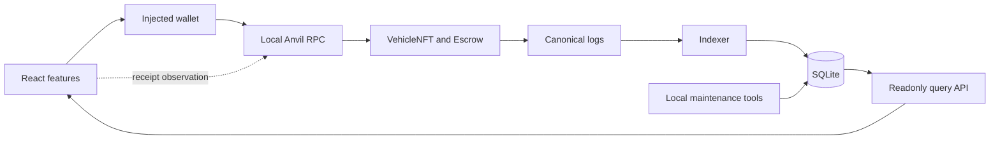

# MotorCove

[繁體中文](README.zh-TW.md)

MotorCove is a deliberately small EVM engineering sandbox for an ERC-721 vehicle collectible sale.
It shows how a React frontend, user wallet, Solidity protocol, event Indexer, SQLite projection, and
readonly API cooperate around wallet-signed transactions. It does not represent physical vehicle
ownership, hold production funds, or claim production readiness.

> **Local sandbox · test ETH and test assets only**

## Current state

The escrow contract, React transaction flows, event Indexer, readonly API, and managed database
lifecycle are implemented. Runtime services use one `@motorcove/database` interface for managed
environment paths, Drizzle migrations, advisory locks, projections, catalog seeds, backup, restore,
and reset. The current source tree passed `pnpm verify` and `pnpm test:e2e` locally.

The browser E2E suite uses an explicit test wallet adapter. Manual MetaMask behavior, remote GitHub
settings, public networks, and external security review are not verified. See
[implementation status](docs/implementation-status.md) for required, implemented, and verified
states. A file or test being present is not a pass result.

## Architecture at a glance



The write path is `browser → wallet → RPC → contracts`. The read path is
`logs → Indexer → SQLite → API → browser`. Receipt observation does not update projections.
[Architecture overview](docs/architecture/overview.md) explains trust and failure boundaries.

## What the repository demonstrates

- Feature, capability, and adapter boundaries in React, with negative dependency fixtures.
- Exact-value escrow funding, independent seller proceeds or buyer refund claims, and NFT reclaim.
- Transaction intent, submission, receipt, unknown, and replacement observations across reloads.
- Bounded event ingestion, pure projectors, checkpoint provenance, and detect-and-stop recovery.
- A mixed-authority SQLite design where catalog data is preserved and projections are rebuildable.
- Provider-consumer contracts, change recipes, local gates, and evidence that separates source
  inspection from executed verification.

The [engineering capability map](docs/engineering-capability-map.md) links each claim to code,
scenarios, verification records, and limits.

## Technology at a glance

| Area     | Implemented stack                                           | Responsibility                                                    |
| -------- | ----------------------------------------------------------- | ----------------------------------------------------------------- |
| Frontend | React, TypeScript, Vite, Wagmi, Viem, TanStack Query        | UI, wallet requests, transaction observation, API reads           |
| Protocol | Solidity, OpenZeppelin, Foundry, Anvil                      | ERC-721 custody, sale rules, claims, local EVM tests              |
| Backend  | Fastify, Zod, generated OpenAPI                             | Readonly query API and runtime provenance                         |
| Data     | SQLite, better-sqlite3, Drizzle ORM and Kit                 | Catalog data, event evidence, projections, migrations, recovery   |
| Quality  | Vitest, Playwright, Storybook, architecture and docs checks | Unit through local real-stack evidence and dependency enforcement |
| Delivery | pnpm workspace, GitHub Actions workflow                     | Reproducible local gates and declared CI jobs                     |

The workspace pins Node 24.21.0 and pnpm 12.5.1. Exact versions and reasons are in
[technology choices](docs/technology-choices.md) and the measured [toolchain](docs/toolchain.md).

## Run the isolated local demo

Prerequisites are Linux or WSL2, Node 24.21.0, pnpm 12.5.1, Foundry/Anvil 1.8.3, and SQLite 3.
Use a new environment ID; managed state is created only under `.motorcove/environments/<id>`.
The commands do not adopt the existing `data/motorcove.sqlite`.

In the first terminal:

```bash
nvm use
pnpm install --frozen-lockfile
export MOTORCOVE_ENV=demo-local
pnpm doctor
pnpm dev:chain
```

After Anvil is ready, use a second terminal:

```bash
nvm use
export MOTORCOVE_ENV=demo-local
pnpm dev:bootstrap
pnpm dev:full
```

Open <http://127.0.0.1:5173>. Add `http://127.0.0.1:8545` with chain ID `31337` to an injected
wallet and import only an Anvil test account. Follow the [demo walkthrough](docs/demo/walkthrough.md)
for complete, cancel/reclaim, expiry/refund/reclaim, stale projection, and recovery paths.

To inspect without starting a chain or opening a managed environment:

```bash
pnpm docs:check
pnpm db:check
```

Run the full local gates with `pnpm verify` and `pnpm test:e2e`. For a disposable owned demo only,
`MOTORCOVE_ENV=demo-local pnpm demo:reset -- --yes` verifies the local Anvil identity, calls
`anvil_reset`, and removes generated state in that selected environment. Read the
[local development](docs/runbooks/local-development.md) and [local reset](docs/runbooks/local-reset.md)
runbooks before maintenance commands.

## Choose a path

- **Understand the project:** [Documentation index](docs/README.md) →
  [project scope](docs/project-scope.md) → [technology choices](docs/technology-choices.md) →
  [architecture](docs/architecture/overview.md)
- **Trace a transaction:** [Listing and funding](docs/flows/listing-and-funding.md) →
  [transaction lifecycle](docs/protocol/transaction-lifecycle.md) →
  [Indexer and API](docs/architecture/backend-indexer.md) →
  [data authority](docs/architecture/data-authority.md)
- **Run and inspect:** [Local development](docs/runbooks/local-development.md) →
  [demo walkthrough](docs/demo/walkthrough.md) → [testing strategy](docs/testing/strategy.md)
- **Contribute safely:** [CONTRIBUTING](CONTRIBUTING.md) →
  [onboarding](docs/onboarding/README.md) → [change recipes](docs/onboarding/change-recipes.md)
- **Evaluate evidence:** [Capability map](docs/engineering-capability-map.md) →
  [scenario catalog](docs/testing/scenario-catalog.md) →
  [verification records](docs/evidence/verification.json)

## Boundaries

MotorCove has no physical title, delivery, financing, tax, authentication, SIWE, backend wallet
custody, public-network deployment, or production database service. It supports one-host local
SQLite and loopback Anvil only. The complete boundary and open product gaps are in
[project scope](docs/project-scope.md).

## License

MotorCove is licensed under the Apache License 2.0. See [LICENSE](./LICENSE) for details.
Third-party dependencies retain their own licenses.
