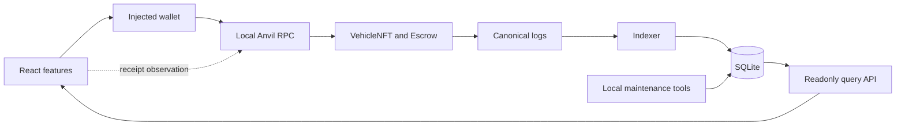

# MotorCove

[](https://github.com/herefindalex/motor-cove/actions/workflows/ci.yml)

[English](README.md) · [繁體中文](README.zh-TW.md)

MotorCove 是刻意缩小业务范围的 EVM 工程沙盒，以 ERC-721 车辆数字收藏品交易为情境，
展示 React 前端、用户钱包、Solidity 协定、事件 Indexer、SQLite projection 与唯读 API
如何协作。它不代表实体车辆产权、不持有正式资金，也不宣称可直接用于正式环境。

> **仅限本机沙盒、测试 ETH 与测试资产**

## 目前状态

Escrow 合约、React 交易流程、事件 Indexer、唯读 API 及受管理的数据库生命周期已实作。
API、Indexer 与维护工具共用 `@motorcove/database`，统一管理环境路径、Drizzle migration、
锁、projection、catalog seed、备份、还原及 reset。目前原代码已在本机通过
`pnpm verify` 与 `pnpm test:e2e`。

Browser E2E 将仅限 loopback 的本地 demo connector 与可注入故障的 EIP-1193 测试 adapter
分开；它不是实际的浏览器钱包扩充功能测试。已发布的原代码已通过 repository 的 GitHub
Actions workflow；branch protection、reviewer identities、手动 MetaMask、公开链与外部安全
稽核尚未验证。完整的 required／implemented／verified 分界请见
[实作状态](docs/implementation-status.zh-CN.md)。存在程序或测试档不等于已通过验证。

## 架构一览



写入路径为 `browser → wallet → RPC → contracts`；读取路径为
`logs → Indexer → SQLite → API → browser`。Receipt observation 不会直接更新 projection。
信任与故障边界见[架构总览](docs/architecture/overview.zh-CN.md)。

## Repository 展示的工程能力

- React feature／capability／adapter 分层，以及可故意触发失败的依赖规则 fixture。
- 精确金额 funding、seller proceeds 或 buyer refund 的独立 claim，以及 NFT reclaim。
- 跨 reload 的 transaction intent、submission、receipt、unknown 与 replacement observation。
- 有界事件截取、纯 projector、checkpoint provenance 及侦测后停止的复原策略。
- 保留 catalog 权威数据、可重建 projection 的 mixed-authority SQLite 设计。
- Provider／consumer 契约、change recipes、本机 gate，以及区分 source inspection 与真实运行的证据。

[工程能力对照](docs/engineering-capability-map.zh-CN.md)把每项能力连到程序、scenario、验证纪录与限制。

## 技术栈一览

| 领域     | 已实作技术                                               | 责任                                               |
| -------- | -------------------------------------------------------- | -------------------------------------------------- |
| Frontend | React、TypeScript、Vite、Wagmi、Viem、TanStack Query     | UI、钱包请求、交易观察、API 读取                   |
| Protocol | Solidity、OpenZeppelin、Foundry、Anvil                   | ERC-721 custody、sale rules、claims、本机 EVM 测试 |
| Backend  | Fastify、Zod、generated OpenAPI                          | 唯读 query API 与 runtime provenance               |
| Data     | SQLite、better-sqlite3、Drizzle ORM／Kit                 | Catalog、事件证据、projection、migration、recovery |
| Quality  | Vitest、Playwright、Storybook、architecture／docs checks | Unit 到本机 real-stack 证据与依赖规则              |
| Delivery | pnpm workspace、GitHub Actions workflow                  | 可重现的本机 gate 与已运行的远程 CI                |

Workspace 固定使用 Node 24.21.0 与 pnpm 12.5.1。精确版本、实际用途、理由及取舍见
[Technology choices](docs/technology-choices.zh-CN.md)与[本机工具链纪录](docs/toolchain.zh-CN.md)。

## 启动隔离的本机 demo

需求为 Linux／WSL2、Node 24.21.0、pnpm 12.5.1、Foundry／Anvil 1.8.3 与 SQLite 3。
请选用新的 environment ID；受管理状态只会创建于 `.motorcove/environments/<id>`，不会接管
既有的 `data/motorcove.sqlite`。

第一个 terminal：

```bash
nvm use
pnpm install --frozen-lockfile
export MOTORCOVE_ENV=demo-local
pnpm doctor
pnpm dev:chain
```

Anvil ready 后，在第二个 terminal：

```bash
nvm use
export MOTORCOVE_ENV=demo-local
pnpm dev:bootstrap
VITE_MOTORCOVE_DEMO_WALLET=1 pnpm dev:full
```

打开 <http://127.0.0.1:5173>，选择 **Use local buyer** 或 **Use local seller**。此开发模式只
接受 loopback RPC，使用 Anvil 已解锁的测试帐号，不会把私钥放进 Web bundle。若要测试
injected wallet，启动时不要设置该 flag。Complete、cancel/reclaim、expiry/refund/reclaim、
stale projection 与 recovery 的完整步骤见[繁中 demo walkthrough](docs/demo/walkthrough.zh-CN.md)。

以下命令不会启动链或打开受管理环境：

```bash
pnpm docs:check
pnpm db:check
```

完整本机 gate 为 `pnpm verify` 与 `pnpm test:e2e`。只对可丢弃且由 MotorCove 管理的 demo
使用 `MOTORCOVE_ENV=demo-local pnpm demo:reset -- --yes`；它会验证本机 Anvil 身分、调用
`anvil_reset`，再移除所选环境的 generated state。运行 maintenance 前先读
[本机开发](docs/runbooks/local-development.zh-CN.md)与[本机 reset](docs/runbooks/local-reset.zh-CN.md) runbook。

## 阅读路径

- **理解项目：** [文档索引](docs/README.zh-CN.md) → [范围](docs/project-scope.zh-CN.md) →
  [技术选型](docs/technology-choices.zh-CN.md) → [架构](docs/architecture/overview.zh-CN.md)
- **追踪一笔交易：** [Listing 与 funding](docs/flows/listing-and-funding.zh-CN.md) →
  [交易生命周期](docs/protocol/transaction-lifecycle.zh-CN.md) →
  [Indexer 与 API](docs/architecture/backend-indexer.zh-CN.md) → [数据权责](docs/architecture/data-authority.zh-CN.md)
- **启动与检查：** [本机开发](docs/runbooks/local-development.zh-CN.md) →
  [繁中 demo](docs/demo/walkthrough.zh-CN.md) → [测试策略](docs/testing/strategy.zh-CN.md)
- **安全贡献：** [CONTRIBUTING](CONTRIBUTING.zh-CN.md) → [Onboarding](docs/onboarding/README.zh-CN.md) →
  [Change recipes](docs/onboarding/change-recipes.zh-CN.md)
- **查核证据：** [能力对照](docs/engineering-capability-map.zh-CN.md) →
  [Scenario catalog](docs/testing/scenario-catalog.zh-CN.md) →
  [Verification records](docs/evidence/verification.json)

## 边界

MotorCove 不处理实体产权、交付、融资、税务、登录、SIWE、后端钱包保管、公开链部署或
正式数据库服务。运行范围限单机 SQLite 与 loopback Anvil。完整 non-goals 与仍待完成的
产品缺口见[项目范围](docs/project-scope.zh-CN.md)。

## 授权

MotorCove 采用 Apache License 2.0，详情请见 [LICENSE](./LICENSE)。第三方依赖各自维持原授权。
