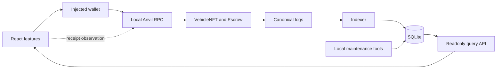

# MotorCove

[](https://github.com/herefindalex/motor-cove/actions/workflows/ci.yml)

[English](README.md) · [简体中文](README.zh-CN.md)

MotorCove 是刻意縮小業務範圍的 EVM 工程沙盒，以 ERC-721 車輛數位收藏品交易為情境，
展示 React 前端、使用者錢包、Solidity 協定、事件 Indexer、SQLite projection 與唯讀 API
如何協作。它不代表實體車輛產權、不持有正式資金，也不宣稱可直接用於正式環境。

> **僅限本機沙盒、測試 ETH 與測試資產**

## 目前狀態

Escrow 合約、React 交易流程、事件 Indexer、唯讀 API 及受管理的資料庫生命週期已實作。
API、Indexer 與維護工具共用 `@motorcove/database`，統一管理環境路徑、Drizzle migration、
鎖、projection、catalog seed、備份、還原及 reset。目前原始碼已在本機通過
`pnpm verify` 與 `pnpm test:e2e`。

Browser E2E 將僅限 loopback 的本地 demo connector 與可注入故障的 EIP-1193 測試 adapter
分開；它不是實際的瀏覽器錢包擴充功能測試。已發布的原始碼已通過 repository 的 GitHub
Actions workflow；branch protection、reviewer identities、手動 MetaMask、公開鏈與外部安全
稽核尚未驗證。完整的 required／implemented／verified 分界請見
[實作狀態](docs/implementation-status.zh-TW.md)。存在程式或測試檔不等於已通過驗證。

## 架構一覽



寫入路徑為 `browser → wallet → RPC → contracts`；讀取路徑為
`logs → Indexer → SQLite → API → browser`。Receipt observation 不會直接更新 projection。
信任與故障邊界見[架構總覽](docs/architecture/overview.zh-TW.md)。

## Repository 展示的工程能力

- React feature／capability／adapter 分層，以及可故意觸發失敗的依賴規則 fixture。
- 精確金額 funding、seller proceeds 或 buyer refund 的獨立 claim，以及 NFT reclaim。
- 跨 reload 的 transaction intent、submission、receipt、unknown 與 replacement observation。
- 有界事件擷取、純 projector、checkpoint provenance 及偵測後停止的復原策略。
- 保留 catalog 權威資料、可重建 projection 的 mixed-authority SQLite 設計。
- Provider／consumer 契約、change recipes、本機 gate，以及區分 source inspection 與真實執行的證據。

[工程能力對照](docs/engineering-capability-map.zh-TW.md)把每項能力連到程式、scenario、驗證紀錄與限制。

## 技術棧一覽

| 領域     | 已實作技術                                               | 責任                                               |
| -------- | -------------------------------------------------------- | -------------------------------------------------- |
| Frontend | React、TypeScript、Vite、Wagmi、Viem、TanStack Query     | UI、錢包請求、交易觀察、API 讀取                   |
| Protocol | Solidity、OpenZeppelin、Foundry、Anvil                   | ERC-721 custody、sale rules、claims、本機 EVM 測試 |
| Backend  | Fastify、Zod、generated OpenAPI                          | 唯讀 query API 與 runtime provenance               |
| Data     | SQLite、better-sqlite3、Drizzle ORM／Kit                 | Catalog、事件證據、projection、migration、recovery |
| Quality  | Vitest、Playwright、Storybook、architecture／docs checks | Unit 到本機 real-stack 證據與依賴規則              |
| Delivery | pnpm workspace、GitHub Actions workflow                  | 可重現的本機 gate 與已執行的遠端 CI                |

Workspace 固定使用 Node 24.21.0 與 pnpm 12.5.1。精確版本、實際用途、理由及取捨見
[Technology choices](docs/technology-choices.zh-TW.md)與[本機工具鏈紀錄](docs/toolchain.zh-TW.md)。

## 啟動隔離的本機 demo

需求為 Linux／WSL2、Node 24.21.0、pnpm 12.5.1、Foundry／Anvil 1.8.3 與 SQLite 3。
請選用新的 environment ID；受管理狀態只會建立於 `.motorcove/environments/<id>`，不會接管
既有的 `data/motorcove.sqlite`。

第一個 terminal：

```bash
nvm use
pnpm install --frozen-lockfile
export MOTORCOVE_ENV=demo-local
pnpm doctor
pnpm dev:chain
```

Anvil ready 後，在第二個 terminal：

```bash
nvm use
export MOTORCOVE_ENV=demo-local
pnpm dev:bootstrap
VITE_MOTORCOVE_DEMO_WALLET=1 pnpm dev:full
```

開啟 <http://127.0.0.1:5173>，選擇 **Use local buyer** 或 **Use local seller**。此開發模式只
接受 loopback RPC，使用 Anvil 已解鎖的測試帳號，不會把私鑰放進 Web bundle。若要測試
injected wallet，啟動時不要設定該 flag。Complete、cancel/reclaim、expiry/refund/reclaim、
stale projection 與 recovery 的完整步驟見[繁中 demo walkthrough](docs/demo/walkthrough.zh-TW.md)。

以下命令不會啟動鏈或開啟受管理環境：

```bash
pnpm docs:check
pnpm db:check
```

完整本機 gate 為 `pnpm verify` 與 `pnpm test:e2e`。只對可丟棄且由 MotorCove 管理的 demo
使用 `MOTORCOVE_ENV=demo-local pnpm demo:reset -- --yes`；它會驗證本機 Anvil 身分、呼叫
`anvil_reset`，再移除所選環境的 generated state。執行 maintenance 前先讀
[本機開發](docs/runbooks/local-development.zh-TW.md)與[本機 reset](docs/runbooks/local-reset.zh-TW.md) runbook。

## 閱讀路徑

- **理解專案：** [文件索引](docs/README.zh-TW.md) → [範圍](docs/project-scope.zh-TW.md) →
  [技術選型](docs/technology-choices.zh-TW.md) → [架構](docs/architecture/overview.zh-TW.md)
- **追蹤一筆交易：** [Listing 與 funding](docs/flows/listing-and-funding.zh-TW.md) →
  [交易生命週期](docs/protocol/transaction-lifecycle.zh-TW.md) →
  [Indexer 與 API](docs/architecture/backend-indexer.zh-TW.md) → [資料權責](docs/architecture/data-authority.zh-TW.md)
- **啟動與檢查：** [本機開發](docs/runbooks/local-development.zh-TW.md) →
  [繁中 demo](docs/demo/walkthrough.zh-TW.md) → [測試策略](docs/testing/strategy.zh-TW.md)
- **安全貢獻：** [CONTRIBUTING](CONTRIBUTING.zh-TW.md) → [Onboarding](docs/onboarding/README.zh-TW.md) →
  [Change recipes](docs/onboarding/change-recipes.zh-TW.md)
- **查核證據：** [能力對照](docs/engineering-capability-map.zh-TW.md) →
  [Scenario catalog](docs/testing/scenario-catalog.zh-TW.md) →
  [Verification records](docs/evidence/verification.json)

## 邊界

MotorCove 不處理實體產權、交付、融資、稅務、登入、SIWE、後端錢包保管、公開鏈部署或
正式資料庫服務。執行範圍限單機 SQLite 與 loopback Anvil。完整 non-goals 與仍待完成的
產品缺口見[專案範圍](docs/project-scope.zh-TW.md)。

## 授權

MotorCove 採用 Apache License 2.0，詳情請見 [LICENSE](./LICENSE)。第三方依賴各自維持原授權。
