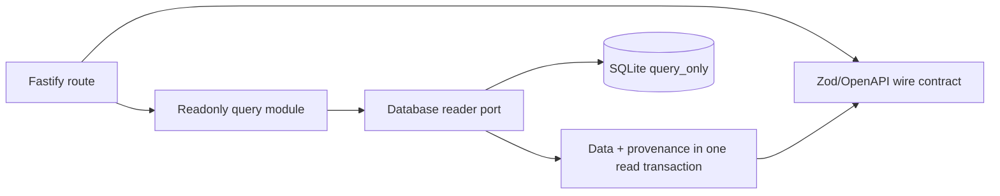
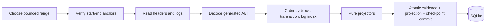

# Backend and Indexer architecture

The API and Indexer are separate local processes with different database rights. The API presents a
readonly snapshot. The Indexer turns verified chain evidence into projections. Neither process
signs transactions, settles payments, or runs migration and reset commands.

## Query API path

Routes live under `apps/api/src/modules`. The API opens `@motorcove/database/reader` with SQLite
`query_only` behavior. Response contracts come from `@motorcove/api-contracts`. Business data and
projector/build/scope/checkpoint provenance are read from the same snapshot so a response does not
combine rows from different projection moments.

The API does not accept a browser receipt as projection evidence. It can report stale, syncing, or
recovery-required status while continuing to serve the last verified snapshot.

## Indexer path

`apps/indexer/src/application/ingest-range.ts` validates the current checkpoint hash, shrinks an
RPC-limited range, obtains headers and logs, verifies log block identity, orders events, rechecks the
end anchor, and asks a store to commit. Projectors under `apps/indexer/src/domain/projectors` are pure
functions and reject invalid event order. The SQLite adapter writes headers, raw events, projection
rows, completed-block evidence, and the checkpoint in one transaction.

Event identity and content, completed-block log counts/digests, deployment scope, projector version,
and projection build identity guard replay. Overlapping input is idempotent only when the stored
evidence matches exactly; conflicting content stops the run.

## Process and database boundary

- API receives reader/types exports only.
- Indexer domain and application layers do not import SQLite or Viem; adapters implement their ports.
- Only the Indexer SQLite adapter receives the projection-writer export.
- Migration, seed, backup, restore, recovery, rebuild, reindex, reconcile, and reset live in explicit
  maintenance tooling and require service exclusion as documented by each runbook.
- All processes share one host. SQLite files and advisory locks are not a cross-host service.

## Stop and recovery behavior

Checkpoint hash change, a provider-confirmed missing checkpoint block, parent discontinuity,
mismatched log block hash, completed-block content conflict, or end-anchor change stops ingestion
with `RECOVERY_REQUIRED`. A timeout or connection failure instead keeps the checkpoint, marks the
read model `STALE`, and retries with bounded backoff. Generic automatic repair is intentionally
absent. Operators classify integrity failures and choose catch-up, rebuild, reindex, restore, or a
new deployment.

Rebuild replays verified local raw evidence into a new projection build and preserves catalog data.
Reindex obtains canonical headers and logs again. Reconciliation compares contract state and
projection at the same anchored block and writes a report; it never modifies projections.

## Evidence and limits

Unit tests cover bounded range behavior and pure projectors. SQLite integration covers overlap,
conflict, and rollback. Real-stack tests use an isolated Anvil, managed SQLite environment, actual
Indexer, and readonly API for settlement, rebuild, and recovery. Automatic arbitrary reorg repair,
unavailable archive history, and broader process/filesystem fault cases remain outside verified
coverage.

See [indexing and recovery](../flows/indexing-and-recovery.md),
[database ownership](database-ownership-and-dependencies.md), and
[testing strategy](../testing/strategy.md).

Chain profiles centralize finality and provider requirements: Anvil 31337 uses immediate loopback
eligibility; Ethereum 1 and Polygon 137 require an RPC finalized head. Startup checks chain identity,
block-hash log filtering, finality and historical-state capability before opening the writer.
Only finalized blocks are projected for public profiles. A second provider is used only by the
read-only bounded source audit, not the normal polling path. An observed finalized hash contradiction
requires recovery. The supported profiles have not been exercised on public networks in this repo.
