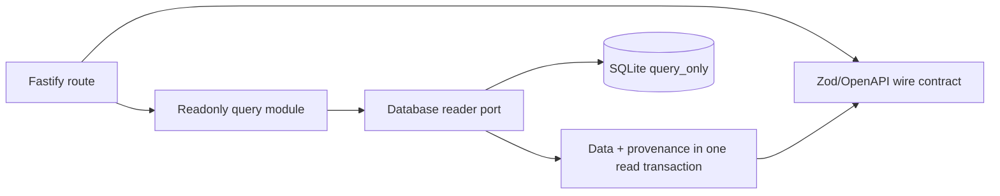
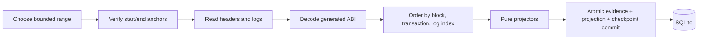

# 后端和Indexer架构

[English](backend-indexer.md) · [繁體中文](backend-indexer.zh-TW.md)

API 和 Indexer 是具有不同数据库权限的独立本地进程。 API 提供只读快照。 Indexer 将经过验证的链证据转化为投影。这两个进程都不会签署交易、结算付款或运行迁移和重置命令。

## 查询API路径

路由在 `apps/api/src/modules` 下直播。 API 以 SQLite `query_only` 行为打开 `@motorcove/database/reader`。响应合约来自`@motorcove/api-contracts`。业务数据和投影器/build/scope/checkpoint 来源是从同一快照读取的，因此响应不会组合来自不同投影时刻的行。

API 不接受浏览器收据作为投影证据。它可以报告过时、同步或需要恢复的状态，同时继续提供上次验证的快照。

## Indexer路径

`apps/indexer/src/application/ingest-range.ts` 验证当前检查点哈希，缩小 RPC 限制范围，获取标头和日志，验证日志块身份，对事件进行排序，重新检查结束锚点，并要求存储提交。 `apps/indexer/src/domain/projectors`下的投影器是纯函数，拒绝无效的事件顺序。 SQLite 适配器在一笔事务中写入标头、原始事件、投影行、已完成的块证据和检查点。

事件身份和内容、已完成的块日志计数/摘要、部署范围、投影器版本和投影构建身份防护重放。仅当存储的证据完全匹配时，重叠输入才是幂等的；冲突的内容会停止运行。

## 进程和数据库边界

- API 仅接收读取器/类型导出。
- Indexer域和应用层不导入SQLite或Viem；适配器实现它们的端口。
- 仅 Indexer SQLite 适配器接收投影-writer 导出。
- 显式迁移、种子、备份、恢复、恢复、重建、重新索引、对账和重置
  维护工具并要求每个运行手册中记录的服务排除。
- 所有进程共享一台主机。 SQLite 文件和咨询锁不是跨主机服务。

## 停止和恢复行为

检查点哈希更改、提供者确认的丢失检查点块、父级不连续性、日志块哈希不匹配、完成块内容冲突或结束锚点更改会停止 `RECOVERY_REQUIRED` 的摄取。相反，超时或连接失败会保留检查点，标记读取模型 `STALE`，并以有界退避重试。通用自动修复是故意缺失的。操作员对完整性故障进行分类，并选择追赶、重建、重新索引、恢复或新部署。

重建将经过验证的本地原始证据重播到新的投影构建中并保留目录数据。 Reindex 再次获取规范标头并记录。 对账比较同一锚定区块的合约状态和投影并写入报告；它永远不会修改投影。

## 证据和限制

单元测试涵盖有界范围行为和纯投影器。 SQLite集成涵盖了重叠、冲突和回滚。真实堆栈测试使用隔离的Anvil、托管的SQLite环境、实际的Indexer和只读的API进行结算、重建和恢复。自动任意重组修复、不可用的存档历史记录以及更广泛的进程/文件系统故障案例仍然超出了经过验证的范围。

请参阅[索引和恢复](../flows/indexing-and-recovery.zh-CN.md)、[数据库所有权](database-ownership-and-dependencies.zh-CN.md) 和[测试策略](../testing/strategy.zh-CN.md)。
