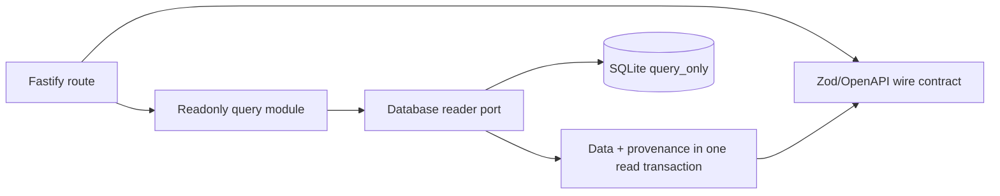
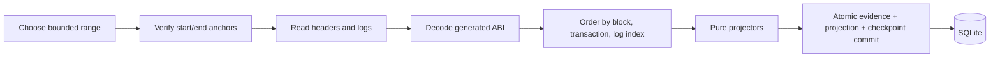

# 後端和Indexer架構

[English](backend-indexer.md) · [简体中文](backend-indexer.zh-CN.md)

API 和 Indexer 是具有不同資料庫權限的獨立本機進程。 API 提供唯讀快照。 Indexer 將經過驗證的鏈證據轉化為投影。這兩個進程都不會簽署交易、結算付款或運行遷移和重置命令。

## 查詢API路徑

路由在 `apps/api/src/modules` 下直播。 API 以 SQLite `query_only` 行為開啟 `@motorcove/database/reader`。響應合約來自`@motorcove/api-contracts`。業務資料和投影器/build/scope/checkpoint 來源是從相同快照讀取的，因此回應不會組合來自不同投影時刻的行。

API 不接受瀏覽器收據作為投影證據。它可以報告過時、同步或需要恢復的狀態，同時繼續提供上次驗證的快照。

## Indexer路徑

`apps/indexer/src/application/ingest-range.ts` 驗證目前檢查點哈希，縮小 RPC 限制範圍，取得標頭和日誌，驗證日誌區塊身份，對事件進行排序，重新檢查結束錨點，並要求儲存提交。 `apps/indexer/src/domain/projectors`下的投影器是純函數，拒絕無效的事件順序。 SQLite 適配器在一筆交易中寫入標頭、原始事件、投影行、已完成的區塊證據和檢查點。

事件身分和內容、已完成的區塊日誌計數/摘要、部署範圍、投影器版本和投影建置身分防護重播。只有當儲存的證據完全匹配時，重疊輸入才是冪等的；衝突的內容會停止運作。

## 行程和資料庫邊界

- API 僅接收讀取器/類型匯出。
- Indexer域和應用層不會匯入SQLite或Viem；適配器實現它們的連接埠。
- 僅 Indexer SQLite 適配器接收投影-writer 匯出。
- 明確遷移、種子、備份、恢復、恢復、重建、重新索引、對帳和重置
  維護工具並要求每個運作手冊中記錄的服務排除。
- 所有進程共享一台主機。 SQLite 檔案和諮詢鎖定不是跨主機服務。

## 停止和恢復行為

檢查點哈希變更、提供者確認的遺失檢查點區塊、父級不連續性、日誌區塊雜湊不符、完成區塊內容衝突或結束錨點變更會停止 `RECOVERY_REQUIRED` 的攝取。相反，逾時或連線失敗會保留檢查點，標記讀取模型 `STALE`，並以有界退避重試。通用自動修復是故意缺少的。操作員將完整性故障分類，並選擇追趕、重建、重新索引、復原或新部署。

重建將經過驗證的本地原始證據重播到新的投影建置中並保留目錄資料。 Reindex 再次取得規範標頭並記錄。 對帳比較同一錨定區塊的合約狀態和投影並寫入報告；它永遠不會修改投影。

## 證據和限制

單元測試涵蓋有界範圍行為和純投影器。 SQLite整合涵蓋了重疊、衝突和回滾。真實堆疊測試使用隔離的Anvil、託管的SQLite環境、實際的Indexer和只讀的API進行結算、重建和恢復。自動任意重組修復、不可用的存檔歷史記錄以及更廣泛的進程/檔案系統故障案例仍然超出了經過驗證的範圍。

請參閱[索引與復原](../flows/indexing-and-recovery.zh-TW.md)、[資料庫所有權](database-ownership-and-dependencies.zh-TW.md) 和[測試策略](../testing/strategy.zh-TW.md)。

鏈 profile 集中管理最終性與供應商要求：Anvil 31337 使用 loopback 立即可索引範圍；Ethereum 1 與 Polygon 137 要求 RPC finalized 鏈頭。啟動時先檢查鏈身分、block-hash log 篩選、最終性與歷史狀態能力，才開啟 writer。公鏈 profile 只投影 finalized 區塊。第二個供應商僅用於唯讀的有界來源稽核，不進入正常輪詢路徑。已觀察的 finalized hash 若矛盾，必須進入恢復。本專案尚未在公網實測這些 profile。
