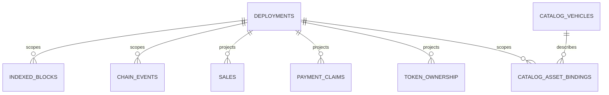

# Database architecture

This page explains the implemented database boundaries. Requirements come from the internal
database handoff; implementation evidence comes from `packages/database` and the database tests.

## Mixed authority and identity

Catalog IDs are stable off-chain identities. Token IDs are on-chain values. Sale, asset, and event
identity always includes a deployment. uint256 values and wei use canonical decimal text; block and
log positions use checked safe integers.

## Roles and coordination

The package exports `environment`, `reader`, `projection-writer`, `seeds`, `maintenance`, and `types`. API must
hold a shared service gate and a readonly connection. Indexer should hold a shared gate plus the
exclusive writer lock. Maintenance takes the exclusive gate and writer lock before opening the DB.
Lock order is always service gate, writer lock, connection.

`packages/database` implements this order with Linux `flock` processes whose stdin lifetime follows
the parent. An external `maintenance.json` blocks runtime after an interrupted operation. Advisory
locks coordinate cooperating local processes; they do not defend against a malicious local user.

## Migration history and existing local data

Drizzle Kit generates SQL and native metadata. The only project apply path is `db:migrate`; it checks
the native ledger against repository hashes, applies via the Drizzle SQLite migrator, fingerprints
the resulting schema, and writes `db_contract`. API and Indexer must not migrate on startup.

The existing `data/motorcove.sqlite` was inspected read-only and was not modified, adopted, reset,
or marked as Drizzle history. Managed environments live under `.motorcove/environments/<id>`.

## Backup, restore, and chain state

Backup uses the SQLite backup API, verifies the standalone snapshot, and writes a manifest with a
checksum. Restore verifies first, quarantines the active main file and sidecars, installs the
snapshot, and retains a crash marker until verification. Restoring a DB never rolls back Anvil or
any blockchain.

## Current limits

Chain seed ambiguity is conservative and parallel suite isolation, SQLite busy/full rollback,
lock-owner death, reorg/reindex, and restore catch-up have local evidence. The remaining database
limits are a prior-schema upgrade, a real process death in the broadcast-to-hash journal window,
full host-filesystem exhaustion, and hardware power loss. See exact per-requirement status in the
[database acceptance matrix](../testing/database-acceptance-matrix.md).
