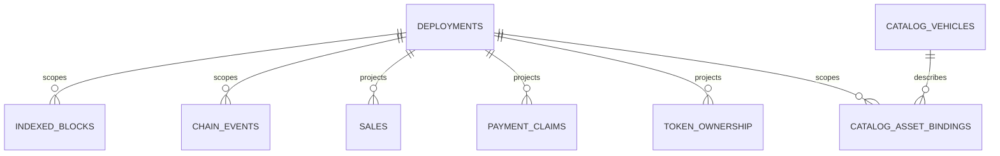

# 数据库架构

[English](database.md) · [繁體中文](database.zh-TW.md)

本页解释了实施的数据库边界。需求来自内部数据库交接；实现证据来自`packages/database`和数据库测试。

## 混合权威来源和身份

目录 ID 是稳定的链外身份。代币 ID 是链上值。 Sale、资产和事件身份始终包含部署。 uint256 值和 wei 使用规范的十进制文本；块和日志位置使用经过检查的安全整数。

## 角色和协调

该包导出 `environment`、`reader`、`projection-writer`、`seeds`、`maintenance` 和 `types`。 API 必须拥有共享服务门和只读连接。 Indexer 应持有共享门加上独占写入器锁。维护在打开数据库之前获取独占门和写入器锁。锁定顺序始终是服务门、写入器锁定、连接。

`packages/database` 使用 Linux `flock` 进程实现此顺序，其 stdin 生命周期遵循父进程。外部 `maintenance.json` 在中断操作后阻塞运行时间。咨询锁协调本地进程的协作；它们不防御恶意本地用户。

## 迁移历史和现有本地数据

Drizzle Kit 生成 SQL 和本机元数据。项目唯一申请路径为`db:migrate`；它根据存储库哈希检查本机分类帐，通过 Drizzle SQLite 迁移器应用，对结果模式进行指纹识别，并写入 `db_contract`。 API 和 Indexer 不得在启动时迁移。

现有的 `data/motorcove.sqlite` 被检查为只读，并且未被修改、采用、重置或标记为 Drizzle 历史。托管环境位于 `.motorcove/environments/<id>` 下。

## 备份、恢复和链状态

备份使用 SQLite 备份 API，验证独立快照，并写入包含校验和、源准备情况、恢复策略和数据库派生的投影证据的清单。标准备份拒绝不完整的维护标记。内部迁移和源刷新存档绑定活动操作并保持仅证据。恢复首先验证标准的就绪快照，隔离活动主文件和 sidecar，安装快照，并保留崩溃标记直至验证。恢复数据库永远不会回滚 Anvil 或任何区块链。

维护标记更新使用唯一的独占临时文件和原子重命名。发布的标记是已提交的状态。匹配的锁所有者可以恢复未发布的孤立状态，并在发布其下一个状态后清除相同操作的临时文件。

## 当前限制

链种子模糊性是保守的。并行套件隔离、SQLite 繁忙/完全回滚、锁所有者死亡、重组/重新索引和恢复追赶都有本地证据。记录的 `0000` 到 `0001` 迁移具有保留数据固定装置。剩余的数据库限制包括广播到哈希日志窗口中的实际进程死亡、主机文件系统完全耗尽以及硬件断电。请参阅[数据库接受矩阵](../testing/database-acceptance-matrix.zh-CN.md) 中的具体要求状态。
