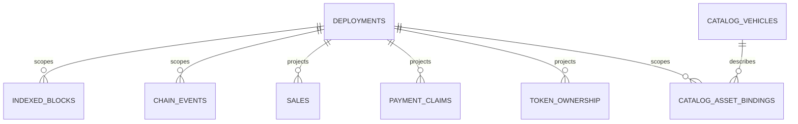

# 資料庫結構定義

[English](database.md) · [简体中文](database.zh-CN.md)

本頁解釋了實施的資料庫邊界。需求來自內部資料庫交接；實現證據來自`packages/database`和資料庫測試。

## 混合權威來源和身份

目錄 ID 是穩定的鏈外身分。代幣 ID 是鏈上值。 Sale、資產和事件身分始終包含部署。 uint256 值和 wei 使用規範的十進位文字；區塊和日誌位置使用經過檢查的安全整數。

## 角色和協調

該套件導出 `environment`、`reader`、`projection-writer`、`seeds`、`maintenance` 和 `types`。 API 必須擁有共用服務閘門和唯讀連線。 Indexer 應持有共用閘門加上獨佔寫入器鎖定。維護在開啟資料庫之前取得獨佔閘和寫入器鎖。鎖定順序始終是服務門、寫入器鎖定、連接。

`packages/database` 使用 Linux `flock` 進程實現此順序，其 stdin 生命週期遵循父進程。外部 `maintenance.json` 在中斷操作後阻塞運轉時間。諮詢鎖定協調本地進程的協作；它們不防禦惡意本地用戶。

## 遷移歷史和現有本地數據

Drizzle Kit 產生 SQL 和本機元資料。專案唯一申請路徑為`db:migrate`；它根據儲存庫雜湊檢查本機分類帳，透過 Drizzle SQLite 遷移器應用，對結果模式進行指紋識別，並寫入 `db_contract`。 API 和 Indexer 不得在啟動時遷移。

現有的 `data/motorcove.sqlite` 被檢查為唯讀，並且未被修改、採用、重置或標記為 Drizzle 歷史。託管環境位於 `.motorcove/environments/<id>` 下。

## 備份、還原和鏈狀態

備份使用 SQLite 備份 API，驗證獨立快照，並寫入包含校驗和、來源準備、復原策略和資料庫衍生的投影證據的清單。標準備份拒絕不完整的維護標記。內部遷移和來源刷新存檔綁定活動操作並保持僅證據。復原首先驗證標準的就緒快照，隔離活動主檔案和 sidecar，安裝快照，並保留崩潰標記直至驗證。恢復資料庫永遠不會回滾 Anvil 或任何區塊鏈。

維護標記更新使用唯一的獨佔暫存檔案和原子重新命名。發布的標記是已提交的狀態。匹配的鎖定所有者可以恢復未發布的孤立狀態，並在發布其下一個狀態後清除相同操作的臨時檔案。

## 目前限制

鏈種子模糊性是保守的。並行套件隔離、SQLite 繁忙/完全回滾、鎖定所有者死亡、重組/重新索引和恢復追趕都有本地證據。記錄的 `0000` 到 `0001` 遷移具有保留資料固定裝置。剩餘的資料庫限制包括廣播到哈希日誌視窗中的實際進程死亡、主機檔案系統完全耗盡以及硬體斷電。請參閱[資料庫接受矩陣](../testing/database-acceptance-matrix.zh-TW.md) 中的具體要求狀態。
