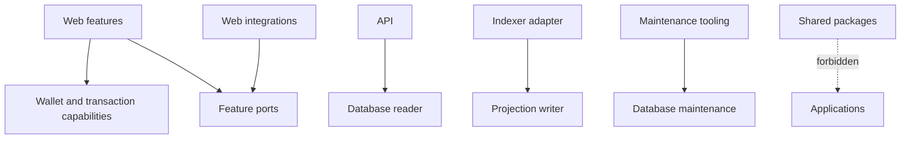

# Dependency rules

This page explains the source dependency policy, its local enforcement, and known gaps.

`tooling/architecture/check.mjs` parses static imports, exports, and dynamic string imports. It
rejects app-to-app source imports, package-to-app imports, selected SDKs in pure layers,
capability-to-feature imports, cross-feature private imports, and cycles. Negative fixtures prove
those rules can fail.

The checker prevents Web database imports, limits API database imports to reader/environment,
limits direct SQLite driver use to the Indexer adapter, and rejects a second Drizzle migration
runner. It also rejects wall-clock access in projectors.

Package boundaries are evaluated from both the source text and the resolved target. The
Web-to-database rule therefore applies to package imports, relative paths, TypeScript aliases, and
re-exports that resolve into `packages/database`. Relative imports inside the same owned package
remain valid. Negative fixtures cover package, relative, and aliased attempts so renaming an import
specifier cannot bypass the ownership rule.

Run `pnpm check:architecture`. A passing local run is distinct from remote branch protection or
code-owner approval, neither of which was inspected.
