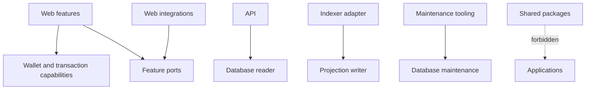

# 依赖规则

[English](dependency-rules.md) · [繁體中文](dependency-rules.zh-TW.md)

本页介绍了源依赖策略、其本地实施以及已知差距。

`tooling/architecture/check.mjs` 解析静态导入、导出和动态字符串导入。它拒绝应用程序到应用程序的源导入、包到应用程序的导入、纯层中选定的 SDK、功能到功能的导入、跨功能私有导入和循环。消极的赛程证明这些规则可能会失败。

检查器会阻止 Web 数据库导入、限制 API 数据库导入到读取器/环境、限制 SQLite 驱动程序对 Indexer 适配器的直接使用，并拒绝第二个 Drizzle 迁移运行程序。它还拒绝投影器中的挂钟访问。

包边界是根据源文本和解析的目标进行评估的。因此，Web 到数据库规则适用于包导入、相对路径、TypeScript 别名以及解析为 `packages/database` 的重新导出。同一拥有的包内的相对导入仍然有效。负固定装置涵盖包、相对和别名尝试，因此重命名导入说明符无法绕过所有权规则。

运行`pnpm check:architecture`。通过本地运行与远程分支保护或代码所有者批准不同，两者都没有经过检查。
