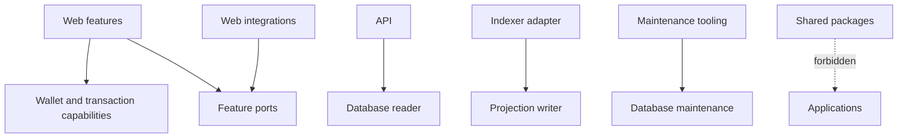

# 依賴規則

[English](dependency-rules.md) · [简体中文](dependency-rules.zh-CN.md)

本頁介紹了來源依賴策略、其本地實施以及已知差距。

`tooling/architecture/check.mjs` 解析靜態導入、匯出和動態字串導入。它拒绝应用程序到应用程序的源导入、包到应用程序的导入、纯层中选定的 SDK、功能到功能的导入、跨功能私有导入和循环。消極的賽程證明這些規則可能會失敗。

檢查器會阻止 Web 資料庫匯入、限制 API 資料庫匯入讀取器/環境、限制 SQLite 驅動程式對 Indexer 適配器的直接使用，並拒絕第二個 Drizzle 遷移執行程式。它還拒絕投影器中的掛鐘存取。

包邊界是根據原始文本和解析的目標進行評估的。因此，Web 到資料庫規則適用於套件匯入、相對路徑、TypeScript 別名以及解析為 `packages/database` 的重新匯出。同一擁有的包內的相對導入仍然有效。負固定裝置涵蓋套件、相對和別名嘗試，因此重新命名匯入說明符無法繞過所有權規則。

運行`pnpm check:architecture`。透過本地運行與遠端分支保護或程式碼擁有者批准不同，兩者都沒有經過檢查。
