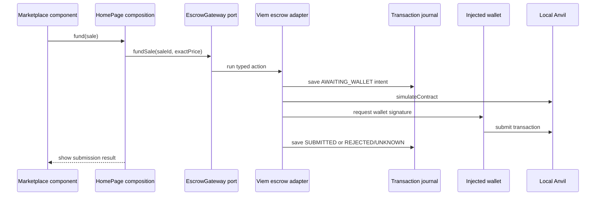

# Frontend architecture

The Web keeps page composition, business use cases, long-lived browser capabilities, and external
SDKs in separate owners. This lets frontend work proceed against ports and generated contracts
without importing wallet, HTTP, or persistence details into feature models.

## Responsibility map

| Layer        | Location                                     | Owns                                                            | Must not own                                |
| ------------ | -------------------------------------------- | --------------------------------------------------------------- | ------------------------------------------- |
| Pages and UI | `apps/web/src/pages`, feature `ui` folders   | Rendering, route composition, local form/disclosure state       | EVM calls, durable transaction truth, SQL   |
| Features     | `apps/web/src/features`                      | Marketplace/trading use cases, amount rules, feature ports      | Wagmi, Viem, HTTP clients, localStorage     |
| Capabilities | `apps/web/src/capabilities`                  | Wallet lifecycle and cross-page transaction journal/observation | Feature-specific sale rules or SDK adapters |
| Ports        | Feature or capability public APIs            | Consumer-facing operations and result types                     | Concrete network or storage implementation  |
| Integrations | `apps/web/src/integrations`                  | HTTP, Wagmi/Viem, chain time, localStorage adapters             | Page policy or feature rendering            |
| Composition  | `apps/web/src/app/composition.tsx` and pages | Provider wiring and adapter selection                           | Hidden service location from pure modules   |

Features import capability public exports and ports. Integrations implement those ports. The static
architecture checker rejects capability-to-feature imports, cross-feature private imports, SDKs in
pure layers, app-to-app source imports, and Web imports of server-only database code.

## Funding use case from component to adapter

`Marketplace` receives `MarketActions`; it does not import Viem. `HomePage` adapts a UI action to
the `EscrowGateway` port. `use-escrow-gateway.ts` simulates and submits with generated ABI, while
the transaction capability records immutable account, chain, deployment, contract, value, action,
and calldata summary before opening the wallet.

Marketplace prices use the trading feature's bigint formatter. It emits an exact ETH decimal from
wei, including values below one milli-ether and remainders smaller than a display unit. The value
passed to `MarketActions.fund` remains the original decimal wei string. UI code must not use
`Number`, `parseFloat`, or integer milli-ether division for this boundary.

## State ownership across page and wallet changes

- Component-local state owns form input, disclosure, and the immediate feedback message.
- TanStack Query owns API snapshots keyed by deployment identity. Each query function also passes the
  expected deployment to the HTTP adapter, which rejects response provenance from another
  deployment. A cache key alone does not validate response identity, and a fresh query is not proof
  that the Indexer reached the chain head. Config polling supplies the new deployment context after a
  local service replacement; it does not replace the response check.
- The wallet capability owns current connection, account, chain, pending, and wrong-network state.
- The transaction capability owns durable operation context in the journal. A page unmount does not
  cancel observation of a known hash.
- The transaction observation port owns one verification workflow per deployment and operation.
  Its browser adapter uses Web Locks across tabs, skips busy automatic polls, queues explicit manual
  checks, and reloads the journal after ownership is acquired. The in-memory fallback is limited to
  one JavaScript realm.
- The transaction submission port owns one workflow per immutable intent before the first durable
  write. Its browser adapter uses Web Locks across tabs through wallet and returned-hash handling;
  different intents remain concurrent and the fallback covers one JavaScript realm only.
- Reload restores journal entries with enough evidence to query. Later account or chain changes do
  not rewrite the original operation's account, chain, contract, or hash.
- `TransactionObserver` can record included success, included revert, replacement/cancellation, or
  orphaning. `INCLUDED_SUCCESS` remains separate from sale, claim, and projection state.

## Evidence and limits

`apps/web/src/features/trading/model/amount.test.ts` covers pure amount rules.
`TransactionTimeline.test.tsx` covers rendered wallet-rejection semantics with React Testing
Library. `WalletPanel.test.tsx` covers missing-provider and connector-choice rendering.
`tests/e2e/marketplace.spec.ts` uses the loopback demo connector for normal settlement and a
controlled EIP-1193 provider for reload, account/network changes, and stale/catch-up behavior.
`tests/e2e/journal-multitab.spec.ts` uses two Chromium pages to verify operation-scoped observation
ownership, same-intent submission exclusion before wallet work, owner-close handoff, and that
unrelated operations and journal writes remain available while ownership is pending.
Manual MetaMask behavior has not been recorded.

See [wallet and network flow](../flows/wallet-and-network.md),
[transaction lifecycle](../protocol/transaction-lifecycle.md), and
[dependency rules](dependency-rules.md).

## Public chain read identity

Approval permission and contract time are published only after the public RPC chain ID and escrow `deploymentId()` match the current API config. Approval reads use one captured block number and reject the result if that block changes during observation. A failed identity proof leaves approval unavailable and contract time unknown. This read-side check complements the separate proof immediately before a wallet request.
