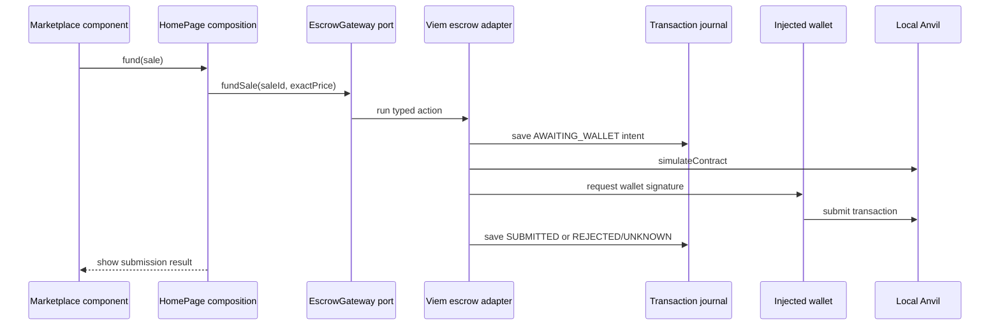

# 前端架构

[English](frontend.md) · [繁體中文](frontend.zh-TW.md)

Web 将页面组合、业务用例、长期浏览器功能和外部 SDK 保留在不同的所有者中。这使得前端工作可以针对端口和生成的合约进行，而无需将钱包、HTTP 或持久性详细信息导入到功能模型中。

## 责任图

| 层             | 地点                                      | 拥有                                          | 不得拥有                               |
| -------------- | ----------------------------------------- | --------------------------------------------- | -------------------------------------- |
| 页面和用户界面 | `apps/web/src/pages`，功能`ui`文件夹      | 渲染、路由组合、局部表单/公开状态             | EVM 来电，持久交易真相，SQL            |
| 功能模块       | `apps/web/src/features`                   | 市场/交易用例、金额规则、功能端口             | Wagmi、Viem、HTTP 客户端、localStorage |
| 能力           | `apps/web/src/capabilities`               | 钱包生命周期和跨页面交易日志/观察             | 特定功能的销售规则或 SDK 适配器        |
| 端口           | 特性或功能公共 API                        | 面向消费者的操作和结果类型                    | 具体网络或存储实现                     |
| 集成           | `apps/web/src/integrations`               | HTTP、Wagmi/Viem、链时间、localStorage 适配器 | 页面策略或功能渲染                     |
| 组合层         | `apps/web/src/app/composition.tsx` 和页面 | 提供商组装和适配器选择                        | 纯模块隐藏的服务位置                   |

具有进口能力公共出口和端口。集成实现了这些端口。静态架构检查器拒绝功能到功能的导入、跨功能的私有导入、纯层中的 SDK、应用程序到应用程序的源导入以及仅服务器数据库代码的 Web 导入。

## 从组件到适配器的资助用例

`Marketplace`接收`MarketActions`；它不导入 Viem。 `HomePage` 使 UI 操作适应 `EscrowGateway` 端口。 `use-escrow-gateway.ts` 用生成的 ABI 进行模拟并提交，而交易能力则在打开钱包之前记录不可变的账户、链、部署、合约、价值、操作和调用数据摘要。

市场价格使用交易功能的 bigint 格式化程序。它从 wei 发出精确的 ETH 小数，包括低于 1 毫以太的值和小于显示单位的余数。传递给 `MarketActions.fund` 的值仍然是原始的十进制 wei 字符串。 UI 代码不得对此边界使用 `Number`、`parseFloat` 或整数毫以太除法。

## 跨页面和钱包的状态所有权变化

- 组件本地状态拥有表单输入、披露和即时反馈消息。
- TanStack Query 拥有由部署身份键控的 API 快照。每个查询函数还传递
  预期部署到 HTTP 适配器，该适配器拒绝来自另一个部署的响应来源。单独的缓存密钥并不能验证响应身份，并且新的查询并不能证明 Indexer 已到达链头。配置轮询在本地服务替换后提供新的部署上下文；它不会取代响应检查。
- 钱包功能拥有当前连接、账户、链、挂起和错误网络状态。
- 事务能力在日志中拥有持久的操作上下文。页面卸载不会
  取消对已知散列的观察。
- 交易观察端口在每次部署和操作时拥有一个验证工作流程。
  其浏览器适配器跨选项卡使用 Web Locks，跳过繁忙的自动轮询，对显式手动检查进行排队，并在获得所有权后重新加载日志。内存中回退仅限于一个 JavaScript 领域。
- 在第一个持久之前，事务提交端口对每个不可变意图拥有一个工作流程
  写。它的浏览器适配器通过钱包和返回哈希处理跨选项卡使用 Web Locks；不同的意图保持并发，后备仅覆盖一个 JavaScript 领域。
- 重新加载会恢复日志条目，并有足够的证据可供查询。稍后帐户或链更改会发生
  不重写原始操作的帐户、链、合约或哈希。
- `TransactionObserver`可以记录收录成功、收录恢复、替换/取消，或者
  成为孤儿。 `INCLUDED_SUCCESS` 仍然与销售、索赔和投影状态分开。

## 证据和限制

`apps/web/src/features/trading/model/amount.test.ts` 涵盖纯金额规则。 `TransactionTimeline.test.tsx` 使用 React 测试库涵盖渲染的钱包拒绝语义。 `WalletPanel.test.tsx` 涵盖了缺失的提供者和连接器选择渲染。 `tests/e2e/marketplace.spec.ts` 使用环回演示连接器进行正常结算，并使用受控 EIP-1193 提供程序进行重新加载、帐户/网络更改和过时/追赶行为。 `tests/e2e/journal-multitab.spec.ts` 使用两个 Chromium 页面来验证操作范围的观察所有权、钱包工作之前的相同意图提交排除、所有者关闭切换，以及在所有权挂起时不相关的操作和日志写入仍然可用。手动 MetaMask 行为尚未被记录。

看 [钱包和网络流量](../flows/wallet-and-network.zh-CN.md), [交易生命周期](../protocol/transaction-lifecycle.zh-CN.md)， 和 [依赖规则](dependency-rules.zh-CN.md).

## 公共链读取的部署身份

核准权限与合约时间，必须先确认公共 RPC 的 chain ID 及 escrow `deploymentId()` 与当前 API 配置一致，才会显示为已验证的链上状态。核准读取共用捕获时的区块高度；若观察期间该区块被替换，就拒绝结果。身份验证失败时，核准状态为不可用，合约时间为未知。这项读取侧检查与钱包请求前的独立验证并行。
