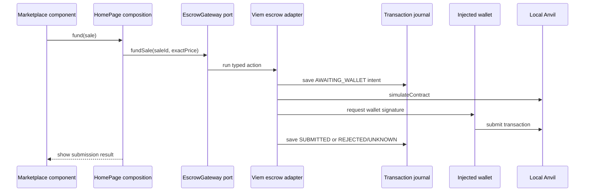

# 前端架構

[English](frontend.md) · [简体中文](frontend.zh-CN.md)

Web 將頁面組合、業務用例、長期瀏覽器功能和外部 SDK 保留在不同的擁有者中。這使得前端工作可以針對連接埠和產生的合約進行，而無需將錢包、HTTP 或持久性詳細資訊匯入功能模型中。

## 責任圖

| 層               | 地點                                      | 擁有                                            | 不得擁有                               |
| ---------------- | ----------------------------------------- | ----------------------------------------------- | -------------------------------------- |
| 頁面和使用者介面 | `apps/web/src/pages`，功能`ui`資料夾      | 渲染、路由組合、局部表單/公開狀態               | EVM 來電，持久交易真相，SQL            |
| 功能模組         | `apps/web/src/features`                   | 市場/交易用例、金額規則、功能端口               | Wagmi、Viem、HTTP 用戶端、localStorage |
| 能力             | `apps/web/src/capabilities`               | 錢包生命週期和跨頁面交易日誌/觀察               | 特定功能的銷售規則或 SDK 轉接器        |
| 介面埠           | 特性或功能公共 API                        | 面向消費者的操作和結果類型                      | 具體網路或儲存實現                     |
| 整合             | `apps/web/src/integrations`               | HTTP、Wagmi/Viem、連結時間、localStorage 轉接器 | 頁面策略或功能渲染                     |
| 組裝層           | `apps/web/src/app/composition.tsx` 和頁面 | 提供者組裝和適配器選擇                          | 純模組隱藏的服務位置                   |

具有進口能力公共出口和介面埠。集成實現了這些端口。靜態架構檢查器拒絕功能到功能的導入、跨功能的私有導入、純層中的 SDK、應用程式到應用程式的來源導入以及僅伺服器資料庫代碼的 Web 導入。

## 從組件到適配器的資助案例

`Marketplace`接收`MarketActions`；它不導入 Viem。 `HomePage` 讓 UI 操作適應 `EscrowGateway` 連接埠。 `use-escrow-gateway.ts` 以產生的 ABI 進行模擬並提交，而交易能力則在開啟錢包之前記錄不可變的帳戶、鏈、部署、合約、價值、操作和呼叫資料摘要。

市場價格使用交易功能的 bigint 格式化程式。它從 wei 發出精確的 ETH 小數，包括低於 1 毫以太的值和小於顯示單位的餘數。傳遞給 `MarketActions.fund` 的值仍然是原始的十進位 wei 字串。 UI 程式碼不得對此邊界使用 `Number`、`parseFloat` 或整數毫以太除法。

## 跨頁面和錢包的狀態所有權變化

- 元件本機狀態擁有表單輸入、揭露和即時回饋訊息。
- TanStack Query 擁有由部署身分鍵控的 API 快照。每個查詢函數也傳遞
  預期部署到 HTTP 適配器，該適配器拒絕來自另一個部署的回應來源。單獨的快取金鑰並不能驗證回應身份，而且新的查詢並不能證明 Indexer 已到達鏈頭。配置輪詢在本地服務替換後提供新的部署上下文；它不會取代回應檢查。
- 錢包功能擁有目前連線、帳戶、連結、掛起和錯誤網路狀態。
- 事務能力在日誌中擁有持久的操作上下文。頁面解除安裝不會
  取消對已知散列的觀察。
- 交易觀察埠在每次部署和操作時擁有一個驗證工作流程。
  其瀏覽器適配器跨選項卡使用 Web Locks，跳過繁忙的自動輪詢，對顯式手動檢查進行排隊，並在獲得所有權後重新加載日誌。記憶體中回退僅限於一個 JavaScript 領域。
- 在第一個持久之前，事務提交端口對每個不可變意圖擁有一個工作流程
  寫。它的瀏覽器適配器透過錢包和返回哈希處理跨選項卡使用 Web Locks；不同的意圖保持並發，後備僅覆蓋一個 JavaScript 領域。
- 重新載入會恢復日誌條目，並有足夠的證據可供查詢。稍後帳戶或鏈更改會發生
  不重寫原始操作的帳戶、鏈、合約或雜湊。
- `TransactionObserver`可以記錄收錄成功、收錄恢復、替換/取消，或者
  成為孤兒。 `INCLUDED_SUCCESS` 仍然與銷售、索賠和投影狀態分開。

## 證據和限制

`apps/web/src/features/trading/model/amount.test.ts` 涵蓋純金額規則。 `TransactionTimeline.test.tsx` 使用 React 測試庫涵蓋渲染的錢包拒絕語意。 `WalletPanel.test.tsx` 涵蓋了缺少的提供者和連接器選擇渲染。 `tests/e2e/marketplace.spec.ts` 使用環回演示連接器進行正常結算，並使用受控 EIP-1193 提供者進行重新載入、帳戶/網路變更和過時/追趕行為。 `tests/e2e/journal-multitab.spec.ts` 使用兩個 Chromium 頁面來驗證操作範圍的觀察所有權、錢包工作之前的相同意圖提交排除、所有者關閉切換，以及在所有權掛起時不相關的操作和日誌寫入仍然可用。手動 MetaMask 行為尚未被記錄。

看 [錢包和網路流量](../flows/wallet-and-network.zh-TW.md), [交易生命週期](../protocol/transaction-lifecycle.zh-TW.md)， 和 [依賴規則](dependency-rules.zh-TW.md).

## 公開鏈讀取的部署身分

核准權限與合約時間，必須先確認公開 RPC 的 chain ID 及 escrow `deploymentId()` 與目前 API 設定一致，才會顯示為已驗證的鏈上狀態。核准讀取共用擷取時的區塊高度；若觀察期間該區塊被替換，就拒絕結果。身分驗證失敗時，核准狀態為不可用，合約時間為未知。這項讀取側檢查與錢包請求前的獨立驗證並行。
