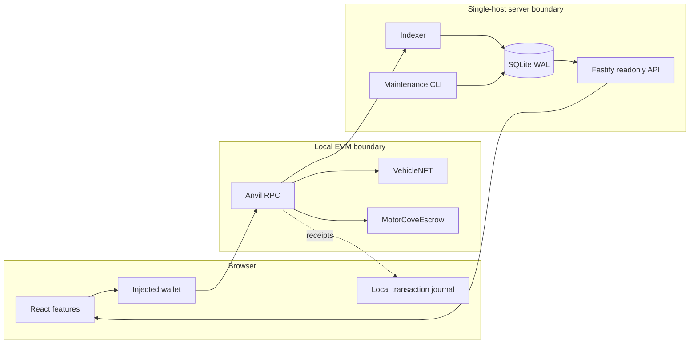
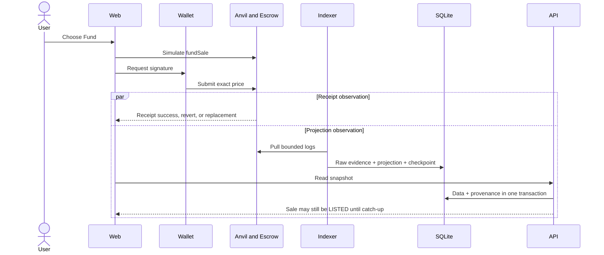

# Architecture overview

This page explains the runtime components, trust boundaries, and independent write, receipt, and
read paths. Import dependencies are documented separately in [dependency rules](dependency-rules.md).

## Runtime paths

The wallet owns transaction authorization. Contracts own custody, sale transitions, and claims.
The Indexer independently pulls logs and writes projections. The API never turns a frontend receipt
into a database state change. All server components are local processes; SQLite and its advisory
locks are not a cross-host service.

## Funding sequence

Receipt success establishes execution for one transaction. It does not establish that the API
projection is current. A stale API response is not a reason to fund again.

## Database boundary

Runtime API and Indexer composition use the public exports of `@motorcove/database`. The API receives
a readonly reader; only the Indexer SQLite adapter receives a projection writer; maintenance tooling
owns migration, seed, backup, restore, recovery, and reset operations. Architecture checks enforce
these import boundaries.

Continue with [frontend architecture](frontend.md), [backend and Indexer](backend-indexer.md),
[database architecture](database.md), or [flows](../flows/listing-and-funding.md).
