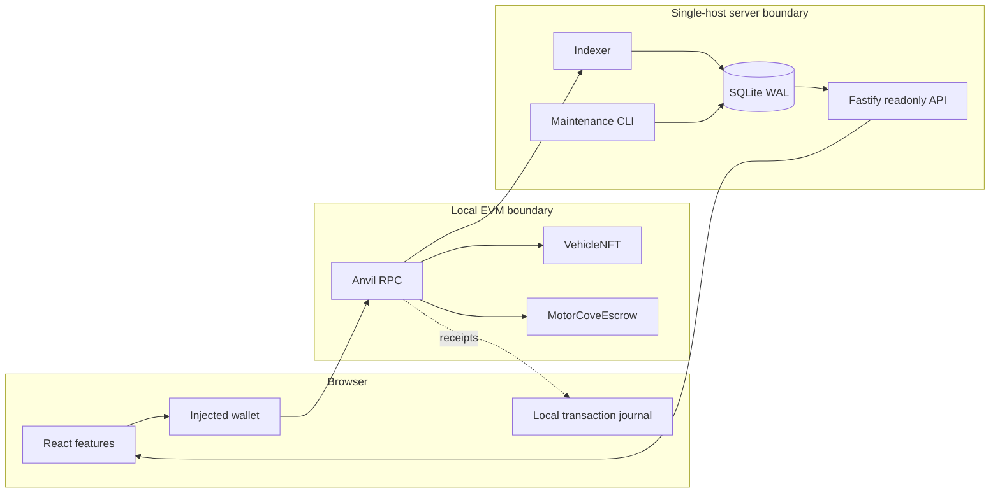
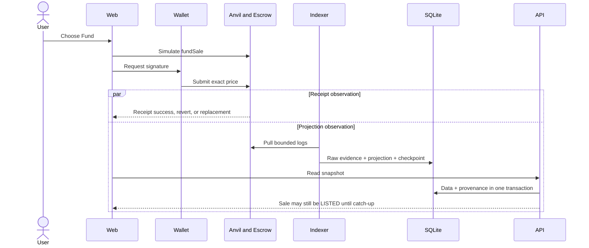

# 架构概述

[English](overview.md) · [繁體中文](overview.zh-TW.md)

本页介绍了运行时组件、信任边界以及独立的写入、接收和读取路径。导入依赖项单独记录在[依赖项规则](dependency-rules.zh-CN.md) 中。

## 运行时路径

钱包拥有交易授权。合约拥有保管权、销售转让和索赔权。 Indexer独立拉取日志并写入投影。 API 永远不会将前端接收转变为数据库状态更改。所有服务器组件都是本地进程； SQLite及其咨询锁不是跨主机服务。

## 资金顺序

收据成功即表示一笔交易的执行。它并不能证明 API 投影是当前的。陈旧的 API 响应并不是再次资助的理由。

## 数据库边界

运行时 API 和 Indexer 组合使用 `@motorcove/database` 的公共导出。 API接收一个只读读取器；仅 Indexer SQLite 适配器接收投影写入器；维护工具拥有迁移、种子、备份、恢复、恢复和重置操作。架构检查强制执行这些导入边界。

继续[前端架构](frontend.zh-CN.md)、[后端和 Indexer](backend-indexer.zh-CN.md)、[数据库架构](database.zh-CN.md) 或[流](../flows/listing-and-funding.zh-CN.md)。
