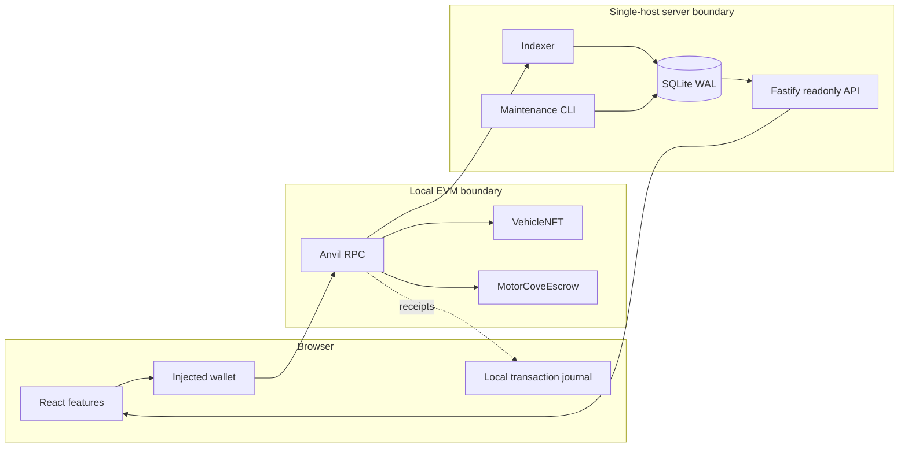
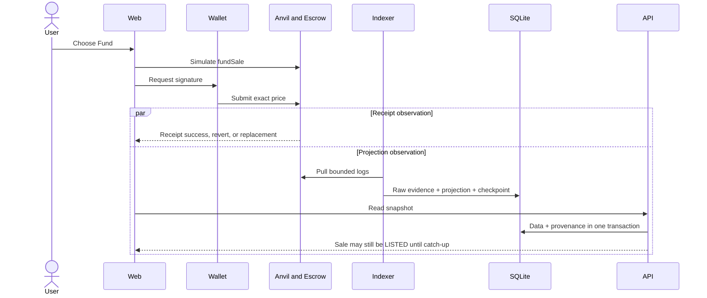

# 架構概述

[English](overview.md) · [简体中文](overview.zh-CN.md)

本頁介紹了運行時元件、信任邊界以及獨立的寫入、接收和讀取路徑。導入相依性單獨記錄在[依賴項規則](dependency-rules.zh-TW.md) 中。

## 運行時路徑

錢包擁有交易授權。合約擁有保管權、銷售轉讓和索賠權。 Indexer獨立拉取日誌並寫入投影。 API 永遠不會將前端接收轉變為資料庫狀態變更。所有伺服器元件都是本機進程； SQLite及其諮詢鎖定不是跨主機服務。

## 資金順序

收據成功即表示一筆交易的執行。它並不能證明 API 投影是目前的。陳舊的 API 回應並不是再次資助的理由。

## 資料庫邊界

運行時 API 和 Indexer 組合使用 `@motorcove/database` 的公共導出。 API接收一個唯讀讀取器；僅 Indexer SQLite 適配器接收投影寫入器；維護工具擁有遷移、種子、備份、復原、復原、重設作業。架構檢查強制執行這些導入邊界。

繼續[前端架構](frontend.zh-TW.md)、[後端和 Indexer](backend-indexer.zh-TW.md)、[資料庫架構](database.zh-TW.md) 或[流](../flows/listing-and-funding.zh-TW.md)。
