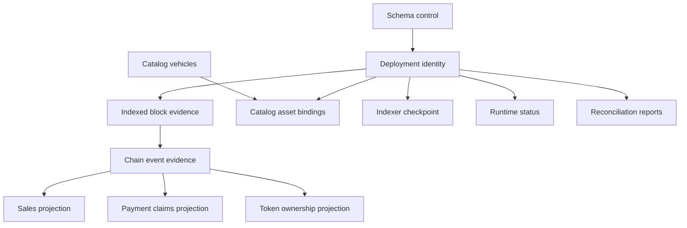

# Database model

## State classes

| Class               | Meaning                                                                     | Examples                                       |
| ------------------- | --------------------------------------------------------------------------- | ---------------------------------------------- |
| Schema control      | Evidence of the exact migration and schema contract installed               | `__drizzle_migrations`, `db_contract`          |
| Deployment identity | Immutable identity of the chain and contract generation represented locally | `deployments`                                  |
| Off-chain authority | Product information that chain history cannot reconstruct                   | `catalog_vehicles`, `catalog_asset_bindings`   |
| Raw chain evidence  | Retained observations used to interpret, replay, and audit chain history    | `indexed_blocks`, `chain_events`               |
| Derived projection  | Query-oriented state reproduced from verified canonical evidence            | `sales`, `payment_claims`, `token_ownership`   |
| Runtime observation | A cursor or health statement made by a particular Indexer execution         | `indexer_checkpoint`, `indexer_runtime_status` |
| Audit evidence      | A historical comparison at recorded anchors                                 | `reconciliation_runs`                          |

Deployment identity and off-chain catalog rows are local authority. Raw event rows are evidence of
what MotorCove observed, rather than a replacement for chain consensus. Projection rows are
rebuildable only when their declared source evidence has passed completeness and identity checks.
Runtime status is a last-known observation and must be interpreted with its heartbeat and observed
time. A reconciliation report remains attached to its own recorded anchors.

## Relationships

The diagram expresses logical responsibility. The [generated schema](schema-reference.generated.md)
is authoritative for physical foreign keys and primary keys.

## Core invariants

- Every chain-derived row belongs to one deployment generation.
- A block hash and height together identify observed branch evidence; height alone does not.
- Noncanonical event evidence may remain stored and must be interpreted through block canonicality.
- Catalog authority is preserved during projection rebuild and cannot be recovered by Indexer
  catch-up.
- A derived row is cleared only inside a controlled operation with a verified recovery source.
- Checkpoint block and hash are one atomic anchor for the projection generation.
- Sale history and current ERC-721 ownership remain separate facts.
- Runtime health does not create chain freshness evidence.
- A reconciliation report does not inherit the current projection scope or canonical head.

## Machine-readable contract

`@motorcove/database/model` exports `databaseModel`, `DatabaseTableName`, and the supported category
and backup vocabularies. Each table entry supplies its purpose, authority, writers, readers,
derived/rebuildable flags, recovery source, backup requirement, reorg behavior, and lifecycle.

The model intentionally does not repeat columns or SQL constraints. Documentation tooling compares
its keys with the tables produced by current migrations so both halves must cover the same physical
database.

## Table contracts

The following contracts are generated from `@motorcove/database/model`. SQL columns, constraints,
and indexes remain in the [physical schema reference](schema-reference.generated.md).

<!-- GENERATED:DATABASE-TABLE-CONTRACTS:START -->

### `__drizzle_migrations`

| Property            | Contract                                                                                                    |
| ------------------- | ----------------------------------------------------------------------------------------------------------- |
| Purpose             | Native migration ledger for the exact SQL history applied to this database.                                 |
| Category            | SCHEMA_CONTROL                                                                                              |
| Authority           | Repository Drizzle migration bundle                                                                         |
| Identity            | id                                                                                                          |
| Writers             | Drizzle migration runner                                                                                    |
| Readers             | Migration verifier; Maintenance commands                                                                    |
| Derived             | no                                                                                                          |
| Rebuildable         | no                                                                                                          |
| Recovery source     | Verified database backup or migration replay into a new empty database                                      |
| Backup requirement  | CRITICAL                                                                                                    |
| Restore requirement | Restore the exact native migration ledger with its database; never infer applied SQL from a newer checkout. |
| Reorg semantics     | Not chain-dependent.                                                                                        |
| Lifecycle           | Created and appended only by ordered migrations; existing rows are immutable.                               |

#### Temporal semantics

| Field        | Time class            | Meaning                                                         |
| ------------ | --------------------- | --------------------------------------------------------------- |
| `created_at` | `LOCAL_MUTATION_TIME` | Local migration ledger insertion time, not a chain observation. |

Migration ordering and SQL hashes, not wall-clock recency, determine validity.

### `db_contract`

| Property            | Contract                                                                             |
| ------------------- | ------------------------------------------------------------------------------------ |
| Purpose             | Attestation that the database matches one repository schema contract.                |
| Category            | SCHEMA_CONTROL                                                                       |
| Authority           | Verified schema contract, migration bundle, and schema fingerprint                   |
| Identity            | singleton contract row                                                               |
| Writers             | Migration maintenance operation                                                      |
| Readers             | Database verifier; Backup and restore tooling                                        |
| Derived             | yes                                                                                  |
| Rebuildable         | yes                                                                                  |
| Recovery source     | Successful verification against the repository schema contract                       |
| Backup requirement  | CONVENIENCE                                                                          |
| Restore requirement | Reverify the schema contract and history against this source revision after restore. |
| Reorg semantics     | Not chain-dependent.                                                                 |
| Lifecycle           | Updated only after the complete migration and schema verification transaction.       |

#### Temporal semantics

| Field         | Time class          | Meaning                                                             |
| ------------- | ------------------- | ------------------------------------------------------------------- |
| `verified_at` | `VERIFICATION_TIME` | Time migration finalization published the verified schema contract. |

A newer timestamp cannot substitute for a matching schema fingerprint.

### `deployments`

| Property            | Contract                                                                                              |
| ------------------- | ----------------------------------------------------------------------------------------------------- |
| Purpose             | Immutable descriptor for the chain and contract generation represented by the database.               |
| Category            | DEPLOYMENT_IDENTITY                                                                                   |
| Authority           | Verified deployment manifest and on-chain contract identity                                           |
| Identity            | deployment_id                                                                                         |
| Writers             | Bootstrap deployment registration                                                                     |
| Readers             | API startup; Indexer; Backup and restore; Reconciliation                                              |
| Derived             | no                                                                                                    |
| Rebuildable         | no                                                                                                    |
| Recovery source     | Compatible deployment manifest plus verified on-chain identity                                        |
| Backup requirement  | CRITICAL                                                                                              |
| Restore requirement | Restore only with compatible active deployment manifest and bootstrap generation evidence.            |
| Reorg semantics     | Deployment block hashes are identity evidence and must not be silently replaced.                      |
| Lifecycle           | Inserted once for a managed deployment generation; replacement requires a new environment generation. |

#### Temporal semantics

| Field           | Time class            | Meaning                                                   |
| --------------- | --------------------- | --------------------------------------------------------- |
| `registered_at` | `LOCAL_MUTATION_TIME` | Local registration time after deployment identity checks. |

Deployment blocks and hashes are chain anchors; registered_at is not deployment time on-chain.

### `catalog_vehicles`

| Property            | Contract                                                                                     |
| ------------------- | -------------------------------------------------------------------------------------------- |
| Purpose             | MotorCove product metadata that has no complete on-chain representation.                     |
| Category            | OFFCHAIN_AUTHORITY                                                                           |
| Authority           | MotorCove catalog seed or explicit local catalog input                                       |
| Identity            | catalog_id                                                                                   |
| Writers             | Catalog seed maintenance command                                                             |
| Readers             | API; Catalog binding maintenance; Projection rebuild preservation                            |
| Derived             | no                                                                                           |
| Rebuildable         | no                                                                                           |
| Recovery source     | Verified database backup or the exact authoritative catalog input                            |
| Backup requirement  | CRITICAL                                                                                     |
| Restore requirement | Restore authoritative catalog rows from a verified compatible backup or exact catalog input. |
| Reorg semantics     | Catalog rows are independent of chain canonicality.                                          |
| Lifecycle           | Seeded idempotently and updated only under exclusive maintenance ownership.                  |

#### Temporal semantics

| Field        | Time class            | Meaning                           |
| ------------ | --------------------- | --------------------------------- |
| `created_at` | `LOCAL_MUTATION_TIME` | Local catalog row creation time.  |
| `updated_at` | `LOCAL_MUTATION_TIME` | Last local catalog mutation time. |

Seed set identity and version govern authority; timestamps alone do not prove catalog content.

### `catalog_asset_bindings`

| Property            | Contract                                                                                                       |
| ------------------- | -------------------------------------------------------------------------------------------------------------- |
| Purpose             | Binds local catalog identity to a token in one deployment and collection.                                      |
| Category            | OFFCHAIN_AUTHORITY                                                                                             |
| Authority           | MotorCove catalog authority constrained by deployment identity                                                 |
| Identity            | deployment_id + collection_address + token_id                                                                  |
| Writers             | Catalog seed maintenance command                                                                               |
| Readers             | API; Catalog and token projection queries                                                                      |
| Derived             | no                                                                                                             |
| Rebuildable         | no                                                                                                             |
| Recovery source     | Verified database backup or the exact authoritative binding input                                              |
| Backup requirement  | CRITICAL                                                                                                       |
| Restore requirement | Restore bindings with the same deployment and catalog generation; chain replay cannot recreate catalog intent. |
| Reorg semantics     | Bindings remain deployment-scoped; a reorg does not rewrite catalog intent.                                    |
| Lifecycle           | Created idempotently after both deployment and catalog rows exist.                                             |

#### Temporal semantics

No physical timestamp or block-time field is recorded in this table.

No wall-clock column; deployment, token identity, binding source, and seed version carry lifecycle meaning.

### `indexed_blocks`

| Property            | Contract                                                                                         |
| ------------------- | ------------------------------------------------------------------------------------------------ |
| Purpose             | Block identity, canonicality, scan completeness, and observed-log digest evidence.               |
| Category            | RAW_CHAIN_EVIDENCE                                                                               |
| Authority           | Verified chain observation for the configured deployment and log scope                           |
| Identity            | deployment_id + block_hash; one canonical hash per height                                        |
| Writers             | Indexer ingestion; Reindex maintenance                                                           |
| Readers             | Indexer; Projection rebuild; Reconciliation; Diagnostics                                         |
| Derived             | no                                                                                               |
| Rebuildable         | yes                                                                                              |
| Recovery source     | Explicit reindex from the verified deployment scan start                                         |
| Backup requirement  | PREFER                                                                                           |
| Restore requirement | Retain verified source evidence when possible; otherwise reacquire through explicit reindex.     |
| Reorg semantics     | Competing hashes may be retained; exactly one canonical row may exist per deployment and height. |
| Lifecycle           | Inserted during ingestion, canonicality changes atomically with event and projection updates.    |

#### Temporal semantics

| Field             | Time class   | Meaning                                          |
| ----------------- | ------------ | ------------------------------------------------ |
| `block_timestamp` | `CHAIN_TIME` | Timestamp supplied by the observed block header. |

Canonicality and scan completeness are branch evidence, not a live observation timestamp.

### `chain_events`

| Property            | Contract                                                                                                 |
| ------------------- | -------------------------------------------------------------------------------------------------------- |
| Purpose             | Raw and decoded contract-log evidence retained before projection interpretation.                         |
| Category            | RAW_CHAIN_EVIDENCE                                                                                       |
| Authority           | Verified chain log observation and recorded decoder version                                              |
| Identity            | deployment_id + block_hash + log_index                                                                   |
| Writers             | Indexer ingestion; Reindex maintenance                                                                   |
| Readers             | Projection rebuild; Reconciliation; Diagnostics                                                          |
| Derived             | no                                                                                                       |
| Rebuildable         | yes                                                                                                      |
| Recovery source     | Explicit reindex from canonical block headers and logs                                                   |
| Backup requirement  | PREFER                                                                                                   |
| Restore requirement | Retain verified raw event evidence when possible; reacquire only through explicit reindex.               |
| Reorg semantics     | Historical noncanonical events remain auditable and are interpreted through indexed_blocks canonicality. |
| Lifecycle           | Inserted with source digests in the same unit of work as block and checkpoint evidence.                  |

#### Temporal semantics

| Field           | Time class         | Meaning                                  |
| --------------- | ------------------ | ---------------------------------------- |
| `first_seen_at` | `OBSERVATION_TIME` | First local observation of this raw log. |

Block hash, transaction index, and log index identify chain position; first_seen_at does not establish canonicality.

### `indexer_checkpoint`

| Property            | Contract                                                                                                 |
| ------------------- | -------------------------------------------------------------------------------------------------------- |
| Purpose             | Committed cursor and projection-generation identity for incremental ingestion.                           |
| Category            | RUNTIME_OBSERVATION                                                                                      |
| Authority           | Last atomically committed canonical ingestion unit                                                       |
| Identity            | deployment_id                                                                                            |
| Writers             | Indexer ingestion; Projection rebuild; Reindex maintenance                                               |
| Readers             | Indexer; API provenance; Maintenance and reconciliation                                                  |
| Derived             | yes                                                                                                      |
| Rebuildable         | yes                                                                                                      |
| Recovery source     | Verified indexed_blocks and chain_events, or explicit reindex                                            |
| Backup requirement  | CONVENIENCE                                                                                              |
| Restore requirement | Restore with matching source and projection generation; verify its block anchor before normal ingestion. |
| Reorg semantics     | Checkpoint block and hash must remain an inseparable canonical anchor.                                   |
| Lifecycle           | Advances only in the atomic event/projection commit and may rewind only under explicit recovery.         |

#### Temporal semantics

| Field        | Time class            | Meaning                                                    |
| ------------ | --------------------- | ---------------------------------------------------------- |
| `updated_at` | `LOCAL_MUTATION_TIME` | Local atomic checkpoint update or maintenance rewind time. |

last_scanned_block/hash are chain anchors; updated_at alone cannot prove current chain head.

### `sales`

| Property            | Contract                                                                                   |
| ------------------- | ------------------------------------------------------------------------------------------ |
| Purpose             | Query-efficient projection of escrow sale state.                                           |
| Category            | DERIVED_PROJECTION                                                                         |
| Authority           | Verified canonical MotorCoveEscrow events                                                  |
| Identity            | deployment_id + sale_id                                                                    |
| Writers             | Indexer projector; Projection rebuild; Reindex maintenance                                 |
| Readers             | API; Reconciliation                                                                        |
| Derived             | yes                                                                                        |
| Rebuildable         | yes                                                                                        |
| Recovery source     | Verified canonical chain_events; explicit reindex when source evidence is suspect          |
| Backup requirement  | CONVENIENCE                                                                                |
| Restore requirement | Restore as a derived convenience only; verify canonical source or explicitly reindex.      |
| Reorg semantics     | Rows follow the canonical event sequence and roll back atomically with checkpoint changes. |
| Lifecycle           | Created by SaleCreated and advanced only by valid sale-state transitions.                  |

#### Temporal semantics

| Field           | Time class      | Meaning                                                        |
| --------------- | --------------- | -------------------------------------------------------------- |
| `funded_at`     | `BUSINESS_TIME` | Contract-funded timestamp used to derive the payment deadline. |
| `expires_at`    | `BUSINESS_TIME` | Contract-derived sale expiry deadline.                         |
| `created_block` | `CHAIN_TIME`    | Canonical creation block height.                               |
| `updated_block` | `CHAIN_TIME`    | Canonical last transition block height.                        |

Block/hash/log provenance and contract deadlines are more meaningful than a local row update clock.

### `payment_claims`

| Property            | Contract                                                                                     |
| ------------------- | -------------------------------------------------------------------------------------------- |
| Purpose             | Projection of pull-payment claims and withdrawal state.                                      |
| Category            | DERIVED_PROJECTION                                                                           |
| Authority           | Verified canonical escrow claim events                                                       |
| Identity            | deployment_id + sale_id                                                                      |
| Writers             | Indexer projector; Projection rebuild; Reindex maintenance                                   |
| Readers             | API; Reconciliation                                                                          |
| Derived             | yes                                                                                          |
| Rebuildable         | yes                                                                                          |
| Recovery source     | Verified canonical chain_events; explicit reindex when source evidence is suspect            |
| Backup requirement  | CONVENIENCE                                                                                  |
| Restore requirement | Restore as a derived convenience only; verify claim creation and withdrawal source evidence. |
| Reorg semantics     | Claim state follows canonical creation and withdrawal events.                                |
| Lifecycle           | Created with a claim event and marked withdrawn only by its matching canonical event.        |

#### Temporal semantics

| Field                   | Time class   | Meaning                                                  |
| ----------------------- | ------------ | -------------------------------------------------------- |
| `creation_block_hash`   | `CHAIN_TIME` | Block anchor of the canonical claim creation event.      |
| `withdrawal_block_hash` | `CHAIN_TIME` | Optional block anchor of the canonical withdrawal event. |

Log indexes pair with block hashes; no local wall-clock timestamp is needed to identify claim order.

### `token_ownership`

| Property            | Contract                                                                               |
| ------------------- | -------------------------------------------------------------------------------------- |
| Purpose             | Current ERC-721 ownership projection independent of historical sale buyer identity.    |
| Category            | DERIVED_PROJECTION                                                                     |
| Authority           | Verified canonical VehicleNFT Transfer events                                          |
| Identity            | deployment_id + collection_address + token_id                                          |
| Writers             | Indexer projector; Projection rebuild; Reindex maintenance                             |
| Readers             | API; Reconciliation                                                                    |
| Derived             | yes                                                                                    |
| Rebuildable         | yes                                                                                    |
| Recovery source     | Verified canonical VehicleNFT chain_events or explicit reindex                         |
| Backup requirement  | CONVENIENCE                                                                            |
| Restore requirement | Restore as a derived convenience only; verify canonical transfer evidence or reindex.  |
| Reorg semantics     | Ownership follows the canonical transfer sequence at the checkpoint.                   |
| Lifecycle           | Upserted for every canonical mint or transfer; never inferred from sale history alone. |

#### Temporal semantics

| Field                      | Time class   | Meaning                                                |
| -------------------------- | ------------ | ------------------------------------------------------ |
| `updated_block`            | `CHAIN_TIME` | Canonical block height of the last reflected transfer. |
| `last_transfer_block_hash` | `CHAIN_TIME` | Block anchor of the last reflected transfer.           |

Block hash and log index, not a local update time, establish transfer provenance.

### `indexer_runtime_status`

| Property            | Contract                                                                                                       |
| ------------------- | -------------------------------------------------------------------------------------------------------------- |
| Purpose             | Last-known projection health, chain observation, recovery reason, and worker heartbeat.                        |
| Category            | RUNTIME_OBSERVATION                                                                                            |
| Authority           | Indexer runtime and live RPC observation                                                                       |
| Identity            | deployment_id                                                                                                  |
| Writers             | Indexer runtime; Explicit projection maintenance                                                               |
| Readers             | API system status; Web freshness presentation; Maintenance diagnostics                                         |
| Derived             | yes                                                                                                            |
| Rebuildable         | yes                                                                                                            |
| Recovery source     | Fresh Indexer execution and explicit recovery transitions                                                      |
| Backup requirement  | NONE                                                                                                           |
| Restore requirement | Treat restored status and heartbeat as last-known evidence; require a new live observation for freshness.      |
| Reorg semantics     | A detected conflict moves health toward recovery; maintenance must not invent live freshness.                  |
| Lifecycle           | Updated by observation, commit, failure, and recovery transitions without replacing historical chain evidence. |

#### Temporal semantics

| Field                   | Time class              | Meaning                                                             |
| ----------------------- | ----------------------- | ------------------------------------------------------------------- |
| `worker_heartbeat_at`   | `PROCESS_LIVENESS_TIME` | Last worker liveness write; local rebuild does not renew it.        |
| `last_rpc_success_at`   | `OBSERVATION_TIME`      | Last successful live RPC observation by the worker.                 |
| `last_observed_at`      | `OBSERVATION_TIME`      | Time the recorded chain head was observed.                          |
| `last_head_advanced_at` | `OBSERVATION_TIME`      | Last live observation when the latest observed chain head advanced. |

projection_status and recovery_reason are durable state claims; CURRENT alone does not prove current freshness.

### `reconciliation_runs`

| Property            | Contract                                                                                                                                                          |
| ------------------- | ----------------------------------------------------------------------------------------------------------------------------------------------------------------- |
| Purpose             | Historical report of a projection-to-chain comparison at explicit anchors.                                                                                        |
| Category            | AUDIT_EVIDENCE                                                                                                                                                    |
| Authority           | Reconciliation observation at its recorded deployment, scope, checkpoint, and head                                                                                |
| Identity            | id; deployment_id plus run_sequence orders reports for that deployment                                                                                            |
| Writers             | Reconciliation CLI                                                                                                                                                |
| Readers             | API diagnostics; Operators                                                                                                                                        |
| Derived             | yes                                                                                                                                                               |
| Rebuildable         | no                                                                                                                                                                |
| Recovery source     | Verified database backup; a new run cannot recreate the prior observation                                                                                         |
| Backup requirement  | PREFER                                                                                                                                                            |
| Restore requirement | Preserve each historical report with its original scope, block/hash, and projection build.                                                                        |
| Reorg semantics     | A report remains tied to its historical anchors and never inherits current canonicality.                                                                          |
| Lifecycle           | Append-only report publication after comparison result is fully determined; run_sequence is allocated transactionally under reconciliation maintenance ownership. |

#### Temporal semantics

| Field        | Time class          | Meaning                                                      |
| ------------ | ------------------- | ------------------------------------------------------------ |
| `created_at` | `VERIFICATION_TIME` | Time this anchored comparison report was published.          |
| `block_hash` | `CHAIN_TIME`        | Chain anchor against which this report compared projections. |

created_at is human publication time; run_sequence, not wall time, selects the latest report. A report never inherits a later checkpoint, scope, or chain head.

<!-- GENERATED:DATABASE-TABLE-CONTRACTS:END -->
