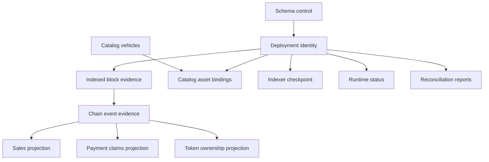

# Database model

## State classes

| Class               | Meaning                                                                     | Examples                                       |
| ------------------- | --------------------------------------------------------------------------- | ---------------------------------------------- |
| Schema control      | Evidence of the exact migration and schema contract installed               | `__drizzle_migrations`, `db_contract`          |
| Deployment identity | Immutable identity of the chain and contract generation represented locally | `deployments`                                  |
| Off-chain authority | Product information that chain history cannot reconstruct                   | `catalog_vehicles`, `catalog_asset_bindings`   |
| Raw chain evidence  | Retained observations used to interpret, replay, and audit chain history    | `indexed_blocks`, `chain_events`               |
| Derived projection  | Query-oriented state reproduced from verified canonical evidence            | `sales`, `payment_claims`, `token_ownership`   |
| Runtime observation | A cursor or health statement made by a particular Indexer execution         | `indexer_checkpoint`, `indexer_runtime_status` |
| Audit evidence      | A historical comparison at recorded anchors                                 | `reconciliation_runs`                          |

Deployment identity and off-chain catalog rows are local authority. Raw event rows are evidence of
what MotorCove observed, rather than a replacement for chain consensus. Projection rows are
rebuildable only when their declared source evidence has passed completeness and identity checks.
Runtime status is a last-known observation and must be interpreted with its heartbeat and observed
time. A reconciliation report remains attached to its own recorded anchors.

## Relationships

The diagram expresses logical responsibility. The [generated schema](schema-reference.generated.md)
is authoritative for physical foreign keys and primary keys.

## Core invariants

- Every chain-derived row belongs to one deployment generation.
- A block hash and height together identify observed branch evidence; height alone does not.
- Noncanonical event evidence may remain stored and must be interpreted through block canonicality.
- Catalog authority is preserved during projection rebuild and cannot be recovered by Indexer
  catch-up.
- A derived row is cleared only inside a controlled operation with a verified recovery source.
- Checkpoint block and hash are one atomic anchor for the projection generation.
- Sale history and current ERC-721 ownership remain separate facts.
- Runtime health does not create chain freshness evidence.
- A reconciliation report does not inherit the current projection scope or canonical head.

## Machine-readable contract

`@motorcove/database/model` exports `databaseModel`, `DatabaseTableName`, and the supported category
and backup vocabularies. Each table entry supplies its purpose, authority, writers, readers,
derived/rebuildable flags, recovery source, backup requirement, reorg behavior, and lifecycle.

The model intentionally does not repeat columns or SQL constraints. Documentation tooling compares
its keys with the tables produced by current migrations so both halves must cover the same physical
database.
