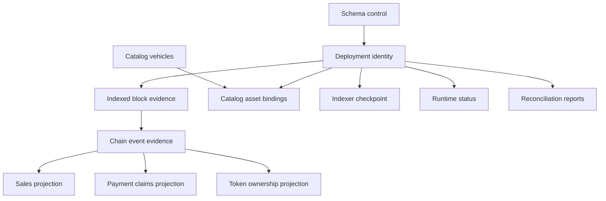

# 数据库模型

[English](database-model.md) · [繁體中文](database-model.zh-TW.md)

## 状态类

| 班级         | 含义                                        | 示例                                           |
| ------------ | ------------------------------------------- | ---------------------------------------------- |
| 模式控制     | 安装的确切迁移和架构合约的证据              | `__drizzle_migrations`, `db_contract`          |
| 部署身份     | 本地代表的链和合约生成的不可变身份          | `deployments`                                  |
| 链下权威来源 | 链历史无法重构的产品信息                    | `catalog_vehicles`, `catalog_asset_bindings`   |
| 原始链证据   | 保留的观察结果用于解释、重放和审计链历史    | `indexed_blocks`, `chain_events`               |
| 派生投影     | 从经过验证的规范证据再现面向查询的状态      | `sales`, `payment_claims`, `token_ownership`   |
| 运行时观察   | 由特定 Indexer 执行生成的游标或运行状况语句 | `indexer_checkpoint`, `indexer_runtime_status` |
| 审计证据     | 记录锚点的历史比较                          | `reconciliation_runs`                          |

部署身份和链外目录行是本地权威来源。原始事件行是 MotorCove 观察到的证据，而不是链共识的替代品。仅当投影行声明的源证据通过完整性和身份检查时，才可重建。运行时状态是最后已知的观察结果，必须用其心跳和观察时间来解释。 对账报告仍附加到其自己记录的锚点。

## 人际关系

该图表达了逻辑责任。 [生成的架构](schema-reference.generated.zh-CN.md) 对于物理外键和主键具有权威性。

## 核心不变量

- 每个链派生行都属于一个部署代。
- 块哈希和高度一起识别观察到的分支证据；仅凭身高并不能。
- 非规范事件证据可能会继续存储，并且必须通过块规范性进行解释。
- 目录权威来源在投影重建期间保留，并且无法由 Indexer 恢复
  追赶。
- 仅在具有经过验证的恢复源的受控操作内清除派生行。
- 检查点块和哈希是投影一代的原子锚点。
- Sale 的历史和当前的 ERC-721 所有权仍然是不同的事实。
- 运行时健康状况不会创建链新鲜度证据。
- 对账报告不会继承当前的投影范围或规范头。

## 机器可读的合约

`@motorcove/database/model` 导出 `databaseModel`、`DatabaseTableName` 以及支持的类别和备份词汇表。每个表条目提供其用途、权威来源、写入器、读取器、派生/可重建标志、恢复源、备份要求、重组行为和生命周期。

该模型有意不重复列或 SQL 约束。文档工具将其键与当前迁移生成的表进行比较，因此两半必须覆盖相同的物理数据库。

## 表合约

以下合约是由 `@motorcove/database/model` 生成的。 SQL 列、约束和索引保留在 [物理架构参考](schema-reference.generated.zh-CN.md) 中。

<!-- GENERATED:DATABASE-TABLE-CONTRACTS:START -->

### `__drizzle_migrations`

| 财产     | 合约                                                                     |
| -------- | ------------------------------------------------------------------------ |
| 目的     | 应用于此数据库的确切 SQL 历史记录的本机迁移分类帐。                      |
| 类别     | SCHEMA_CONTROL                                                           |
| 权威来源 | 存储库 Drizzle 迁移捆绑包                                                |
| 身份     | 编号                                                                     |
| 作家     | Drizzle 迁移运行程序                                                     |
| 读者     | 迁移验证器；维护命令                                                     |
| 派生     | 不                                                                       |
| 可重建   | 不                                                                       |
| 恢复来源 | 已验证的数据库备份或迁移重播到新的空数据库                               |
| 备份要求 | 关键                                                                     |
| 恢复要求 | 恢复准确的本机迁移账本及其数据库；永远不要从较新的结帐中推断应用的 SQL。 |
| 重组语义 | 不依赖链。                                                               |
| 生命周期 | 仅通过有序迁移创建和附加；现有行是不可变的。                             |

#### 时间语义

| 领域         | 时间班                | 含义                                 |
| ------------ | --------------------- | ------------------------------------ |
| `created_at` | `LOCAL_MUTATION_TIME` | 本地迁移账本插入时间，不是链式观察。 |

迁移顺序和 SQL 哈希（而不是挂钟新近度）决定有效性。

### `db_contract`

| 财产     | 合约                                           |
| -------- | ---------------------------------------------- |
| 目的     | 证明数据库与一个存储库架构合约相匹配。         |
| 类别     | SCHEMA_CONTROL                                 |
| 权威来源 | 已验证的架构合约、迁移包和架构指纹             |
| 身份     | 单例合约行                                     |
| 作家     | 迁移维护操作                                   |
| 读者     | 数据库验证器；备份和恢复工具                   |
| 派生     | 是的                                           |
| 可重建   | 是的                                           |
| 恢复来源 | 成功验证存储库架构合约                         |
| 备份要求 | 便利性                                         |
| 恢复要求 | 恢复后根据此源修订重新验证架构合约和历史记录。 |
| 重组语义 | 不依赖链。                                     |
| 生命周期 | 仅在完成迁移和架构验证事务后更新。             |

#### 时间语义

| 领域          | 时间班              | 含义                                   |
| ------------- | ------------------- | -------------------------------------- |
| `verified_at` | `VERIFICATION_TIME` | 时间迁移完成发布了经过验证的模式合约。 |

较新的时间戳无法替代匹配的架构指纹。

### `deployments`

| 财产     | 合约                                             |
| -------- | ------------------------------------------------ |
| 目的     | 由数据库表示的链和合约生成的不可变描述符。       |
| 类别     | 部署标识                                         |
| 权威来源 | 已验证的部署清单和链上合约身份                   |
| 身份     | 部署 ID                                          |
| 作家     | 引导部署注册                                     |
| 读者     | API启动； Indexer；备份与恢复； 对账             |
| 派生     | 不                                               |
| 可重建   | 不                                               |
| 恢复来源 | 兼容的部署清单加上经过验证的链上身份             |
| 备份要求 | 关键                                             |
| 恢复要求 | 仅使用兼容的活动部署清单和引导生成证据进行恢复。 |
| 重组语义 | 部署块哈希是身份证据，不得被悄悄替换。           |
| 生命周期 | 插入一次以生成托管部署；更换需要生成新的环境。   |

#### 时间语义

| 领域            | 时间班                | 含义                           |
| --------------- | --------------------- | ------------------------------ |
| `registered_at` | `LOCAL_MUTATION_TIME` | 部署身份检查后的本地注册时间。 |

部署块和哈希是链锚； Registered_at 不是链上部署时间。

### `catalog_vehicles`

| 财产     | 合约                                                   |
| -------- | ------------------------------------------------------ |
| 目的     | MotorCove 没有完整链上表示的产品元数据。               |
| 类别     | OFFCHAIN\_权威来源                                     |
| 权威来源 | MotorCove 目录种子或显式本地目录输入                   |
| 身份     | 目录ID                                                 |
| 作家     | 目录种子维护命令                                       |
| 读者     | API;目录装订维护； 投影重建保存                        |
| 派生     | 不                                                     |
| 可重建   | 不                                                     |
| 恢复来源 | 经过验证的数据库备份或准确的权威目录输入               |
| 备份要求 | 关键                                                   |
| 恢复要求 | 从经过验证的兼容备份或精确的目录输入中恢复权威目录行。 |
| 重组语义 | 目录行独立于链规范性。                                 |
| 生命周期 | 幂等播种并仅在独占维护所有权下更新。                   |

#### 时间语义

| 领域         | 时间班                | 含义                   |
| ------------ | --------------------- | ---------------------- |
| `created_at` | `LOCAL_MUTATION_TIME` | 本地目录行创建时间。   |
| `updated_at` | `LOCAL_MUTATION_TIME` | 上次本地目录突变时间。 |

种子集标识和版本控制权威来源；时间戳本身并不能证明目录内容。

### `catalog_asset_bindings`

| 财产     | 合约                                                           |
| -------- | -------------------------------------------------------------- |
| 目的     | 将本地目录身份绑定到一个部署和集合中的令牌。                   |
| 类别     | OFFCHAIN\_权威来源                                             |
| 权威来源 | MotorCove 目录权威来源受部署标识约束                           |
| 身份     | 部署 ID + 集合地址 + 令牌 ID                                   |
| 作家     | 目录种子维护命令                                               |
| 读者     | API;目录和令牌投影查询                                         |
| 派生     | 不                                                             |
| 可重建   | 不                                                             |
| 恢复来源 | 经过验证的数据库备份或确切的权威绑定输入                       |
| 备份要求 | 关键                                                           |
| 恢复要求 | 使用相同的部署和目录生成恢复绑定；链重播无法重新创建目录意图。 |
| 重组语义 | 绑定仍然是部署范围内的；重组不会重写目录意图。                 |
| 生命周期 | 在部署行和目录行都存在后以幂等方式创建。                       |

#### 时间语义

该表中没有记录任何物理时间戳或块时间字段。

无挂钟柱；部署、令牌身份、绑定源和种子版本具有生命周期意义。

### `indexed_blocks`

| 财产     | 合约                                                         |
| -------- | ------------------------------------------------------------ |
| 目的     | 块身份、规范性、扫描完整性和观察日志摘要证据。               |
| 类别     | RAW*CHAIN*证据                                               |
| 权威来源 | 针对配置的部署和日志范围验证了链观察                         |
| 身份     | 部署 ID + 区块哈希值；每个高度一个规范哈希                   |
| 作家     | Indexer摄取；重建索引维护                                    |
| 读者     | Indexer; 投影重建； 对账；诊断                               |
| 派生     | 不                                                           |
| 可重建   | 是的                                                         |
| 恢复来源 | 从已验证的部署扫描开始显式重新索引                           |
| 备份要求 | 偏好                                                         |
| 恢复要求 | 尽可能保留经过验证的来源证据；否则通过显式重新索引重新获取。 |
| 重组语义 | 可以保留竞争的哈希值；每个部署和高度可能只存在一个规范行。   |
| 生命周期 | 在摄取期间插入，规范性会随着事件和投影更新而自动更改。       |

#### 时间语义

| 领域              | 时间班       | 含义                         |
| ----------------- | ------------ | ---------------------------- |
| `block_timestamp` | `CHAIN_TIME` | 由观察到的块头提供的时间戳。 |

规范性和扫描完整性是分支证据，而不是实时观察时间戳。

### `chain_events`

| 财产     | 合约                                                             |
| -------- | ---------------------------------------------------------------- |
| 目的     | 在投影解释之前保留的原始和解码的合约日志证据。                   |
| 类别     | RAW*CHAIN*证据                                                   |
| 权威来源 | 验证链日志观察并记录解码器版本                                   |
| 身份     | 部署id + 区块哈希值 + 日志索引                                   |
| 作家     | Indexer摄取；重建索引维护                                        |
| 读者     | 投影重建； 对账；诊断                                            |
| 派生     | 不                                                               |
| 可重建   | 是的                                                             |
| 恢复来源 | 从规范块头和日志中显式重新索引                                   |
| 备份要求 | 偏好                                                             |
| 恢复要求 | 尽可能保留经过验证的原始事件证据；仅通过显式重新索引来重新获取。 |
| 重组语义 | 历史非规范事件仍然可审计，并通过 indexed_blocks 规范性进行解释。 |
| 生命周期 | 在与块和检查点证据相同的工作单元中插入源摘要。                   |

#### 时间语义

| 领域            | 时间班             | 含义                         |
| --------------- | ------------------ | ---------------------------- |
| `first_seen_at` | `OBSERVATION_TIME` | 对该原始日志的首次本地观察。 |

区块哈希、交易索引、日志索引识别链位置； first_seen_at 不建立规范性。

### `indexer_checkpoint`

| 财产     | 合约                                                        |
| -------- | ----------------------------------------------------------- |
| 目的     | 提交的游标和投影生成标识用于增量摄取。                      |
| 类别     | 运行时观察                                                  |
| 权威来源 | 最后一个原子提交的规范摄取单元                              |
| 身份     | 部署 ID                                                     |
| 作家     | Indexer摄取； 投影重建；重建索引维护                        |
| 读者     | Indexer; API出处；维修及对账                                |
| 派生     | 是的                                                        |
| 可重建   | 是的                                                        |
| 恢复来源 | 已验证的indexed_blocks和chain_events，或显式重新索引        |
| 备份要求 | 便利性                                                      |
| 恢复要求 | 使用匹配源和投影生成进行恢复；在正常摄取之前验证其块锚点。  |
| 重组语义 | 检查点块和哈希必须保持不可分割的规范锚。                    |
| 生命周期 | 仅在原子事件/投影提交中前进，并且仅在显式恢复下才可能回滚。 |

#### 时间语义

| 领域         | 时间班                | 含义                               |
| ------------ | --------------------- | ---------------------------------- |
| `updated_at` | `LOCAL_MUTATION_TIME` | 本地原子检查点更新或维护回滚时间。 |

last_scanned_block/hash 是链锚； update_at 本身无法证明当前链头。

### `sales`

| 财产     | 合约                                                  |
| -------- | ----------------------------------------------------- |
| 目的     | 托管销售状态查询高效投影。                            |
| 类别     | 派生\_投影                                            |
| 权威来源 | 已验证的规范 MotorCoveEscrow 事件                     |
| 身份     | 部署 ID + 销售 ID                                     |
| 作家     | Indexer 投影器； 投影重建；重建索引维护               |
| 读者     | API; 对账                                             |
| 派生     | 是的                                                  |
| 可重建   | 是的                                                  |
| 恢复来源 | 已验证规范的 chain_events；当源证据可疑时显式重新索引 |
| 备份要求 | 便利性                                                |
| 恢复要求 | 恢复仅作为衍生便利；验证规范来源或显式重新索引。      |
| 重组语义 | 行遵循规范的事件序列，并通过检查点更改自动回滚。      |
| 生命周期 | 由 Sale 创建并仅通过有效的销售状态转换进行高级。      |

#### 时间语义

| 领域            | 时间班          | 含义                                   |
| --------------- | --------------- | -------------------------------------- |
| `funded_at`     | `BUSINESS_TIME` | 用于得出付款截止日期的合约资助时间戳。 |
| `expires_at`    | `BUSINESS_TIME` | 合约衍生的销售到期期限。               |
| `created_block` | `CHAIN_TIME`    | 规范创建块高度。                       |
| `updated_block` | `CHAIN_TIME`    | 规范的最后一个过渡块高度。             |

块/哈希/日志来源和合约截止日期比本地行更新时钟更有意义。

### `payment_claims`

| 财产     | 合约                                                   |
| -------- | ------------------------------------------------------ |
| 目的     | 投影拉动付款索赔和提款状态。                           |
| 类别     | 派生\_投影                                             |
| 权威来源 | 经过验证的规范托管索赔事件                             |
| 身份     | 部署 ID + 销售 ID                                      |
| 作家     | Indexer 投影器； 投影重建；重建索引维护                |
| 读者     | API; 对账                                              |
| 派生     | 是的                                                   |
| 可重建   | 是的                                                   |
| 恢复来源 | 已验证规范的 chain_events；当源证据可疑时显式重新索引  |
| 备份要求 | 便利性                                                 |
| 恢复要求 | 恢复仅作为衍生便利；验证索赔创建和撤回来源证据。       |
| 重组语义 | Claim 状态遵循规范的创建和撤回事件。                   |
| 生命周期 | 使用声明事件创建并仅通过其匹配的规范事件标记为已撤回。 |

#### 时间语义

| 领域                    | 时间班       | 含义                         |
| ----------------------- | ------------ | ---------------------------- |
| `creation_block_hash`   | `CHAIN_TIME` | 规范声明创建事件的区块锚点。 |
| `withdrawal_block_hash` | `CHAIN_TIME` | 规范撤回事件的可选区块锚点。 |

日志索引与块哈希配对；不需要本地挂钟时间戳来识别索赔顺序。

### `token_ownership`

| 财产     | 合约                                                         |
| -------- | ------------------------------------------------------------ |
| 目的     | 当前 ERC-721 所有权投影独立于历史销售买家身份。              |
| 类别     | 派生\_投影                                                   |
| 权威来源 | 已验证的规范 VehicleNFT 传输事件                             |
| 身份     | 部署 ID + 集合地址 + 令牌 ID                                 |
| 作家     | Indexer 投影器； 投影重建；重建索引维护                      |
| 读者     | API; 对账                                                    |
| 派生     | 是的                                                         |
| 可重建   | 是的                                                         |
| 恢复来源 | 经过验证的规范 VehicleNFT chain_events 或显式重新索引        |
| 备份要求 | 便利性                                                       |
| 恢复要求 | 恢复仅作为衍生便利；验证规范传输证据或重新索引。             |
| 重组语义 | 所有权遵循检查点的规范转移顺序。                             |
| 生命周期 | 为每个规范铸币厂或转让进行更新；从未单独从销售历史中推断出。 |

#### 时间语义

| 领域                       | 时间班       | 含义                       |
| -------------------------- | ------------ | -------------------------- |
| `updated_block`            | `CHAIN_TIME` | 最后反射传输的规范块高度。 |
| `last_transfer_block_hash` | `CHAIN_TIME` | 最后反射传输的块锚。       |

块哈希和日志索引，而不是本地更新时间，建立传输来源。

### `indexer_runtime_status`

| 财产     | 合约                                                                 |
| -------- | -------------------------------------------------------------------- |
| 目的     | 最后已知的投影健康状况、链观察、恢复原因和工人心跳。                 |
| 类别     | 运行时观察                                                           |
| 权威来源 | Indexer运行时和实时RPC观察                                           |
| 身份     | 部署 ID                                                              |
| 作家     | Indexer运行时；显式投影维护                                          |
| 读者     | API系统状态；网页新鲜度呈现；维护诊断                                |
| 派生     | 是的                                                                 |
| 可重建   | 是的                                                                 |
| 恢复来源 | 新的 Indexer 执行和显式恢复转换                                      |
| 备份要求 | 无                                                                   |
| 恢复要求 | 将恢复的状态和心跳视为最后已知的证据；需要新的实时观察来保证新鲜度。 |
| 重组语义 | 发现的冲突可以使健康走向恢复；维护不能创造新鲜感。                   |
| 生命周期 | 通过观察、提交、失败和恢复转换进行更新，而不替换历史链证据。         |

#### 时间语义

| 领域                  | 时间班                  | 含义                                         |
| --------------------- | ----------------------- | -------------------------------------------- |
| `worker_heartbeat_at` | `PROCESS_LIVENESS_TIME` | 最后一个worker活性写入；本地重建不会更新它。 |
| `last_rpc_success_at` | `OBSERVATION_TIME`      | 工人最后一次成功现场观察 RPC。               |
| `last_observed_at`    | `OBSERVATION_TIME`      | 观察记录的链头的时间。                       |

投影\_status和recovery_reason是持久状态声明； CURRENT 本身并不能证明当前的新鲜度。

### `reconciliation_runs`

| 财产     | 合约                                                           |
| -------- | -------------------------------------------------------------- |
| 目的     | 在显式锚点上进行投影与链比较的历史报告。                       |
| 类别     | 审计证据                                                       |
| 权威来源 | 对账对其记录的部署、范围、检查点和头部进行观察                 |
| 身份     | 身份证号；每个报告还绑定部署和比较锚点                         |
| 作家     | 对账 CLI                                                       |
| 读者     | API诊断；运营商                                                |
| 派生     | 是的                                                           |
| 可重建   | 不                                                             |
| 恢复来源 | 验证数据库备份；新的运行无法重现先前的观察结果                 |
| 备份要求 | 偏好                                                           |
| 恢复要求 | 保留每个历史报告及其原始范围、块/哈希和投影构建。              |
| 重组语义 | 报告仍然与其历史锚点联系在一起，并且永远不会继承当前的规范性。 |
| 生命周期 | 比较结果完全确定后，仅附加报告发布。                           |

#### 时间语义

| 领域         | 时间班              | 含义                         |
| ------------ | ------------------- | ---------------------------- |
| `created_at` | `VERIFICATION_TIME` | 此锚定比较报告的发布时间。   |
| `block_hash` | `CHAIN_TIME`        | 本报告将投影与链锚进行比较。 |

报告永远不会继承后来的检查点、范围或链头。

<!-- GENERATED:DATABASE-TABLE-CONTRACTS:END -->
