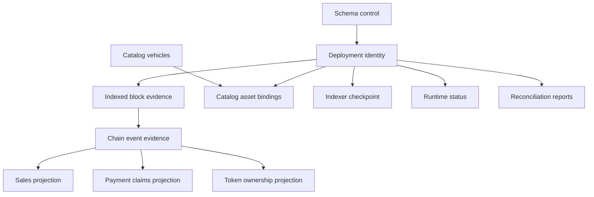

# 資料庫模型

[English](database-model.md) · [简体中文](database-model.zh-CN.md)

## 狀態類別

| 班級         | 意義                                        | 範例                                           |
| ------------ | ------------------------------------------- | ---------------------------------------------- |
| 模式控制     | 安裝的確切遷移和架構合約的證據              | `__drizzle_migrations`, `db_contract`          |
| 部署身份     | 本地代表的鍊和合約產生的不可變身份          | `deployments`                                  |
| 链下權威來源 | 鏈歷史無法重構的產品訊息                    | `catalog_vehicles`, `catalog_asset_bindings`   |
| 原始鏈證據   | 保留的觀察結果用於解釋、重播和審計鏈歷史    | `indexed_blocks`, `chain_events`               |
| 派生投影     | 從經過驗證的規範證據再現以查詢為導向的狀態  | `sales`, `payment_claims`, `token_ownership`   |
| 運行時觀察   | 由特定 Indexer 執行產生的遊標或運行狀況語句 | `indexer_checkpoint`, `indexer_runtime_status` |
| 審計證據     | 記錄錨點的歷史比較                          | `reconciliation_runs`                          |

部署身分和鏈外目錄行是本機權威來源。原始事件行是 MotorCove 觀察到的證據，而不是鏈共識的替代品。只有當投影行聲明的來源證據通過完整性和身分檢查時，才可重建。運行時狀態是最後已知的觀察結果，必須用其心跳和觀察時間來解釋。 對帳報告仍附加到其自己記錄的錨點。

## 人際關係

該圖表達了邏輯責任。 [產生的架構](schema-reference.generated.zh-TW.md) 對於實體外鍵和主鍵具有權威性。

## 核心不變量

- 每個鏈派生行都屬於一個部署代。
- 塊哈希和高度一起識別觀察到的分支證據；僅憑身高並不能。
- 非規範事件證據可能會繼續存儲，並且必須透過區塊規範性進行解釋。
- 目錄權威來源在投影重建期間保留，並且無法由 Indexer 恢復
  追趕。
- 僅在具有經過驗證的復原來源的受控操作內清除派生行。
- 檢查點塊和哈希是投影世代的原子錨點。
- Sale 的歷史和目前的 ERC-721 所有權仍然是不同的事實。
- 運行時健康狀況不會創建鏈新鮮度證據。
- 對帳報告不會繼承目前的投影範圍或規範頭。

## 機器可讀的合約

`@motorcove/database/model` 匯出 `databaseModel`、`DatabaseTableName` 以及支援的類別和備份詞彙表。每個表格條目提供其用途、權威來源、寫入器、讀取器、衍生/可重建標誌、復原來源、備份要求、重組行為和生命週期。

該模型有意不重複列或 SQL 約束。文件工具將其鍵與當前遷移生成的表進行比較，因此兩半必須覆蓋相同的實體資料庫。

## 表合約

以下合約是由 `@motorcove/database/model` 產生的。 SQL 欄位、約束和索引保留在 [實體架構參考](schema-reference.generated.zh-TW.md) 中。

<!-- GENERATED:DATABASE-TABLE-CONTRACTS:START -->

### `__drizzle_migrations`

| 財產     | 契約                                                                   |
| -------- | ---------------------------------------------------------------------- |
| 目的     | 套用於此資料庫的確切 SQL 歷史記錄的本機移轉分類帳。                    |
| 類別     | SCHEMA_CONTROL                                                         |
| 權威來源 | 儲存庫 Drizzle 遷移捆綁包                                              |
| 身分     | 編號                                                                   |
| 作家     | Drizzle 遷移運行程序                                                   |
| 讀者     | 遷移驗證器；維護命令                                                   |
| 衍生     | 不                                                                     |
| 可重建   | 不                                                                     |
| 恢復來源 | 已驗證的資料庫備份或遷移重播到新的空資料庫                             |
| 備份要求 | 關鍵                                                                   |
| 恢復要求 | 恢復準確的本機遷移帳本及其資料庫；永遠不要從較新的結帳推斷應用的 SQL。 |
| 重組語意 | 不依賴鏈。                                                             |
| 生命週期 | 僅透過有序遷移建立和附加；現有行是不可變的。                           |

#### 時間語義

| 領域         | 時間班                | 意義                                 |
| ------------ | --------------------- | ------------------------------------ |
| `created_at` | `LOCAL_MUTATION_TIME` | 本地遷移帳本插入時間，不是鍊式觀察。 |

遷移順序和 SQL 哈希（而不是掛鐘新近度）決定有效性。

### `db_contract`

| 財產     | 契約                                             |
| -------- | ------------------------------------------------ |
| 目的     | 證明資料庫與一個儲存庫架構合約相符。             |
| 類別     | SCHEMA_CONTROL                                   |
| 權威來源 | 已驗證的架構合約、遷移包和架構指紋               |
| 身分     | 單例合約行                                       |
| 作家     | 遷移維護作業                                     |
| 讀者     | 資料庫驗證器；備份和復原工具                     |
| 衍生     | 是的                                             |
| 可重建   | 是的                                             |
| 恢復來源 | 成功驗證儲存庫架構合約                           |
| 備份要求 | 便利性                                           |
| 恢復要求 | 恢復後根據此來源修訂重新驗證架構合約和歷史記錄。 |
| 重組語意 | 不依賴鏈。                                       |
| 生命週期 | 僅在完成遷移和架構驗證事務後更新。               |

#### 時間語義

| 領域          | 時間班              | 意義                                   |
| ------------- | ------------------- | -------------------------------------- |
| `verified_at` | `VERIFICATION_TIME` | 時間遷移完成發布了經過驗證的模式合約。 |

較新的時間戳記無法取代匹配的架構指紋。

### `deployments`

| 財產     | 契約                                             |
| -------- | ------------------------------------------------ |
| 目的     | 由資料庫表示的鍊和合約產生的不可變描述符。       |
| 類別     | 部署標識                                         |
| 權威來源 | 已驗證的部署清單和鏈上合約身份                   |
| 身分     | 部署 ID                                          |
| 作家     | 引導部署註冊                                     |
| 讀者     | API啟動；Indexer；備份與復原；對帳               |
| 衍生     | 不                                               |
| 可重建   | 不                                               |
| 恢復來源 | 相容的部署清單加上經過驗證的鏈上身份             |
| 備份要求 | 關鍵                                             |
| 恢復要求 | 僅使用相容的活動部署清單和引導產生證據進行復原。 |
| 重組語意 | 部署區塊哈希是身份證據，不得被悄悄取代。         |
| 生命週期 | 插入一次以產生託管部署；更換需要產生新的環境。   |

#### 時間語義

| 領域            | 時間班                | 意義                           |
| --------------- | --------------------- | ------------------------------ |
| `registered_at` | `LOCAL_MUTATION_TIME` | 部署身分檢查後的本機註冊時間。 |

部署區塊和哈希是鏈錨； Registered_at 不是鏈上部署時間。

### `catalog_vehicles`

| 財產     | 契約                                                   |
| -------- | ------------------------------------------------------ |
| 目的     | MotorCove 沒有完整鏈上表示的產品元資料。               |
| 類別     | OFFCHAIN\_權威來源                                     |
| 權威來源 | MotorCove 目錄種子或明確本地目錄輸入                   |
| 身分     | 目錄ID                                                 |
| 作家     | 目錄種子維護命令                                       |
| 讀者     | API;目錄裝訂維護；投影重建保存                         |
| 衍生     | 不                                                     |
| 可重建   | 不                                                     |
| 恢復來源 | 經過驗證的資料庫備份或準確的權威目錄輸入               |
| 備份要求 | 關鍵                                                   |
| 恢復要求 | 從經過驗證的相容備份或精確的目錄輸入中還原權威目錄行。 |
| 重組語意 | 目錄行獨立於鏈規範性。                                 |
| 生命週期 | 冪等播種並僅在獨佔維護所有權下更新。                   |

#### 時間語義

| 領域         | 時間班                | 意義                   |
| ------------ | --------------------- | ---------------------- |
| `created_at` | `LOCAL_MUTATION_TIME` | 本地目錄行建立時間。   |
| `updated_at` | `LOCAL_MUTATION_TIME` | 上次本地目錄突變時間。 |

種子集標識和版本控制權威來源；時間戳本身並不能證明目錄內容。

### `catalog_asset_bindings`

| 財產     | 契約                                                           |
| -------- | -------------------------------------------------------------- |
| 目的     | 將本機目錄身分綁定到一個部署和集合中的令牌。                   |
| 類別     | OFFCHAIN\_權威來源                                             |
| 權威來源 | MotorCove 目錄權威來源受部署標識約束                           |
| 身分     | 部署 ID + 集合位址 + 令牌 ID                                   |
| 作家     | 目錄種子維護命令                                               |
| 讀者     | API;目錄和令牌投影查詢                                         |
| 衍生     | 不                                                             |
| 可重建   | 不                                                             |
| 恢復來源 | 經過驗證的資料庫備份或確切的權威綁定輸入                       |
| 備份要求 | 關鍵                                                           |
| 恢復要求 | 使用相同的部署和目錄產生復原綁定；鏈重播無法重新建立目錄意圖。 |
| 重組語意 | 綁定仍然是部署範圍內的；重組不會重寫目錄意圖。                 |
| 生命週期 | 在部署行和目錄行都存在後以冪等方式建立。                       |

#### 時間語義

該表中沒有記錄任何實體時間戳記或區塊時間欄位。

無掛鐘柱；部署、令牌身分、綁定來源和種子版本具有生命週期意義。

### `indexed_blocks`

| 財產     | 契約                                                         |
| -------- | ------------------------------------------------------------ |
| 目的     | 區塊身分、規範性、掃描完整性和觀察日誌摘要證據。             |
| 類別     | RAW*CHAIN*證據                                               |
| 權威來源 | 針對配置的部署和日誌範圍驗證了鏈觀察                         |
| 身分     | 部署 ID + 區塊哈希值；每個高度一個規範哈希                   |
| 作家     | Indexer攝取；重建索引維護                                    |
| 讀者     | Indexer; 投影重建；對帳；診斷                                |
| 衍生     | 不                                                           |
| 可重建   | 是的                                                         |
| 恢復來源 | 從已驗證的部署掃描開始明確重新索引                           |
| 備份要求 | 偏好                                                         |
| 恢復要求 | 盡可能保留經過驗證的來源證據；否則透過明確重新索引重新取得。 |
| 重組語意 | 可以保留競爭的雜湊值；每個部署和高度可能只存在一個規範行。   |
| 生命週期 | 在攝取期間插入，規範性會隨著事件和投影更新而自動變更。       |

#### 時間語義

| 領域              | 時間班       | 意義                         |
| ----------------- | ------------ | ---------------------------- |
| `block_timestamp` | `CHAIN_TIME` | 觀察到的塊頭提供的時間戳記。 |

規範性和掃描完整性是分支證據，而不是即時觀察時間戳。

### `chain_events`

| 財產     | 契約                                                             |
| -------- | ---------------------------------------------------------------- |
| 目的     | 在投影解釋之前保留的原始和解碼的合約日誌證據。                   |
| 類別     | RAW*CHAIN*證據                                                   |
| 權威來源 | 驗證鏈日誌觀察並記錄解碼器版本                                   |
| 身分     | 部署id + 區塊哈希值 + 日誌索引                                   |
| 作家     | Indexer攝取；重建索引維護                                        |
| 讀者     | 投影重建；對帳；診斷                                             |
| 衍生     | 不                                                               |
| 可重建   | 是的                                                             |
| 恢復來源 | 從規範塊頭和日誌中明確重新索引                                   |
| 備份要求 | 偏好                                                             |
| 恢復要求 | 盡可能保留經過驗證的原始事件證據；僅透過明確重新索引來重新取得。 |
| 重組語意 | 歷史非規範事件仍然可審計，並透過 indexed_blocks 規範性進行解釋。 |
| 生命週期 | 在與區塊和檢查點證據相同的工作單元中插入來源摘要。               |

#### 時間語義

| 領域            | 時間班             | 意義                         |
| --------------- | ------------------ | ---------------------------- |
| `first_seen_at` | `OBSERVATION_TIME` | 對該原始日誌的首次本地觀察。 |

區塊哈希、交易索引、日誌索引識別鏈位置； first_seen_at 不建立規範性。

### `indexer_checkpoint`

| 財產     | 契約                                                           |
| -------- | -------------------------------------------------------------- |
| 目的     | 提交的遊標和投影產生標識用於增量攝取。                         |
| 類別     | 運行時觀察                                                     |
| 權威來源 | 最後一個原子提交的規範攝取單元                                 |
| 身分     | 部署 ID                                                        |
| 作家     | Indexer攝取；投影重建；重建索引維護                            |
| 讀者     | Indexer; API出處；維修及對帳                                   |
| 衍生     | 是的                                                           |
| 可重建   | 是的                                                           |
| 恢復來源 | 已驗證的indexed_blocks和chain_events，或明確重新索引           |
| 備份要求 | 便利性                                                         |
| 恢復要求 | 使用匹配來源和投影生成進行恢復；在正常攝取之前驗證其區塊錨點。 |
| 重組語意 | 檢查點塊和哈希必須保持不可分割的規範錨。                       |
| 生命週期 | 僅在原子事件/投影提交中前進，並且僅在明確恢復下才可能回滾。    |

#### 時間語義

| 領域         | 時間班                | 意義                               |
| ------------ | --------------------- | ---------------------------------- |
| `updated_at` | `LOCAL_MUTATION_TIME` | 本機原子檢查點更新或維護回滾時間。 |

last_scanned_block/hash 是鏈錨； update_at 本身無法證明目前鏈頭。

### `sales`

| 財產     | 契約                                                    |
| -------- | ------------------------------------------------------- |
| 目的     | 託管銷售狀態查詢高效率投影。                            |
| 類別     | 衍生\_投影                                              |
| 權威來源 | 已驗證的規範 MotorCoveEscrow 事件                       |
| 身分     | 部署 ID + 銷售 ID                                       |
| 作家     | Indexer 投影器; 投影重建；重建索引維護                  |
| 讀者     | API; 對帳                                               |
| 衍生     | 是的                                                    |
| 可重建   | 是的                                                    |
| 恢復來源 | 已驗證規範的 chain_events；當來源證據可疑時明確重新索引 |
| 備份要求 | 便利性                                                  |
| 恢復要求 | 恢復僅作為衍生便利；驗證規範來源或明確重新索引。        |
| 重組語意 | 行遵循規範的事件序列，並透過檢查點變更自動回滾。        |
| 生命週期 | 由 Sale 創建並僅透過有效的銷售狀態轉換進行進階。        |

#### 時間語義

| 領域            | 時間班          | 意義                                     |
| --------------- | --------------- | ---------------------------------------- |
| `funded_at`     | `BUSINESS_TIME` | 用於得出付款截止日期的合約資助時間戳記。 |
| `expires_at`    | `BUSINESS_TIME` | 合約衍生的銷售到期期限。                 |
| `created_block` | `CHAIN_TIME`    | 規範創建塊高度。                         |
| `updated_block` | `CHAIN_TIME`    | 規範的最後一個過渡塊高度。               |

區塊/哈希/日誌來源和合約截止日期比本地行更新時鐘更有意義。

### `payment_claims`

| 財產     | 契約                                                    |
| -------- | ------------------------------------------------------- |
| 目的     | 投影拉動付款索賠和提款狀態。                            |
| 類別     | 衍生\_投影                                              |
| 權威來源 | 經過驗證的規範託管索賠事件                              |
| 身分     | 部署 ID + 銷售 ID                                       |
| 作家     | Indexer 投影器; 投影重建；重建索引維護                  |
| 讀者     | API; 對帳                                               |
| 衍生     | 是的                                                    |
| 可重建   | 是的                                                    |
| 恢復來源 | 已驗證規範的 chain_events；當來源證據可疑時明確重新索引 |
| 備份要求 | 便利性                                                  |
| 恢復要求 | 恢復僅作為衍生便利；驗證索賠創建和撤回來源證據。        |
| 重組語意 | Claim 狀態遵循規範的建立和撤回事件。                    |
| 生命週期 | 使用聲明事件建立並僅透過其符合的規範事件標記為已撤回。  |

#### 時間語義

| 領域                    | 時間班       | 意義                         |
| ----------------------- | ------------ | ---------------------------- |
| `creation_block_hash`   | `CHAIN_TIME` | 規範聲明創建事件的區塊錨點。 |
| `withdrawal_block_hash` | `CHAIN_TIME` | 規範撤回事件的可選區塊錨點。 |

日誌索引與區塊雜湊配對；不需要本地掛鐘時間戳來識別索賠順序。

### `token_ownership`

| 財產     | 契約                                                         |
| -------- | ------------------------------------------------------------ |
| 目的     | 目前 ERC-721 所有權投影獨立於歷史銷售買家身分。              |
| 類別     | 衍生\_投影                                                   |
| 權威來源 | 已驗證的規範 VehicleNFT 傳輸事件                             |
| 身分     | 部署 ID + 集合位址 + 令牌 ID                                 |
| 作家     | Indexer 投影器; 投影重建；重建索引維護                       |
| 讀者     | API; 對帳                                                    |
| 衍生     | 是的                                                         |
| 可重建   | 是的                                                         |
| 恢復來源 | 經過驗證的規範 VehicleNFT chain_events 或明確重新索引        |
| 備份要求 | 便利性                                                       |
| 恢復要求 | 恢復僅作為衍生便利；驗證規範傳輸證據或重新索引。             |
| 重組語意 | 所有權遵循檢查點的規範轉移順序。                             |
| 生命週期 | 為每個規範鑄幣廠或轉讓進行更新；從未單獨從銷售歷史中推斷出。 |

#### 時間語義

| 領域                       | 時間班       | 意義                       |
| -------------------------- | ------------ | -------------------------- |
| `updated_block`            | `CHAIN_TIME` | 最後反射傳輸的規範塊高度。 |
| `last_transfer_block_hash` | `CHAIN_TIME` | 最後反射傳輸的區塊錨。     |

區塊哈希和日誌索引，而不是本地更新時間，建立傳輸來源。

### `indexer_runtime_status`

| 財產     | 契約                                                                 |
| -------- | -------------------------------------------------------------------- |
| 目的     | 最後已知的投影健康狀況、鏈觀察、恢復原因和工人心跳。                 |
| 類別     | 運行時觀察                                                           |
| 權威來源 | Indexer運行時和即時RPC觀察                                           |
| 身分     | 部署 ID                                                              |
| 作家     | Indexer運作時；顯式投影維護                                          |
| 讀者     | API系統狀態；網頁新鮮度呈現；維護診斷                                |
| 衍生     | 是的                                                                 |
| 可重建   | 是的                                                                 |
| 恢復來源 | 新的 Indexer 執行和明確恢復轉換                                      |
| 備份要求 | 無                                                                   |
| 恢復要求 | 將恢復的狀態和心跳視為最後已知的證據；需要新的即時觀察來保證新鮮度。 |
| 重組語意 | 發現的衝突可以使健康走向恢復；維護不能創造新鮮感。                   |
| 生命週期 | 透過觀察、提交、失敗和恢復轉換進行更新，而不取代歷史鏈證據。         |

#### 時間語義

| 領域                  | 時間班                  | 意義                                         |
| --------------------- | ----------------------- | -------------------------------------------- |
| `worker_heartbeat_at` | `PROCESS_LIVENESS_TIME` | 最後一個worker活性寫入；本地重建不會更新它。 |
| `last_rpc_success_at` | `OBSERVATION_TIME`      | 工人最後一次成功現場觀察 RPC。               |
| `last_observed_at`    | `OBSERVATION_TIME`      | 觀察記錄的鏈頭的時間。                       |

投影\_status和recovery_reason是持久狀態宣告；CURRENT 本身並不能證明目前的新鮮度。

### `reconciliation_runs`

| 財產     | 契約                                                           |
| -------- | -------------------------------------------------------------- |
| 目的     | 在明確錨點上進行投影與鏈比較的歷史報告。                       |
| 類別     | 審計證據                                                       |
| 權威來源 | 對帳對其記錄的部署、範圍、檢查點和頭部進行觀察                 |
| 身分     | 身分證號；每個報告還綁定部署和比較錨點                         |
| 作家     | 對帳 CLI                                                       |
| 讀者     | API診斷；操作員                                                |
| 衍生     | 是的                                                           |
| 可重建   | 不                                                             |
| 恢復來源 | 驗證資料庫備份；新的運作無法重現先前的觀察結果                 |
| 備份要求 | 偏好                                                           |
| 恢復要求 | 保留每個歷史報告及其原始範圍、區塊/哈希和投影建置。            |
| 重組語意 | 報告仍然與其歷史錨點聯繫在一起，並且永遠不會繼承當前的規範性。 |
| 生命週期 | 比較結果完全確定後，僅有附加報告發布。                         |

#### 時間語義

| 領域         | 時間班              | 意義                           |
| ------------ | ------------------- | ------------------------------ |
| `created_at` | `VERIFICATION_TIME` | 此錨定比較報告的發佈時間。     |
| `block_hash` | `CHAIN_TIME`        | 本報告將投影與鏈錨定進行比較。 |

報告永遠不會繼承後來的檢查點、範圍或鏈頭。

<!-- GENERATED:DATABASE-TABLE-CONTRACTS:END -->
