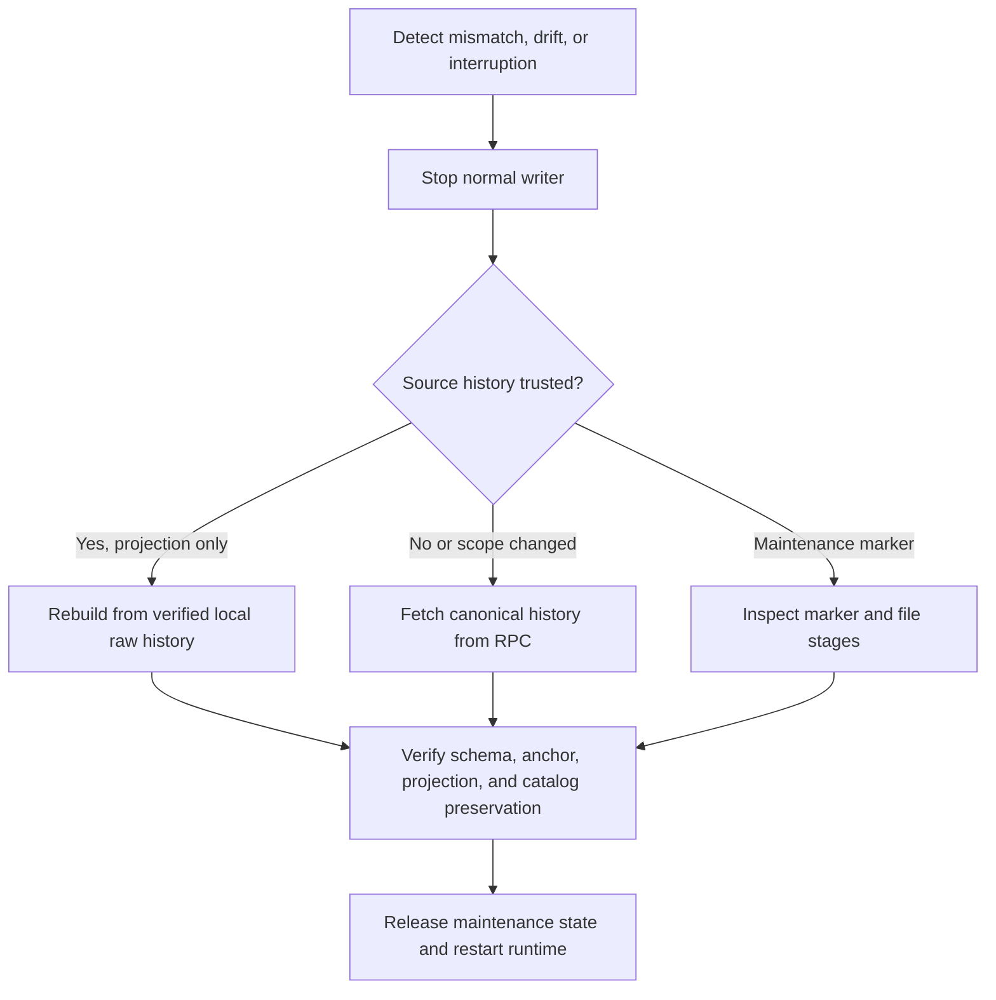

# Indexing and recovery flow

This page distinguishes catch-up, rebuild, reindex, reconciliation, and maintenance recovery.

Catch-up scans new blocks from a valid checkpoint. Rebuild recomputes derived rows from complete,
verified local raw events and preserves catalog data. Reindex fetches canonical headers and logs
again when source completeness or scope is suspect. Reconciliation compares the projection to chain
state at the same anchored block and reports comparison separately from freshness.

The current source implements bounded catch-up, detect-and-stop checks, atomic replay, rebuild,
reindex, and same-block reconciliation. A real Anvil recovery scenario orphans an indexed funding
event, requires reindex, restores the canonical `LISTED` projection, and keeps the old raw event
linked to a noncanonical block. Another scenario restores a consistent backup behind the live chain
head and lets the same Indexer catch up without changing deployment identity. A reset scenario
redeploys to the same deterministic addresses under a new deployment ID and proves that the old
environment refuses recovery.

The batch transaction stores headers, source events, projections, and checkpoint together. A
test-only synchronous hook can stop a child process at
`BEFORE_BEGIN`, `BEFORE_COMMIT`, or `AFTER_COMMIT`; it is not exposed through HTTP or runtime
configuration.

The process-kill test sends `SIGKILL` only to its harness-owned child and opens a new SQLite
connection without deleting WAL or SHM files. Before-COMMIT kills expose the previous snapshot.
After-COMMIT kills expose the new checkpoint, and replaying the same batch is a no-op. This evidence
covers ordinary process termination with SQLite WAL. Separate controlled fixtures cover
`SQLITE_BUSY` and transaction rollback under SQLite `max_page_count` exhaustion. They do not claim
hardware power-loss or full host-filesystem exhaustion.

Browser transaction recovery is a separate read-only path. It can inspect chain evidence and call
the selector-scoped API, but its dependency graph cannot reach wallet writes. A stopped Indexer can
therefore leave an operation in `NOT_REACHED`; restarting the same worker catches up from its
durable checkpoint without a second payment.

See [projection runbook](../runbooks/projection-rebuild-and-reindex.md) and
[backup/recovery runbook](../runbooks/backup-restore-and-recovery.md).
