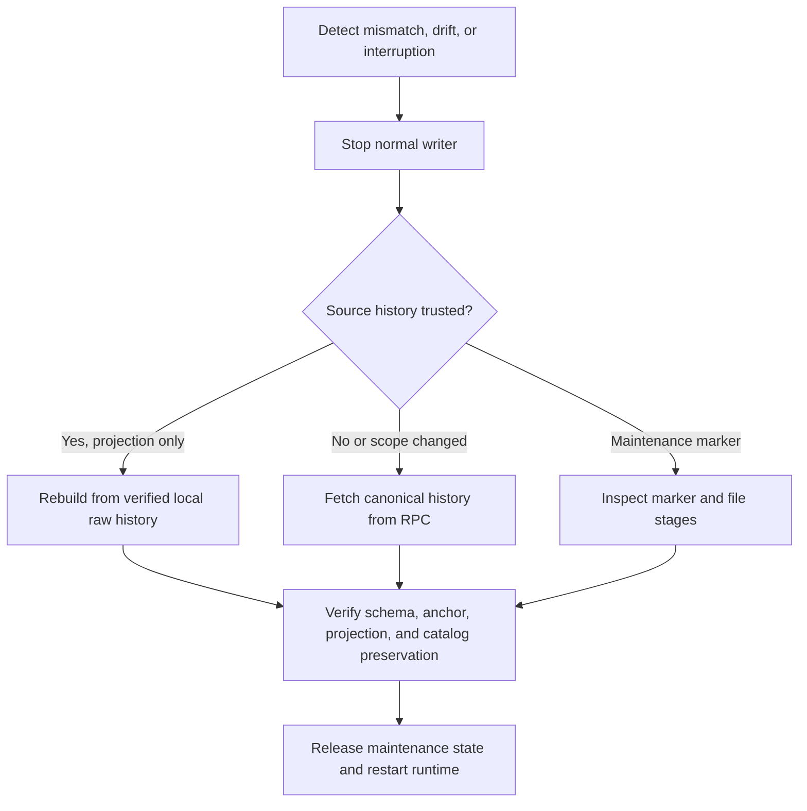

# Indexing and recovery flow

This page distinguishes catch-up, rebuild, reindex, reconciliation, and maintenance recovery.

Catch-up scans new blocks from a valid checkpoint. Rebuild recomputes derived rows from complete,
verified local raw events and preserves catalog data. Reindex fetches canonical headers and logs
again when source completeness or scope is suspect. Reconciliation compares the projection to chain
state at the same anchored block and reports comparison separately from freshness.

Rebuild and reindex take the exclusive service and writer locks and persist a maintenance marker.
Normal readers and writers cannot start while the operation is active. A failed operation retains
its marker for diagnosis and explicit recovery. Reindexing an unchanged range recanonicalizes its
stored blocks and reapplies its durable events; it does not delete and redownload source evidence.
The first header of every incremental batch must join the durable checkpoint hash.

The current source implements bounded catch-up, detect-and-stop checks, atomic replay, rebuild,
reindex, and same-block reconciliation. A real Anvil recovery scenario orphans an indexed funding
event, requires reindex, restores the canonical `LISTED` projection, and keeps the old raw event
linked to a noncanonical block. Another scenario restores a consistent backup behind the live chain
head and lets the same Indexer catch up without changing deployment identity. A reset scenario
redeploys to the same deterministic addresses under a new deployment ID and proves that the old
environment refuses recovery.

The batch transaction stores headers, source events, projections, and checkpoint together. A
test-only synchronous hook can stop a child process at
`BEFORE_BEGIN`, `BEFORE_COMMIT`, or `AFTER_COMMIT`; it is not exposed through HTTP or runtime
configuration.

The process-kill test sends `SIGKILL` only to its harness-owned child and opens a new SQLite
connection without deleting WAL or SHM files. Before-COMMIT kills expose the previous snapshot.
After-COMMIT kills expose the new checkpoint, and replaying the same batch is a no-op. This evidence
covers ordinary process termination with SQLite WAL. Separate controlled fixtures cover
`SQLITE_BUSY` and transaction rollback under SQLite `max_page_count` exhaustion. They do not claim
hardware power-loss or full host-filesystem exhaustion.

Browser transaction recovery is a separate read-only path. It can inspect chain evidence and call
the selector-scoped API, but its dependency graph cannot reach wallet writes. A stopped Indexer can
therefore leave an operation in `NOT_REACHED`; restarting the same worker catches up from its
durable checkpoint without a second payment.

Temporary JSON-RPC transport failures keep the checkpoint unchanged, mark the read model `STALE`,
and retry with bounded backoff. They do not request reindex. A changed hash or a provider-confirmed
missing checkpoint block is integrity evidence, changes health to `RECOVERY_REQUIRED`, and stops
ingestion. The local supervisor leaves API and Web running if the Indexer exits so stale state and
the recovery reason remain inspectable.

See [projection runbook](../runbooks/projection-rebuild-and-reindex.md) and
[backup/recovery runbook](../runbooks/backup-restore-and-recovery.md).

## Interruption completion evidence

Projection markers are operation-specific completion evidence. `ops:recover --complete` does not
clear an interrupted rebuild or reindex after a generic schema check. It returns
`ACTION_REQUIRED`, keeps API and Indexer startup blocked, and requires the same operation type,
deployment, rewind point, and captured target anchor to resume under the existing exclusive gate.
Only the resumed operation's projection postconditions can clear the marker.

An isolated child-process test sends `SIGKILL` after `rewindFrom()` commits and before rebuild. It
proves the mixed state remains blocked, then resumes the exact marker and verifies a new projection
build. This covers ordinary process termination with SQLite WAL, not hardware power loss.

## Snapshot-consistent source reads

Each ingestion batch observes its block headers first. The chain adapter then requests logs by each
observed `blockHash`, instead of issuing an independent number-range query that could resolve against
a different branch. The application still checks every decoded event against the supplied header and
rechecks the final canonical anchor before committing headers, source events, projections, and the
checkpoint in one transaction.

This ordering closes the case where the chain changes between `getLogs(fromBlock, toBlock)` and
`getBlock(number)`: an empty log result from branch A can no longer be combined with headers from
branch B and published as a scan-complete block. Header transport errors and deterministic adapter
errors remain distinct from provider range-limit errors, so a deterministic failure is not retried by
shrinking the range.

## Durable reindex catch-up

Reindex records two projection phases in its existing maintenance marker:

1. `PREPARING` owns the source rewind and projection preparation.
2. `CATCHING_UP` owns replay from the durable checkpoint to the previously captured target.

There is no fixed successful-batch ceiling. Catch-up continues while the durable checkpoint advances.
If ingestion reports success without advancing the checkpoint, reindex stops with
`REINDEX_CATCHUP_NO_PROGRESS`. A process restart in `CATCHING_UP` rebuilds the derived projection from
the retained source journal and continues from that checkpoint; it does not rewind the source again or
move the captured target.
