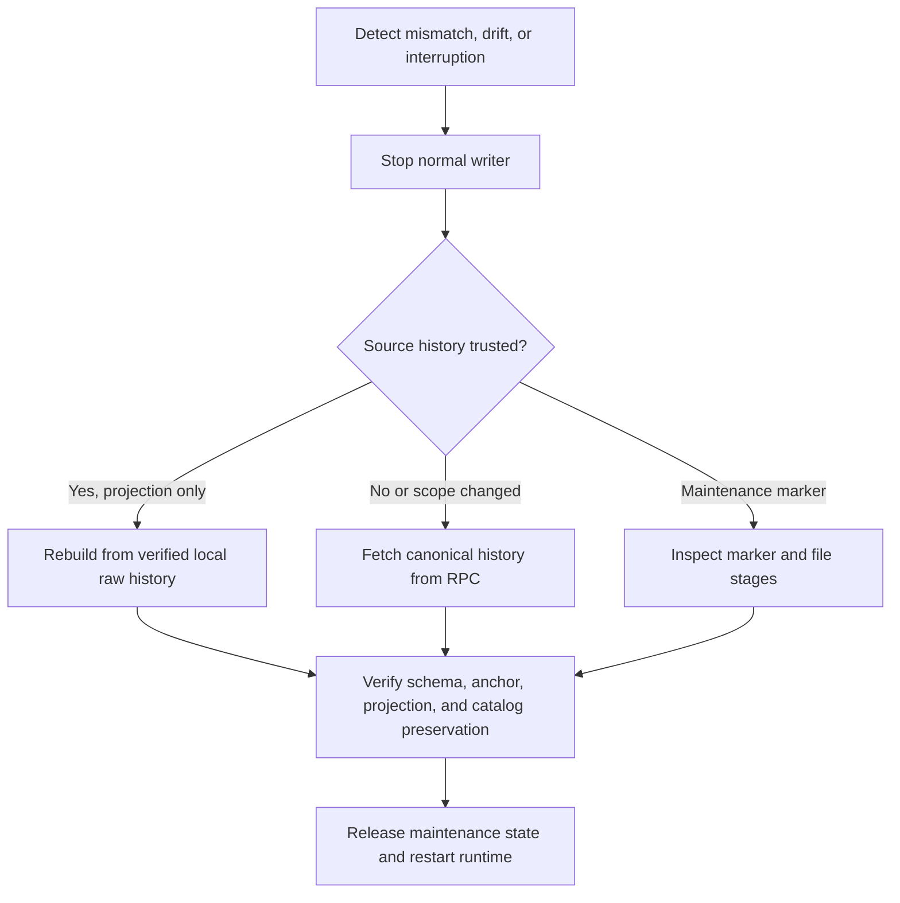

# 索引和恢复流程

[English](indexing-and-recovery.md) · [繁體中文](indexing-and-recovery.zh-TW.md)

本页区分追赶、重建、重新索引、对账和维护恢复。

追赶从有效检查点扫描新块。重建从完整的、经过验证的本地原始事件重新计算派生行并保留目录数据。当源完整性或范围受到怀疑时，重新索引会再次获取规范标头和日志。 对账将投影与同一锚定块的链状态进行比较，并分别报告比较结果和新鲜度。

重建和重新索引采用独占服务和写入器锁并保留维护标记。当操作处于活动状态时，普通读取器和写入器无法启动。失败的手术保留其标记以供诊断和明确恢复。重新索引未更改的范围会重新规范其存储的块并重新应用其持久事件；它不会删除和重新下载源证据。每个增量批次的第一个标头必须加入持久检查点哈希。

当前源实现了有界追赶、检测和停止检查、原子重播、重建、重新索引和同块对账。真实的 Anvil 恢复场景会孤立索引融资事件，需要重新索引，恢复规范的 `LISTED` 投影，并将旧的原始事件链接到非规范区块。另一种情况是在活动链头后面恢复一致的备份，并让相同的 Indexer 赶上而不改变部署身份。重置场景会在新的部署 ID 下重新部署到相同的确定性地址，并证明旧环境拒绝恢复。

批量事务将标头、源事件、投影和检查点存储在一起。仅测试同步钩子可以在 `BEFORE_BEGIN`、`BEFORE_COMMIT` 或 `AFTER_COMMIT` 处停止子进程；它不通过 HTTP 或运行时配置公开。

进程终止测试仅将 `SIGKILL` 发送到其线束拥有的子级，并打开新的 SQLite 连接，而不删除 WAL 或 SHM 文件。 Before-COMMIT 终止会暴露之前的快照。提交后的终止会暴露新的检查点，并且重播同一批次是无操作的。该证据涵盖使用 SQLite WAL 的普通进程终止。单独的受控夹具涵盖`SQLITE_BUSY`和SQLite `max_page_count`耗尽下的事务回滚。他们没有声称硬件断电或主机文件系统完全耗尽。

浏览器事务恢复是一个单独的只读路径。它可以检查链证据并调用选择器范围的 API，但其依赖图无法到达钱包写入。因此，停止的 Indexer 可以在 `NOT_REACHED` 中留下操作；重新启动同一个工作人员可以从其持久检查点赶上，无需第二次付款。

临时 JSON-RPC 传输失败保持检查点不变，标记读取模型 `STALE`，并使用有界退避重试。他们不请求重新索引。更改的哈希值或提供者确认的丢失检查点块是完整性证据，将健康状况更改为 `RECOVERY_REQUIRED`，并停止摄取。如果 Indexer 退出过时状态并且恢复原因仍然可检查，则本地主管使 API 和 Web 保持运行。

索引深度是一项资格政策，而不仅仅是下一次民意调查的抵消。如果配置更改使持久检查点大于 `head - indexingDepth`，则正常摄取会标记 `CHECKPOINT_EXCEEDS_ELIGIBLE_TARGET` 并停止。它不会在新的阻止窗口内发布带有块的 `CURRENT`，也不会静默倒带。停止运行时编写器并对符合条件的目标运行现有的显式重新索引工作流程。通过普通的向前追赶继续减少深度。

提交批次会记录检查点进度，而不声明投影为实时状态。工作人员将生成的检查点和锚点与最新深度调整的合格目标进行比较。仅达到较旧的固定维护目标即可使投影处于追赶状态；只有符合条件的实时收敛才会发布 `CURRENT`。

请参阅 [投影操作手册](../runbooks/projection-rebuild-and-reindex.zh-CN.md) 和 [备份/恢复操作手册](../runbooks/backup-restore-and-recovery.zh-CN.md)。

## 中断完成证据

投影标记是操作特定的完成证据。 `ops:recover --complete` 在通用模式检查后不会清除中断的重建或重新索引。它返回`ACTION_REQUIRED`，保持API和Indexer的启动被阻止，并且需要相同的操作类型、部署、倒带点和捕获的目标锚点才能在现有独占门下恢复。只有恢复操作的投影后置条件才能清除标记。

隔离子进程测试在 `rewindFrom()` 提交之后和重建之前发送 `SIGKILL`。它证明混合状态仍然被阻止，然后恢复精确标记并验证新的投影构建。这涵盖了使用 SQLite WAL 的普通进程终止，而不是硬件断电。

## 快照一致的源读取

每个摄取批次首先观察其块头。然后，链适配器通过每个观察到的 `blockHash` 请求日志，而不是发出可以针对不同分支解析的独立数字范围查询。应用程序仍然根据提供的标头检查每个解码的事件，并在一个事务中提交标头、源事件、投影和检查点之前重新检查最终规范锚。

此排序结束了 `getLogs(fromBlock, toBlock)` 和 `getBlock(number)` 之间链发生变化的情况：来自分支 A 的空日志结果不能再与来自分支 B 的标头组合并发布为扫描完成块。标头传输错误和确定性适配器错误与提供程序范围限制错误仍然不同，因此不会通过缩小范围来重试确定性故障。

## 持久的重新索引追赶

Reindex 在其现有维护标记中记录了两个投影阶段：

1. `PREPARING`拥有源倒带和投影准备。
2. `CATCHING_UP` 拥有从持久检查点到先前捕获的目标的重放。

没有固定的成功批次上限。随着持久检查点的推进，追赶仍在继续。如果摄取报告成功但没有推进检查点，则重新索引会以 `REINDEX_CATCHUP_NO_PROGRESS` 停止。 `CATCHING_UP` 中的进程重新启动会从保留的源日志重建派生的投影，并从该检查点继续；它不会再次倒带源或移动捕获的目标。

## R25恢复屏障

持久的 `RECOVERY_REQUIRED` 原因会停止正常的写入器启动，并且无法由普通的传输陈旧或当前转换替换。重建符合经过验证的本地源和仅投影器完整性原因。确认的规范或来源怀疑需要重新索引。重新索引保留该原因，而其维护标记则拥有倒带、重播和追赶；验证目标向`SYNCING`发布原因。下一次现场投票决定 `CURRENT`。本地重建不会更新worker心跳或上次成功的RPC观察时间。

## 链 profile 的可索引范围

Anvil（31337）把最新的 loopback 区块视为立即可索引。Ethereum（1）与 Polygon（137）要求服务商证实的 finalized 链头；`indexingDepth` 不能取代这些 profile 的最终性。若服务商无法证明 finalized 目标，或已有 finalized 锚点发生变化，索引会拒绝继续并保留恢复证据。运行时使用单一主要 RPC；`pnpm ops:audit-source` 以独立次要来源比对有界 finalized 范围，且不写入投影。因此交易可能已包含，但市场投影仍在等待最终性。本项目对公链 profile 仅做过 loopback 与模拟验证。

Web 健康状态选择器依公链 profile 的链头停滞门槛与持久化的 `lastHeadAdvancedAt`，在仍持续报告的 worker 长时间未观察到链头推进时显示 `CHAIN_HEAD_STALLED`。这表示观察进度，不证明链上数据错误。空闲的 Anvil 链头不会被标为停滞。
