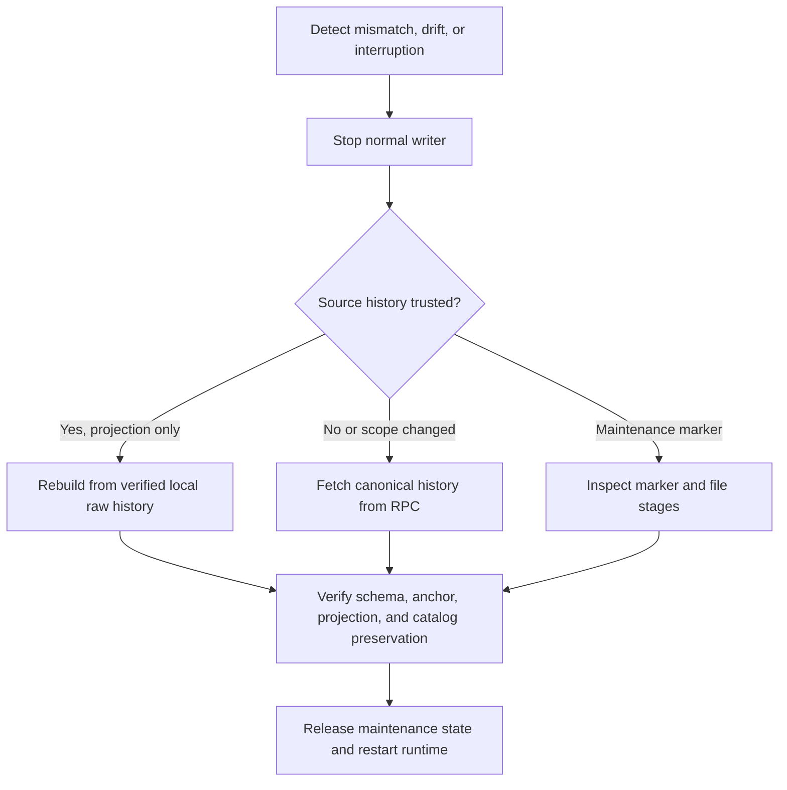

# 索引和復原流程

[English](indexing-and-recovery.md) · [简体中文](indexing-and-recovery.zh-CN.md)

本頁區分追趕、重建、重新索引、對帳和維護恢復。

追趕從有效檢查點掃描新區塊。重建從完整的、經過驗證的本地原始事件重新計算派生行並保留目錄資料。當來源完整性或範圍受到懷疑時，重新索引會再次取得規範標頭和日誌。 對帳將投影與同一錨定區塊的鏈狀態進行比較，並分別報告比較結果和新鮮度。

重建和重新索引採用獨佔服務和寫入器鎖並保留維護標記。當操作處於活動狀態時，普通讀取器和寫入器無法啟動。失敗的手術保留其標記以供診斷和明確恢復。重新索引未更改的範圍會重新規範其儲存的區塊並重新套用其持久事件；它不會刪除和重新下載來源證據。每個增量批次的第一個標頭必須加入持久檢查點哈希。

目前來源實現了有界追趕、偵測和停止檢查、原子重播、重建、重新索引和同塊對帳。真實的 Anvil 恢復場景會孤立索引融資事件，需要重新索引，恢復規範的 `LISTED` 投影，並將舊的原始事件連結到非規範區塊。另一種情況是在活動鏈頭後面恢復一致的備份，並讓相同的 Indexer 趕上而不改變部署身分。重置場景會在新的部署 ID 下重新部署到相同的確定性位址，並證明舊環境拒絕復原。

批次事務將標頭、來源事件、投影和檢查點儲存在一起。僅測試同步鉤子可以在 `BEFORE_BEGIN`、`BEFORE_COMMIT` 或 `AFTER_COMMIT` 處停止子程序；它不透過 HTTP 或運行時配置公開。

進程終止測試僅將 `SIGKILL` 傳送到其線束擁有的子級，並開啟新的 SQLite 連接，而不刪除 WAL 或 SHM 檔案。 Before-COMMIT 終止會暴露先前的快照。提交後的終止會暴露新的檢查點，重播同一批次是無操作的。該證據涵蓋使用 SQLite WAL 的普通進程終止。單獨的受控夾具涵蓋`SQLITE_BUSY`和SQLite `max_page_count`耗盡下的事務回滾。他們沒有聲稱硬體斷電或主機檔案系統完全耗盡。

瀏覽器事務復原是一個單獨的唯讀路徑。它可以檢查鏈證據並呼叫選擇器範圍的 API，但其依賴圖無法到達錢包寫入。因此，停止的 Indexer 可以在 `NOT_REACHED` 中留下操作；重新啟動同一個工作人員可以從其持久檢查點趕上，無需第二次付款。

臨時 JSON-RPC 傳輸失敗保持檢查點不變，標記讀取模型 `STALE`，並使用有界退避重試。他們不請求重新索引。更改的雜湊值或提供者確認的遺失檢查點區塊是完整性證據，將健康狀況更改為 `RECOVERY_REQUIRED`，並停止攝取。如果 Indexer 退出過時狀態且復原原因仍可檢查，則本地主管使 API 和 Web 保持運作。

索引深度是一項資格政策，而不僅僅是下一次民意調查的抵消。如果配置變更使持久檢查點大於 `head - indexingDepth`，則正常攝取會標記 `CHECKPOINT_EXCEEDS_ELIGIBLE_TARGET` 並停止。它不會在新的阻止視窗內發布帶有區塊的 `CURRENT`，也不會靜默倒帶。停止執行時間編寫器並對符合條件的目標執行現有的明確重新索引工作流程。透過普通的向前追趕繼續減少深度。

提交批次會記錄檢查點進度，而不聲明投影為即時狀態。工作人員將產生的檢查點和錨點與最新深度調整的合格目標進行比較。僅達到較舊的固定維護目標即可讓投影處於追趕狀態；只有符合條件的即時收斂才會發布 `CURRENT`。

請參閱 [投影操作手冊](../runbooks/projection-rebuild-and-reindex.zh-TW.md) 和 [備份/復原作業手冊](../runbooks/backup-restore-and-recovery.zh-TW.md)。

## 中斷完成證據

投影標記是操作特定的完成證據。 `ops:recover --complete` 在通用模式檢查後不會清除中斷的重建或重新索引。它返回`ACTION_REQUIRED`，保持API和Indexer的啟動被阻止，並且需要相同的操作類型、部署、倒帶點和捕獲的目標錨點才能在現有獨佔門下恢復。只有恢復操作的投影後置條件才能清除標記。

隔離子進程測試在 `rewindFrom()` 提交之後和重建之前發送 `SIGKILL`。它證明混合狀態仍然被阻止，然後恢復精確標記並驗證新的投影建置。這涵蓋了使用 SQLite WAL 的普通進程終止，而不是硬體斷電。

## 快照一致的來源讀取

每個攝取批次首先觀察其區塊頭。然後，鏈結適配器透過每個觀察到的 `blockHash` 請求日誌，而不是發出可以針對不同分支解析的獨立數字範圍查詢。應用程式仍然根據提供的標頭檢查每個解碼的事件，並在一個事務中提交標頭、來源事件、投影和檢查點之前重新檢查最終規範錨。

此排序結束了 `getLogs(fromBlock, toBlock)` 和 `getBlock(number)` 之間鏈發生變化的情況：來自分支 A 的空日誌結果不能再與來自分支 B 的標頭組合併發佈為掃描完成區塊。標頭傳輸錯誤和確定性適配器錯誤與提供者範圍限制錯誤仍然不同，因此不會透過縮小範圍來重試確定性故障。

## 持久的重新索引追趕

Reindex 在其現有維護標記中記錄了兩個投影階段：

1. `PREPARING`擁有源倒帶和投影準備。
2. `CATCHING_UP` 擁有從持久檢查點到先前捕獲的目標的重播。

沒有固定的成功批次上限。隨著持久檢查點的推進，追趕仍在繼續。如果攝取報告成功但沒有推進檢查點，則重新索引會以 `REINDEX_CATCHUP_NO_PROGRESS` 停止。 `CATCHING_UP` 中的程序重新啟動會從保留的來源日誌重建派生的投影，並從該檢查點繼續；它不會再次倒帶源或移動捕獲的目標。

## R25恢復屏障

持久的 `RECOVERY_REQUIRED` 原因會停止正常的寫入器啟動，並且無法由普通的傳輸陳舊或當前轉換取代。重建符合經過驗證的本地來源和僅投影器完整性原因。確認的規範或來源懷疑需要重新索引。重新索引保留該原因，而其維護標記則擁有倒帶、重播和追趕；驗證目標向`SYNCING`發布原因。下一次現場投票決定 `CURRENT`。本地重建不會更新worker心跳或上次成功的RPC觀察時間。
