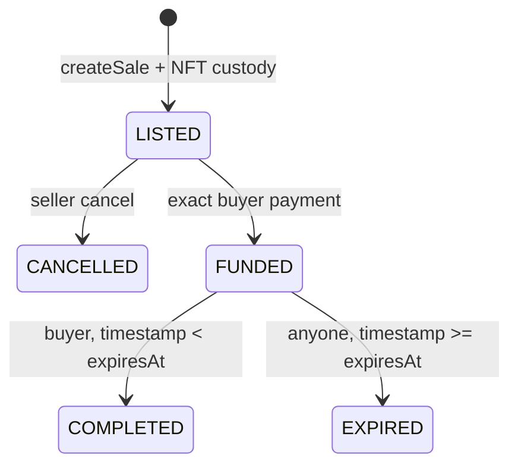

# Escrow protocol

Cancellation and expiry retain NFT custody until seller-only `reclaimToken`. Completion creates a
seller proceeds claim; expiry creates a buyer refund claim. `withdrawPayment` is beneficiary-only
but permits a safe alternate recipient. Pull claims and reclaim are independently retryable.
Escrow liability counts each principal exactly once and balance may exceed it through forced ETH.

`VehicleNFT` has a one-time escrow binding finalized by bootstrap before minting or listing. A
transfer whose destination is the bound escrow is accepted only when the escrow contract itself is
the authorized ERC-721 operator. This keeps ordinary EOA-to-EOA transfers available while rejecting
both direct `transferFrom` and direct `safeTransferFrom` deposits. Every NFT owned by
`MotorCoveEscrow` must therefore have a nonzero `custodySaleId` that references the same token. The
escrow receiver hook remains a second check for the expected `createSale` receipt.
