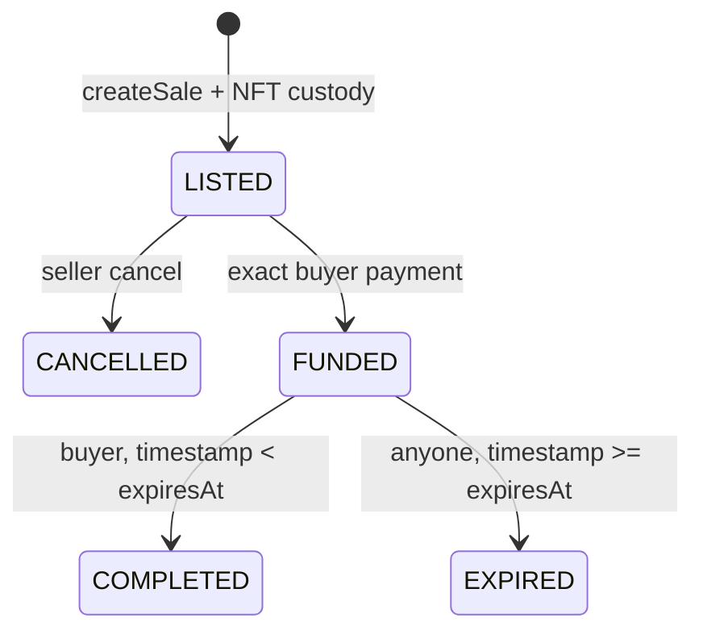

# Escrow protocol

Cancellation and expiry retain NFT custody until seller-only `reclaimToken`. Completion creates a
seller proceeds claim; expiry creates a buyer refund claim. `withdrawPayment` is beneficiary-only
but permits a safe alternate recipient. Pull claims and reclaim are independently retryable.
Escrow liability counts each principal exactly once and balance may exceed it through forced ETH.
