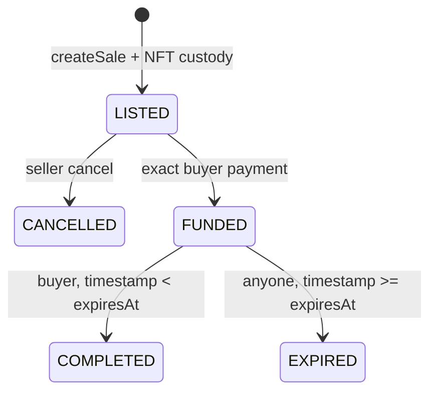

# 托管协议

[English](escrow.md) · [繁體中文](escrow.zh-TW.md)

取消和到期保留 NFT 保管权，直至仅限卖家 `reclaimToken`。完成后，卖方将产生收益索赔；到期会产生买家退款索赔。 `withdrawPayment` 仅限受益人，但允许安全的替代接收人。拉取声明和回收可以独立重试。托管责任对每个本金只计算一次，并且余额可能会通过强制 ETH 超过它。

`VehicleNFT` 在铸造或上市之前由 bootstrap 完成一次性托管绑定。仅当托管合约本身是授权的 ERC-721 运营商时，才接受目的地为绑定托管的转账。这使得普通的 EOA 到 EOA 转账可用，同时拒绝直接 `transferFrom` 和直接 `safeTransferFrom` 存款。因此，`MotorCoveEscrow` 拥有的每个 NFT 都必须有一个引用相同代币的非零 `custodySaleId`。托管接收器挂钩仍然是对预期 `createSale` 收据的第二次检查。
