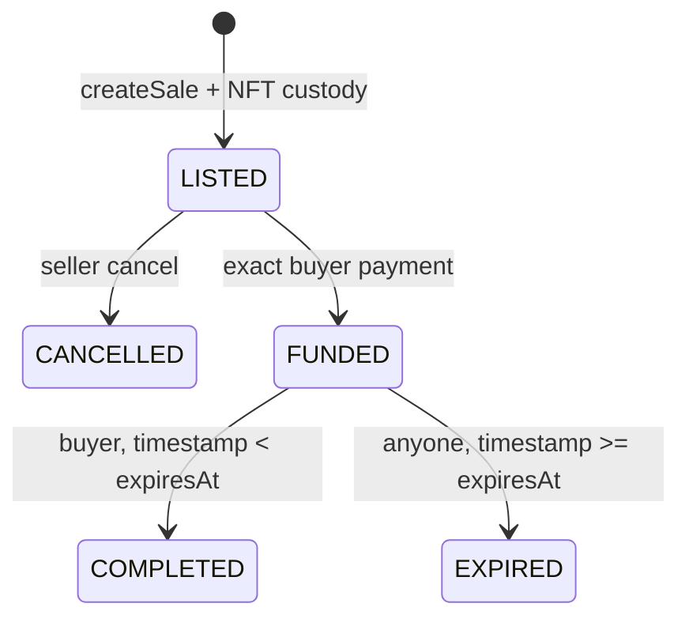

# 託管協議

[English](escrow.md) · [简体中文](escrow.zh-CN.md)

取消和到期保留 NFT 保管權，直至僅限賣家 `reclaimToken`。完成後，賣方將產生收益索賠；到期會產生買家退款索賠。 `withdrawPayment` 僅限受益人，但允許安全的替代接收者。拉取聲明和回收可以獨立重試。託管責任對每個本金只計算一次，並且餘額可能會透過強制 ETH 超過它。

`VehicleNFT` 在鑄造或上市之前由 bootstrap 完成一次性託管綁定。只有當託管合約本身是授權的 ERC-721 業者時，才接受目的地為綁定託管的轉帳。這使得普通的 EOA 到 EOA 轉帳可用，同時拒絕直接 `transferFrom` 和直接 `safeTransferFrom` 存款。因此，`MotorCoveEscrow` 擁有的每個 NFT 都必須有一個引用相同代幣的非零 `custodySaleId`。託管接收器掛鉤仍然是預期 `createSale` 收據的第二次檢查。

每筆新 Sale 都記錄賣家選定的 `allowedBuyer`。只有該地址能以精確的 `priceWei` 付款；`buyer` 記錄實際付款者。零地址與賣家地址不能作為預留買家。Listing 繼續由 escrow 保管，不是公開先到先得的報價。
