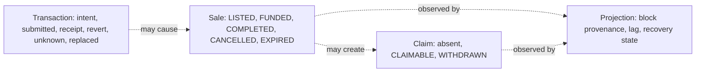

# Transaction and state lifecycles

This page answers why MotorCove shows four state families and why none can stand in for another.



The browser records immutable intent before asking the wallet. A wallet rejection proves no
submission by that request. A transport timeout can be unknown and must not trigger an automatic
resend. A known hash can be observed after reload and may be replaced, cancelled, included with
success, or included with a revert.

## Durable submission boundary

For each explicit attempt, the journal fixes the deployment, chain, original account, protocol
identity, target, exact calldata, value, and sale before any wallet call. The submission sequence is:

```text
PREPARING saved
→ simulation and full live-context recheck
→ AWAITING_WALLET saved
→ full live-context recheck after the awaited save
→ one wallet call
→ returned hash saved immediately
→ receipt, event, and projection reads only
```

If either pre-write fails, the wallet call count stays zero. If the wallet request starts but no
hash returns, reload changes the observation to `UNKNOWN`; it never submits automatically. If the
hash returns but its save fails, the in-memory result still exposes a copyable hash and remains an
unknown recovery case. Journal input is runtime validated. Corrupt JSON, partial entries, and
unknown schema versions are reported as load issues instead of becoming trusted operations.

The last check before the wallet compares the active account, chain, deployment ID, protocol
version, NFT address, and escrow address with the immutable intent. If the application receives a
new valid deployment while simulation is pending, the old action stops before the wallet request.
Once a wallet request has started, a later context change does not prove that submission did not
occur; hash preservation and `UNKNOWN` recovery remain authoritative.

Normal internal product links use client-side routing, so the application-owned journal instance
and any memory-only returned hash survive a route change within the tab. A real document reload,
tab close, browser crash, or device change still discards a non-durable hash. The warning shown for
that state is a recovery boundary, not a promise of reload durability.

## Read-only recovery evidence

Recovery receives only a chain reader, projection observation reader, and journal port. It cannot
receive a wallet client or write gateway. A known or user-supplied hash is associated only after the
transaction sender, escrow target, exact `fundSale(saleId)` calldata, value, receipt block, canonical
block hash, and the escrow's `SaleFunded` log all match the saved intent. The log uses its RPC
`logIndex`; the receipt array position is not an event identity.

Before looking up a candidate transaction, the reader compares the saved chain, deployment,
protocol, and intended contract with the immutable API configuration. It then reads the RPC chain
ID and the escrow `deploymentId()` getter. Approval must target the configured NFT contract; every
other supported action must target the configured escrow. A mismatch returns verification
unavailable without requesting the transaction or receipt, so evidence from another valid
deployment cannot be attached to the saved operation.

RPC or API failure marks current verification unavailable while keeping the last receipt and event
evidence. A user-supplied match records `USER_SUPPLIED` and `INTENT_MATCH`; it proves the funding
effect matches the intent, while it may not prove that it was the exact lost wallet response.

When verification is unavailable for an entry that already has a saved hash, the Observer also
accepts an alternative candidate hash copied from wallet activity. The read-only check keeps the
original hash and verifies the candidate against the saved account, chain, deployment, target,
calldata, and value before associating any evidence. Supplying a candidate never starts a wallet
write or treats the original transaction as safely replaceable.

If the RPC explicitly reports that the saved original or current hash cannot be found, the journal
has a nonce, and no receipt block was previously recorded, recovery persists
`REPLACEMENT_HASH_REQUIRED`. The Observer asks for the current or replacement hash from wallet
activity. It keeps the immutable intent and original hash, validates the supplied candidate through
the same read-only identity checks, and never infers that the transaction is safe to resend. Generic
transport failures remain ordinary unavailable observations; they do not request a replacement hash.

A replacement with the same sender, nonce, target, calldata, and value continues as `REPRICED` and
uses the replacement hash for receipt and projection evidence. A wallet cancellation is recorded as
`CANCELLED`; another target, call, or value is `DIFFERENT_CALL`. Neither latter case proves funding,
and recovery does not submit another transaction.

Each API verification attempt uses one deadline for response headers and body consumption. When the
deadline expires, the HTTP adapter aborts the underlying request, the journal keeps its last known
evidence and records verification unavailable, and the Observer releases that operation's
single-flight slot so a later read-only check can run.

Receipt identity is also canonical-chain evidence, not a permanent fact. When the RPC no longer
returns a previously saved receipt, recovery compares the saved receipt block number and hash with
the current canonical header. A mismatch records `NONCANONICAL` and preserves the orphaned evidence.
If the same transaction hash is later included again, recovery replaces the saved receipt and event
identity with the new canonical block data before checking projection convergence. Real Anvil tests
cover all three replacement classes, an orphaned receipt, and same-hash reinclusion.

`COMPLETED` means the buyer received the NFT and a seller proceeds claim exists. It does not mean the
seller withdrew. `EXPIRED` creates a buyer refund claim while the seller's NFT remains in escrow
until reclaim. Passing a deadline does not execute expiry by itself. Receipt success does not mean
the Indexer has projected the event.

See [listing and funding](../flows/listing-and-funding.md),
[settlement and claims](../flows/settlement-and-claims.md), and
[System API reference](../reference/api.md).

## Supported action observation and tab coordination

Both included success and included revert remain under automatic observation while they are local
non-final evidence. A later canonicality change can therefore move either outcome to `ORPHANED` or
replace it with same-hash reinclusion evidence. `REJECTED` and `FAILED_BEFORE_SUBMIT` never start
receipt polling. This is a local recovery policy, not a mainnet finality guarantee.

Known-hash receipt observation covers `APPROVE_TOKEN`, `CREATE_SALE`, `FUND_SALE`, `COMPLETE_SALE`,
`CANCEL_SALE`, `EXPIRE_SALE`, `WITHDRAW_PAYMENT`, and `RECLAIM_TOKEN`. Every action verifies the saved
sender, target, calldata, value, canonical receipt block, success or revert, and replacement outcome.
Funding additionally verifies the exact `SaleFunded` log and then asks the API for projection effect.
A successful receipt for any other action updates only transaction evidence; it does not imply Sale,
Payment, or projection convergence.

All durable journal writes are awaited. Each operation has a persisted revision; `save()` compares
the expected revision and advances it while holding the deployment Web Lock. A stale revision raises
`JOURNAL_REVISION_CONFLICT` instead of silently acknowledging a discarded write. `updatedAt` remains
diagnostic display evidence and does not order writes. Callers carry forward the entry returned by
`save()`, including its new revision.

If hashless recovery advances an entry while the wallet request is still open, the returned hash is
merged only into the latest revision of the same immutable intent. A different intent or an existing
different hash is never overwritten. Memory-only evidence overlays the durable pre-submit row; an
unrelated operation write does not erase that durable fallback.

Tabs in one browser profile serialize deployment journal writes with the Web Locks API. Closing the
lock owner releases the lock for another tab. The journal does not coordinate different devices.

Receipt and projection observation has a separate exclusive owner keyed by deployment and client
operation. The owner reloads the latest journal revision before it creates a verification generation
and keeps ownership through RPC/API inspection and the controlled save. Automatic polling uses a
non-blocking Web Lock request and skips a busy tick; a manual candidate check waits for the current
owner and then uses the latest revision. Different operations still run concurrently, and the
deployment-wide journal write lock remains a short storage critical section rather than spanning
network requests. When Web Locks are unavailable, the in-memory fallback coordinates only one
JavaScript realm and does not provide a cross-tab guarantee.

## Concurrent wallet and observer evidence

`AWAITING_WALLET` can be inspected before the wallet returns. The observer may therefore advance
the durable revision to `UNKNOWN` while the request later returns an explicit rejection. Wallet
request outcome is recorded independently from transaction status:

- a rejection is merged only into the same immutable intent and wallet request instance;
- revision conflicts reload the latest entry and retry the merge with a bounded compare-and-swap;
- an already discovered transaction hash, receipt, or projection effect is never replaced by a
  wallet rejection;
- a persistence failure uses the existing volatile journal overlay and the notice states that the
  outcome will not survive reload.

This preserves both facts when they coexist: what the wallet call reported and what transaction
evidence was found.

## Durable storage read availability

A durable storage read failure is reported as `STORAGE_UNAVAILABLE`. The browser adapter still
merges known volatile entries so their hashes remain visible in the current application instance,
and the transaction timeline states that reload or tab close loses volatile-only evidence. This
read fallback does not weaken the pre-wallet boundary: inability to durably save the initial intent
still prevents the wallet request.

A durable write failure during known-hash verification does not block the read-only RPC inspection.
The latest `VERIFYING`, receipt, or error evidence is kept in the existing volatile overlay and the
UI states that it is available only in the current tab. The last durable bytes remain unchanged, so
a reload returns the previous durable evidence rather than claiming that the volatile result was
saved. A later explicit recovery attempt may retry the durable compare-and-swap from the recorded
base revision; a concurrent durable update still wins with `JOURNAL_REVISION_CONFLICT`. This retry
path never opens a wallet request.

## Same-intent submission ownership

The application acquires exclusive call-stack ownership for the complete immutable intent before
simulation, journal persistence, or any other awaited step. The key binds deployment, chain,
account, protocol, action, sale/token identity, contract, calldata, and value. In browsers, a Web
Lock carries that ownership across tabs through the returned-hash persistence path. A concurrent
activation returns `OPERATION_ALREADY_IN_FLIGHT` before it can create another journal entry,
simulate, or open a wallet request. A different intent remains independent. The module-level
fallback covers one JavaScript realm only when Web Locks are unavailable.

Returning a transaction hash ends the wallet request, but it does not resolve the attempt. Before a
new operation is created, the capability reloads the journal and rejects the same immutable intent
with `OPERATION_ATTEMPT_UNRESOLVED` while an earlier row is `PREPARING`, `AWAITING_WALLET`,
`SUBMITTED`, `UNKNOWN`, `INCLUDED_SUCCESS`, or `ORPHANED`. This durable check survives reloads and
tab changes. A proved pre-submit rejection or failure permits a fresh operation. A retry after a
proved chain outcome is a separate operation and records `retryOf`; a pending or unknown attempt
cannot be bypassed by setting `retryOf`.

If a returned hash exists only in the volatile overlay and another tab advances the durable row
without transaction evidence, durability retry may rebase that unique hash onto the newer revision.
The operation ID, immutable intent, and wallet request must match. Any durable hash, receipt,
association, event, or projection evidence makes the retry fail closed; no evidence is overwritten
and no wallet request is repeated.

The marketplace mirrors this capability rule with a per-action pending key. The matching control is
disabled and exposes `aria-busy` until the gateway call settles. The durable journal guard continues
after that UI pending state ends, so a returned hash cannot reopen a second wallet request. This UI
state improves feedback but does not replace the capability-level invariant.

## Included versus finalized on public profiles

Ethereum and Polygon projection eligibility follows the chain profile's finalized RPC evidence.
A successful included receipt remains transaction evidence; it does not by itself make the sale
visible in the finalized application projection. Anvil is the loopback immediate-finality profile.
A contradiction at a finalized anchor requires recovery rather than ordinary shallow-reorg retry.
For a new listing, the immutable intent and contract call include the seller-selected
`allowedBuyer`; `buyer` is populated only after that address successfully funds the sale.
