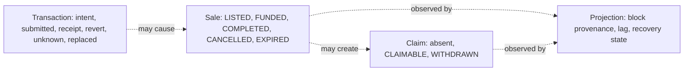

# Transaction and state lifecycles

This page answers why MotorCove shows four state families and why none can stand in for another.



The browser records immutable intent before asking the wallet. A wallet rejection proves no
submission by that request. A transport timeout can be unknown and must not trigger an automatic
resend. A known hash can be observed after reload and may be replaced, cancelled, included with
success, or included with a revert.

## Durable submission boundary

For each explicit attempt, the journal fixes the deployment, chain, original account, protocol
identity, target, exact calldata, value, and sale before any wallet call. The submission sequence is:

```text
PREPARING saved
→ simulation and full live-context recheck
→ AWAITING_WALLET saved
→ full live-context recheck after the awaited save
→ one wallet call
→ returned hash saved immediately
→ receipt, event, and projection reads only
```

If either pre-write fails, the wallet call count stays zero. If the wallet request starts but no
hash returns, reload changes the observation to `UNKNOWN`; it never submits automatically. If the
hash returns but its save fails, the in-memory result still exposes a copyable hash and remains an
unknown recovery case. Journal input is runtime validated. Corrupt JSON, partial entries, and
unknown schema versions are reported as load issues instead of becoming trusted operations.

The last check before the wallet compares the active account, chain, deployment ID, protocol
version, NFT address, and escrow address with the immutable intent. If the application receives a
new valid deployment while simulation is pending, the old action stops before the wallet request.
Once a wallet request has started, a later context change does not prove that submission did not
occur; hash preservation and `UNKNOWN` recovery remain authoritative.

Normal internal product links use client-side routing, so the application-owned journal instance
and any memory-only returned hash survive a route change within the tab. A real document reload,
tab close, browser crash, or device change still discards a non-durable hash. The warning shown for
that state is a recovery boundary, not a promise of reload durability.

## Read-only recovery evidence

Recovery receives only a chain reader, projection observation reader, and journal port. It cannot
receive a wallet client or write gateway. A known or user-supplied hash is associated only after the
transaction sender, escrow target, exact `fundSale(saleId)` calldata, value, receipt block, canonical
block hash, and the escrow's `SaleFunded` log all match the saved intent. The log uses its RPC
`logIndex`; the receipt array position is not an event identity.

RPC or API failure marks current verification unavailable while keeping the last receipt and event
evidence. A user-supplied match records `USER_SUPPLIED` and `INTENT_MATCH`; it proves the funding
effect matches the intent, while it may not prove that it was the exact lost wallet response.

A replacement with the same sender, nonce, target, calldata, and value continues as `REPRICED` and
uses the replacement hash for receipt and projection evidence. A wallet cancellation is recorded as
`CANCELLED`; another target, call, or value is `DIFFERENT_CALL`. Neither latter case proves funding,
and recovery does not submit another transaction.

Each API verification attempt uses one deadline for response headers and body consumption. When the
deadline expires, the HTTP adapter aborts the underlying request, the journal keeps its last known
evidence and records verification unavailable, and the Observer releases that operation's
single-flight slot so a later read-only check can run.

Receipt identity is also canonical-chain evidence, not a permanent fact. When the RPC no longer
returns a previously saved receipt, recovery compares the saved receipt block number and hash with
the current canonical header. A mismatch records `NONCANONICAL` and preserves the orphaned evidence.
If the same transaction hash is later included again, recovery replaces the saved receipt and event
identity with the new canonical block data before checking projection convergence. Real Anvil tests
cover all three replacement classes, an orphaned receipt, and same-hash reinclusion.

`COMPLETED` means the buyer received the NFT and a seller proceeds claim exists. It does not mean the
seller withdrew. `EXPIRED` creates a buyer refund claim while the seller's NFT remains in escrow
until reclaim. Passing a deadline does not execute expiry by itself. Receipt success does not mean
the Indexer has projected the event.

See [listing and funding](../flows/listing-and-funding.md),
[settlement and claims](../flows/settlement-and-claims.md), and
[System API reference](../reference/api.md).

## Supported action observation and tab coordination

Both included success and included revert remain under automatic observation while they are local
non-final evidence. A later canonicality change can therefore move either outcome to `ORPHANED` or
replace it with same-hash reinclusion evidence. `REJECTED` and `FAILED_BEFORE_SUBMIT` never start
receipt polling. This is a local recovery policy, not a mainnet finality guarantee.

Known-hash receipt observation covers `APPROVE_TOKEN`, `CREATE_SALE`, `FUND_SALE`, `COMPLETE_SALE`,
`CANCEL_SALE`, `EXPIRE_SALE`, `WITHDRAW_PAYMENT`, and `RECLAIM_TOKEN`. Every action verifies the saved
sender, target, calldata, value, canonical receipt block, success or revert, and replacement outcome.
Funding additionally verifies the exact `SaleFunded` log and then asks the API for projection effect.
A successful receipt for any other action updates only transaction evidence; it does not imply Sale,
Payment, or projection convergence.

All durable journal writes are awaited. Each operation has a persisted revision; `save()` compares
the expected revision and advances it while holding the deployment Web Lock. A stale revision raises
`JOURNAL_REVISION_CONFLICT` instead of silently acknowledging a discarded write. `updatedAt` remains
diagnostic display evidence and does not order writes. Callers carry forward the entry returned by
`save()`, including its new revision.

If hashless recovery advances an entry while the wallet request is still open, the returned hash is
merged only into the latest revision of the same immutable intent. A different intent or an existing
different hash is never overwritten. Memory-only evidence overlays the durable pre-submit row; an
unrelated operation write does not erase that durable fallback.

Tabs in one browser profile serialize deployment journal writes with the Web Locks API. Closing the
lock owner releases the lock for another tab. The journal does not coordinate different devices.
