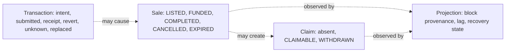

# 事务和状态生命周期

[English](transaction-lifecycle.md) · [繁體中文](transaction-lifecycle.zh-TW.md)

本页回答了为什么 MotorCove 显示四个状态系列以及为什么没有一个状态系列可以替代另一个状态系列。



浏览器在询问钱包之前记录不可变的意图。钱包被拒绝证明该请求没有提交。传输超时可能是未知的，并且不得触发自动重新发送。重新加载后可以观察到已知的散列，并且可以替换、取消、成功包含或包含恢复。

## 持久提交边界

对于每次显式尝试，日志在任何钱包调用之前都会修复部署、链、原始帐户、协议身份、目标、确切的调用数据、价值和销售。提交顺序为：

```text
PREPARING saved
→ simulation and full live-context recheck
→ AWAITING_WALLET saved
→ full live-context recheck after the awaited save
→ one wallet call
→ returned hash saved immediately
→ receipt, event, and projection reads only
```

如果任一预写入失败，钱包调用计数将保持为零。如果钱包请求开始但没有哈希返回，则重新加载将观察值更改为`UNKNOWN`；它永远不会自动提交。如果哈希返回但保存失败，则内存中的结果仍然会暴露可复制的哈希，并且仍然是未知的恢复情况。 日志输入经过运行时验证。损坏的 JSON、部分条目和未知架构版本将报告为加载问题，而不是成为可信操作。

钱包之前的最后一次检查将活动帐户、链、部署 ID、协议版本、NFT 地址和托管地址与不可变意图进行比较。如果应用程序在模拟挂起时收到新的有效部署，则旧操作会在钱包请求之前停止。一旦钱包请求开始，稍后的上下文更改并不能证明提交没有发生；哈希保存和 `UNKNOWN` 恢复仍然具有权威性。

正常的内部产品链接使用客户端路由，因此应用程序拥有的日志实例和任何仅返回内存的哈希在选项卡内发生路由更改后仍然存在。真正的文档重新加载、选项卡关闭、浏览器崩溃或设备更改仍然会丢弃非持久哈希。该状态显示的警告是恢复边界，而不是重新加载耐久性的承诺。

## 只读恢复证据

恢复仅接收链式阅读器、投影观察阅读器和日志端口。它无法接收钱包客户端或写入网关。仅当交易发送方、托管目标、确切的 `fundSale(saleId)` 调用数据、值、接收块、规范块哈希和托管的 `SaleFunded` 日志全部与保存的意图匹配后，才会关联已知或用户提供的哈希。日志使用其RPC `logIndex`；收据数组位置不是事件标识。

在查找候选交易之前，读者将保存的链、部署、协议和预期合约与不可变的 API 配置进行比较。然后它读取 RPC 链 ID 和托管 `deploymentId()` getter。批准必须针对配置的NFT合约；所有其他受支持的操作都必须针对配置的托管。如果不请求交易或收据，不匹配会导致验证不可用，因此来自另一个有效部署的证据无法附加到已保存的操作。

RPC或API失败标记当前验证不可用，同时保留最后的收据和事件证据。用户提供的匹配记录`USER_SUPPLIED`和`INTENT_MATCH`；它证明了资金效应与意图相符，但可能无法证明这就是钱包丢失的确切反应。

当已保存哈希的条目无法进行验证时，观察者还接受从钱包活动复制的替代候选哈希。只读检查保留原始哈希，并在关联任何证据之前根据已保存的帐户、链、部署、目标、调用数据和值验证候选者。提供候选人永远不会开始钱包写入或将原始交易视为可安全替换。

如果 RPC 显式报告无法找到保存的原始或当前哈希，日志有随机数，并且先前没有记录接收块，则恢复持续 `REPLACEMENT_HASH_REQUIRED`。观察者从钱包活动中请求当前或替换的哈希值。它保留不可变的意图和原始哈希，通过相同的只读身份检查验证提供的候选者，并且永远不会推断交易可以安全地重新发送。一般的运输故障仍然是普通的、无法观察到的；他们不请求替换哈希。

具有相同发送者、随机数、目标、呼叫数据和值的替换继续为 `REPRICED`，并使用替换哈希作为收据和投影证据。钱包取消记录为`CANCELLED`；另一个目标、调用或值是 `DIFFERENT_CALL`。后一种情况都无法证明资金，并且恢复不会提交另一笔交易。

每个 API 验证尝试都使用一个响应标头和正文消耗的截止时间。当截止日期到期时，HTTP 适配器中止底层请求，日志保留其最后已知的证据并记录验证不可用，并且观察者释放该操作的单次飞行槽，以便稍后可以运行只读检查。

收据身份也是规范链证据，而不是永久事实。当 RPC 不再返回之前保存的收据时，恢复会将保存的收据块号和哈希值与当前规范标头进行比较。不匹配记录 `NONCANONICAL` 并保留孤立证据。如果稍后再次包含相同的交易哈希，则恢复会在检查投影收敛之前用新的规范块数据替换保存的收据和事件身份。真正的 Anvil 测试涵盖所有三个替换类、孤立收据和相同哈希重新包含。

`COMPLETED` 表示买方收到了 NFT，并且存在卖方收益索赔。这并不意味着卖家退出。 `EXPIRED` 创建买方退款索赔，而卖方的 NFT 仍处于托管状态直至收回。超过最后期限本身并不意味着到期。接收成功并不意味着Indexer已经预测了该事件。

看 [上市及融资](../flows/listing-and-funding.zh-CN.md), [和解及索赔](../flows/settlement-and-claims.zh-CN.md)， 和 [系统API参考](../reference/api.zh-CN.md).

## 支持动作观察和选项卡协调

两者都包括成功和包括恢复仍然处于自动观察状态，而它们是本地非最终证据。因此，后来的规范性更改可以将任一结果移至 `ORPHANED` 或用相同哈希重新包含证据替换它。 `REJECTED` 和 `FAILED_BEFORE_SUBMIT` 从不启动收据轮询。这是本地恢复策略，而不是主网最终确定性保证。

已知哈希收据观察涵盖 `APPROVE_TOKEN`、`CREATE_SALE`、`FUND_SALE`、`COMPLETE_SALE`、`CANCEL_SALE`、`EXPIRE_SALE`、`WITHDRAW_PAYMENT` 和 `RECLAIM_TOKEN`。每个操作都会验证保存的发送者、目标、呼叫数据、值、规范接收块、成功或恢复以及替换结果。 Funding还验证了确切的`SaleFunded`日志，然后向API询问投影的效果。任何其他操作的成功收据仅更新交易证据；它并不意味着Sale、支付或投影收敛。

等待所有持久的日志写入。每个操作都有一个持久的修订； `save()` 比较预期修订并在保持部署 Web 锁定的同时推进它。过时的修订会引发 `JOURNAL_REVISION_CONFLICT`，而不是默默地确认丢弃的写入。 `updatedAt` 保留诊断显示证据并且不命令写入。调用者继承 `save()` 返回的条目，包括其新版本。

如果无哈希恢复在钱包请求仍处于打开状态时推进条目，则返回的哈希仅合并到同一不可变意图的最新版本中。不同的意图或现有的不同哈希永远不会被覆盖。仅内存证据覆盖持久的预提交行；不相关的写入操作不会擦除持久回退。

一个浏览器配置文件中的选项卡使用 Web Locks API 序列化部署日志写入。关闭锁所有者会释放另一个选项卡的锁。 日志不协调不同的设备。

收据和投影观察有一个单独的专有所有者，由部署和客户端操作键入。所有者在创建验证生成之前重新加载最新的日志修订版，并通过 RPC/API 检查和受控保存保留所有权。自动轮询使用非阻塞 Web Lock 请求并跳过繁忙的滴答声；手动候选检查等待当前所有者，然后使用最新版本。不同的操作仍然并发运行，部署范围的日志写锁仍然是一个短存储关键部分，而不是跨越网络请求。当 Web Locks 不可用时，内存回退仅协调一个 JavaScript 领域，并且不提供跨表保证。

## 并发钱包和观察者证据

`AWAITING_WALLET` 钱包返还前可以检查。因此，观察者可以将持久修订推进到 `UNKNOWN`，而请求稍后返回明确的拒绝。钱包请求结果的记录与交易状态无关：

- 拒绝仅合并到相同的不可变意图和钱包请求实例中；
- 修订冲突重新加载最新条目并使用有界比较和交换重试合并；
- 已经发现的交易哈希、收据或投影效应永远不会被替换
  钱包拒绝；
- 持久性故障使用现有的易失性日志覆盖，并且通知指出
  结果将无法重新加载。

当这两个事实共存时，这会保留它们：钱包调用报告的内容和发现的交易证据。

## 持久存储读取可用性

持久存储读取失败报告为 `STORAGE_UNAVAILABLE`。浏览器适配器仍然合并已知的易失性条目，以便它们的哈希值在当前应用程序实例中保持可见，并且事务时间线表明重新加载或选项卡关闭会丢失仅易失性证据。这种读取回退不会削弱预钱包边界：无法持久保存初始意图仍然会阻止钱包请求。

已知哈希验证期间的持久写入失败不会阻止只读 RPC 检查。最新的 `VERIFYING`、收据或错误证据保留在现有的易失性覆盖中，并且 UI 声明它仅在当前选项卡中可用。最后的持久字节保持不变，因此重新加载会返回先前的持久证据，而不是声明易失性结果已保存。稍后的显式恢复尝试可能会根据记录的基础修订版重试持久比较和交换；并发持久更新仍然以 `JOURNAL_REVISION_CONFLICT` 获胜。此重试路径永远不会打开钱包请求。

## 相同意图提交所有权

应用程序在模拟、日志持久性或任何其他等待步骤之前获取完整的不可变意图的独占调用堆栈所有权。密钥绑定部署、链、账户、协议、操作、销售/代币身份、合约、调用数据和价值。在浏览器中，Web Lock 通过返回的哈希持久路径在选项卡之间传递所有权。并发激活在创建另一个日志条目、模拟或打开钱包请求之前返回 `OPERATION_ALREADY_IN_FLIGHT`。不同的意图保持独立。仅当 Web Locks 不可用时，模块级后备覆盖一个 JavaScript 领域。

返回交易哈希会结束钱包请求，但不会解决该尝试。在创建新操作之前，该功能会重新加载日志并拒绝与 `OPERATION_ATTEMPT_UNRESOLVED` 相同的不可变意图，而较早的行是 `PREPARING`、`AWAITING_WALLET`、`SUBMITTED`、`UNKNOWN`、`INCLUDED_SUCCESS` 或 `ORPHANED`。这种持久的检查可以在重新加载和选项卡更改后继续存在。经证实的预提交拒绝或失败允许重新操作。证明链结果后的重试是一个单独的操作并记录 `retryOf`；无法通过设置 `retryOf` 来绕过未决或未知的尝试。

如果返回的散列仅存在于易失性覆盖中，并且另一个选项卡在没有事务证据的情况下推进持久行，则持久性重试可能会将该唯一散列重新设置为较新的版本。操作 ID、不可变意图和钱包请求必须匹配。任何持久的哈希、收据、关联、事件或投影证据都会导致重试失败关闭；没有证据被覆盖，也没有钱包请求被重复。

市场通过每个操作挂起密钥来反映此功能规则。匹配控制被禁用并公开 `aria-busy`，直到网关呼叫稳定为止。持久的日志防护在 UI 挂起状态结束后继续，因此返回的哈希无法重新打开第二个钱包请求。此 UI 状态可改善反馈，但不会取代功能级别不变量。
