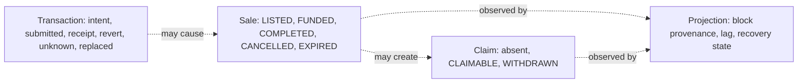

# 事務和狀態生命週期

[English](transaction-lifecycle.md) · [简体中文](transaction-lifecycle.zh-CN.md)

本頁回答了為什麼 MotorCove 顯示四個狀態系列以及為什麼沒有一個狀態系列可以取代另一個狀態系列。



浏览器在询问钱包之前记录不可变的意图。錢包被拒絕證明該請求沒有提交。传输超时可能是未知的，并且不得触发自动重新发送。重新加载后可以观察到已知的散列，并且可以替换、取消、成功包含或包含恢复。

## 持久提交邊界

對於每次明確嘗試，日誌在任何錢包呼叫之前都會修復部署、鏈、原始帳戶、協定身分、目標、確切的呼叫資料、價值和銷售。提交順序為：

```text
PREPARING saved
→ simulation and full live-context recheck
→ AWAITING_WALLET saved
→ full live-context recheck after the awaited save
→ one wallet call
→ returned hash saved immediately
→ receipt, event, and projection reads only
```

如果任一預寫入失敗，錢包呼叫計數將保持為零。如果錢包請求開始但沒有哈希返回，則重新加載將觀察值更改為`UNKNOWN`；它永遠不會自動提交。如果哈希返回但保存失敗，則記憶體中的結果仍然會暴露可複製的哈希，並且仍然是未知的恢復情況。 日誌輸入經過運轉時驗證。損壞的 JSON、部分條目和未知架構版本將報告為載入問題，而不是成為可信任操作。

钱包之前的最后一次检查将活动帐户、链、部署 ID、协议版本、NFT 地址和托管地址与不可变意图进行比较。如果应用程序在模拟挂起时收到新的有效部署，则旧操作会在钱包请求之前停止。一旦錢包請求開始，稍後的上下文更改並不能證明提交沒有發生；哈希保存和 `UNKNOWN` 恢復仍然具有權威性。

正常的內部產品連結使用客戶端路由，因此應用程式擁有的日誌實例和任何僅返回記憶體的雜湊在選項卡內發生路由變更後仍然存在。真正的文件重新載入、選項卡關閉、瀏覽器崩潰或裝置變更仍然會丟棄非持久性哈希。此狀態顯示的警告是恢復邊界，而不是重新載入耐久性的承諾。

## 唯讀恢復證據

恢復僅接收鍊式閱讀器、投影觀察閱讀器和日誌連接埠。它無法接收錢包客戶端或寫入網關。只有在交易發送者、託管目標、確切的 `fundSale(saleId)` 呼叫資料、值、接收區塊、規範區塊雜湊和託管的 `SaleFunded` 日誌全部與保存的意圖匹配後，才會關聯已知或用戶提供的雜湊。日誌使用其RPC `logIndex`；收據數組位置不是事件標識。

在尋找候選交易之前，讀者將保存的鏈、部署、協議和預期合約與不可變的 API 配置進行比較。然後它讀取 RPC 鏈 ID 和託管 `deploymentId()` getter。批准必須針對配置的NFT合約；所有其他受支援的操作都必須針對配置的託管。如果不要求交易或收據，不匹配會導致驗證不可用，因此來自另一個有效部署的證據無法附加到已保存的操作。

RPC或API失敗標記目前驗證不可用，同時保留最後的收據和事件證據。用戶提供的配對記錄`USER_SUPPLIED`和`INTENT_MATCH`；它證明了資金效應與意圖相符，但可能無法證明這就是錢包遺失的確切反應。

當已保存哈希的條目無法進行驗證時，觀察者也接受從錢包活動複製的替代候選哈希。只讀檢查保留原始哈希，並在關聯任何證據之前根據已儲存的帳戶、鏈、部署、目標、呼叫資料和值驗證候選者。提供候選人永遠不會開始錢包寫入或將原始交易視為可安全替換。

如果 RPC 明確報告無法找到已儲存的原始或目前雜湊，日誌有隨機數，且先前沒有記錄接收區塊，則恢復持續 `REPLACEMENT_HASH_REQUIRED`。觀察者從錢包活動中請求當前或替換的雜湊值。它保留不可變的意圖和原始哈希，透過相同的唯讀身份檢查驗證提供的候選者，並且永遠不會推斷交易可以安全地重新發送。一般的運輸故障仍然是普通的、無法觀察到的；他們不請求替換雜湊。

具有相同發送者、隨機數、目標、呼叫資料和值的替換繼續為 `REPRICED`，並使用替換雜湊作為收據和投影證據。錢包取消記錄為`CANCELLED`；另一個目標、呼叫或值是 `DIFFERENT_CALL`。後一種情況都無法證明資金，並且恢復不會提交另一筆交易。

每個 API 驗證嘗試都使用一個回應標頭和正文消耗的截止時間。當截止日期到期時，HTTP 適配器中止底層請求，日誌保留其最後已知的證據並記錄驗證不可用，並且觀察者釋放該操作的單次飛行槽，以便稍後可以運行只讀檢查。

收據身分也是規範鏈證據，而不是永久事實。當 RPC 不再傳回先前儲存的收據時，復原會將已儲存的收據區塊編號和雜湊值與目前規範標頭進行比較。不匹配記錄 `NONCANONICAL` 並保留孤立證據。如果稍後再次包含相同的交易哈希，則復原會在檢查投影收斂之前用新的規範區塊資料取代已儲存的收據和事件身分。真正的 Anvil 測試涵蓋所有三個替換類別、孤立收據和相同雜湊重新包含。

`COMPLETED` 表示買方收到了 NFT，並且存在賣方收益索賠。這並不意味著賣家退出。 `EXPIRED` 建立買方退款索賠，而賣方的 NFT 仍處於託管狀態直至收回。超過最後期限本身並不意味著到期。接收成功並不意味著Indexer已經預測了該事件。

看 [上市及融資](../flows/listing-and-funding.zh-TW.md), [和解及索賠](../flows/settlement-and-claims.zh-TW.md)， 和 [系統API參考](../reference/api.zh-TW.md).

## 支援動作觀察和選項卡協調

兩者都包括成功和包括恢復仍然處於自動觀察狀態，而它們是本地非最終證據。因此，後來的規範性變更可以將任一結果移至 `ORPHANED` 或用相同雜湊重新包含證據取代它。 `REJECTED` 和 `FAILED_BEFORE_SUBMIT` 從不啟動收據輪詢。這是本地恢復策略，而不是主網最終確定性保證。

已知哈希收據觀察涵蓋 `APPROVE_TOKEN`、`CREATE_SALE`、`FUND_SALE`、`COMPLETE_SALE`、`CANCEL_SALE`、`EXPIRE_SALE`、`WITHDRAW_PAYMENT` 和 `RECLAIM_TOKEN`。每個操作都會驗證已儲存的傳送者、目標、呼叫資料、值、規範接收區塊、成功或復原以及替換結果。 Funding也驗證了確切的`SaleFunded`日誌，然後向API詢問投影的效果。任何其他操作的成功收據僅更新交易證據；它並不意味著Sale、付款或投影收斂。

等待所有持久的日誌寫入。每個操作都有一個持久的修訂； `save()` 比較預期修訂並在保持部署 Web 鎖定的同時推進它。過時的修訂會引發 `JOURNAL_REVISION_CONFLICT`，而不是默默地確認丟棄的寫入。 `updatedAt` 保留診斷顯示證據並且不命令寫入。呼叫者繼承 `save()` 傳回的條目，包括其新版本。

如果無雜湊恢復在錢包請求仍處於開啟狀態時推進條目，則傳回的雜湊僅合併到同一不可變意圖的最新版本中。不同的意圖或現有的不同哈希永遠不會被覆蓋。僅記憶體證據覆蓋持久的預提交行；不相關的寫入操作不會擦除持久回退。

一個瀏覽器設定檔中的標籤使用 Web Locks API 序列化部署日誌寫入。關閉鎖定所有者會釋放另一個選項卡的鎖。 日誌不協調不同的設備。

收據和投影觀察有一個單獨的專有所有者，由部署和客戶端操作鍵入。擁有者在建立驗證產生之前重新載入最新的日誌修訂版，並透過 RPC/API 檢查和受控保存保留所有權。自動輪詢使用非阻塞 Web Lock 請求並跳過繁忙的滴答聲；手動候選檢查等待目前所有者，然後使用最新版本。不同的操作仍然並發運行，部署範圍的日誌寫鎖仍然是一個短存儲關鍵部分，而不是跨越網路請求。當 Web Locks 不可用時，記憶體回退僅協調一個 JavaScript 領域，並且不提供跨表保證。

## 並發錢包和觀察者證據

`AWAITING_WALLET` 錢包返還前可以檢查。因此，觀察者可以將持久修訂推進到 `UNKNOWN`，而請求稍後返回明確的拒絕。錢包請求結果的記錄與交易狀態無關：

- 拒絕僅合併到相同的不可變意圖和錢包請求實例中；
- 修訂衝突重新載入最新條目並使用有界比較和交換重試合併；
- 已經發現的交易哈希、收據或投影效應永遠不會被替換
  錢包拒絕；
- 持久性故障使用現有的揮發性日誌覆蓋，並且通知指出
  結果將無法重新載入。

當這兩個事實共存時，這會保留它們：錢包調用報告的內容和發現的交易證據。

## 持久性儲存讀取可用性

持久性儲存讀取失敗報告為 `STORAGE_UNAVAILABLE`。瀏覽器適配器仍然合併已知的揮發性條目，以便它們的雜湊值在當前應用程式實例中保持可見，且交易時間軸表示重新載入或標籤關閉會遺失僅易失性證據。這種讀取回退不會削弱預錢包邊界：無法持久保存初始意圖仍然會阻止錢包請求。

已知雜湊驗證期間的持久寫入失敗不會阻止只讀 RPC 檢查。最新的 `VERIFYING`、收據或錯誤證據保留在現有的易失性覆蓋中，並且 UI 聲明它僅在當前選項卡中可用。最後的持久位元組保持不變，因此重新載入會傳回先前的持久證據，而不是聲明易失性結果已儲存。稍後的明確恢復嘗試可能會根據記錄的基礎修訂版重試持久比較和交換；並發持久更新仍然以 `JOURNAL_REVISION_CONFLICT` 獲勝。此重試路徑永遠不會打開錢包請求。

## 相同意圖提交所有權

应用程序在模拟、日誌持久性或任何其他等待步骤之前获取完整的不可变意图的独占调用堆栈所有权。密鑰綁定部署、鏈、帳戶、協議、操作、銷售/代幣身份、合約、調用資料和價值。在瀏覽器中，Web Lock 透過傳回的哈希持久路徑在標籤之間傳遞所有權。并发激活在创建另一个日誌条目、模拟或打开钱包请求之前返回 `OPERATION_ALREADY_IN_FLIGHT`。不同的意圖保持獨立。僅當 Web Locks 不可用時，模組級後備涵蓋一個 JavaScript 領域。

返回交易哈希會結束錢包請求，但不會解決該嘗試。在创建新操作之前，该功能会重新加载日誌并拒绝相同的不可变意图 `OPERATION_ATTEMPT_UNRESOLVED` 而前面的一行是 `PREPARING`, `AWAITING_WALLET`, `SUBMITTED`, `UNKNOWN`, `INCLUDED_SUCCESS`， 或者 `ORPHANED`。這種持久的檢查可以在重新載入和選項卡更改後繼續存在。經證實的預提交拒絕或失敗允許重新操作。證明鏈結果後的重試是單獨的操作和記錄 `retryOf`;無法透過設定繞過未決或未知的嘗試 `retryOf`.

如果傳回的雜湊僅存在於易失性覆蓋中，且另一個標籤在沒有交易證據的情況下會推進持久行，則持久性重試可能會將該唯一雜湊重新設定為較新的版本。操作 ID、不可變意圖和錢包請求必須匹配。任何持久的哈希、收據、關聯、事件或投影證據都會導致重試失敗關閉；沒有證據被覆蓋，也沒有錢包請求被重複。

市場透過每個操作掛起密鑰來反映此功能規則。匹配控制被停用並公開 `aria-busy`，直到網關呼叫穩定為止。持久的日誌防护在 UI 挂起状态结束后继续，因此返回的哈希无法重新打开第二个钱包请求。此 UI 狀態可改善回饋，但不會取代功能等級不變量。

## 公鏈 profile 的已包含與已達最終性

Ethereum 與 Polygon 的投影可索引範圍依鏈 profile 的 finalized RPC 證據決定。成功且已包含的收據仍是交易證據；它本身不會使 Sale 立即出現在已達最終性的應用投影。Anvil 是 loopback 立即最終性 profile。Finalized 錨點若發生矛盾，必須進入恢復，不能只當作一般淺層 reorg 重試。新 listing 的不可變意圖與合約呼叫包含賣家選定的 `allowedBuyer`；只有該地址成功付款後，才設定實際 `buyer`。
