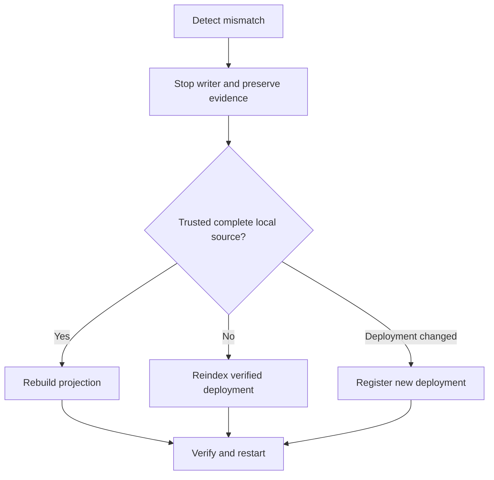

# How to recover the Indexer

Use this runbook when ingestion reports a checkpoint, parent, log/hash, ABI, scope, or deployment
mismatch. Do not skip the failing range.

1. Stop the managed Indexer and preserve DB, manifest, marker, and sanitized logs.
2. Classify deployment change, canonical-history change, local source corruption, projection-only
   corruption, or maintenance interruption.
3. If the anchor remains available, run an anchored reconciliation. Do not repair from its report.
4. Choose catch-up, rebuild, reindex, new deployment, restore, or marker recovery using the
   [indexing flow](../flows/indexing-and-recovery.md).
5. Verify deployment identity, schema contract, source scope, checkpoint hash, projection build,
   catalog preservation, and API provenance before restarting one writer.

Rebuild and reindex use the managed database path described above. Automatic cross-branch reorg
rollback remains out of scope; operators explicitly reindex or register a new deployment.

