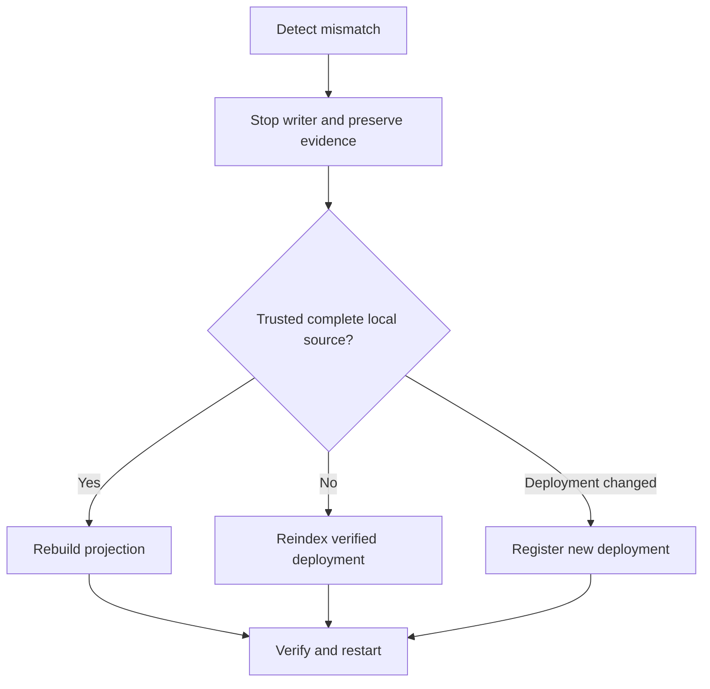

# 如何恢复Indexer

[English](indexer-recovery.md) · [繁體中文](indexer-recovery.zh-TW.md)

当摄取报告检查点、父级、日志/哈希、ABI、范围或部署不匹配时，请使用此 Runbook。不要跳过失败范围。

1. 停止托管 Indexer 并保留数据库、清单、标记和清理的日志。
2. 对部署更改、规范历史更改、本地源损坏、仅投影进行分类
   损坏或维护中断。
3. 如果锚点仍然可用，则运行锚定的对账。请勿根据其报告进行修复。
4. 使用以下命令选择追赶、重建、重新索引、新部署、恢复或标记恢复
   [索引流程](../flows/indexing-and-recovery.zh-CN.md)。
5. 验证部署身份、模式合约、源范围、检查点哈希、投影构建、
   重新启动一位编写器之前，目录保存以及 API 出处。

重建和重新索引使用上述托管数据库路径。自动跨分支重组回滚仍然超出范围；操作员显式重新索引或注册新部署。

