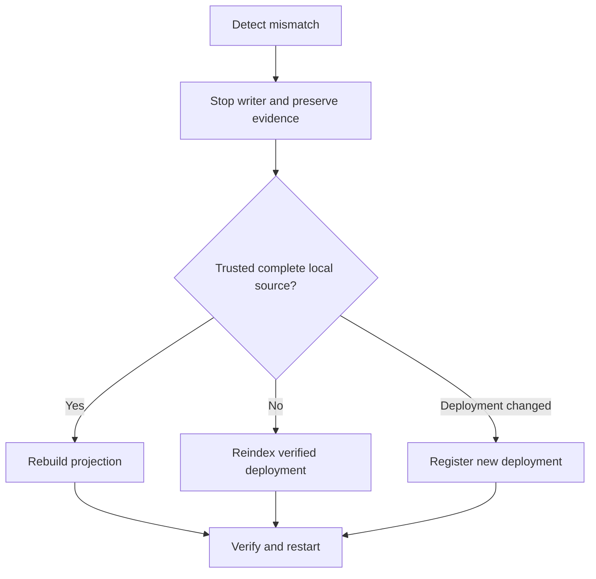

# 如何恢復Indexer

[English](indexer-recovery.md) · [简体中文](indexer-recovery.zh-CN.md)

當攝取報告檢查點、父級、日誌/雜湊、ABI、範圍或部署不符時，請使用此 Runbook。不要跳過失敗範圍。

1. 停止託管 Indexer 並保留資料庫、清單、標記和清理的日誌。
2. 將部署變更、規範歷史變更、本機來源損壞、僅投影進行分類
   損壞或維護中斷。
3. 如果錨點仍然可用，則運行錨定的對帳。請勿根據其報告進行修復。
4. 使用以下命令選擇追趕、重建、重新索引、新部署、復原或標記復原
   [索引流程](../flows/indexing-and-recovery.zh-TW.md)。
5. 驗證部署身分、模式合約、來源範圍、檢查點哈希、投影建置、
   重新啟動一位編寫器之前，目錄儲存以及 API 出處。

重建和重新索引使用上述託管資料庫路徑。自動跨分支重組回滾仍然超出範圍；操作員明確重新索引或註冊新部署。

