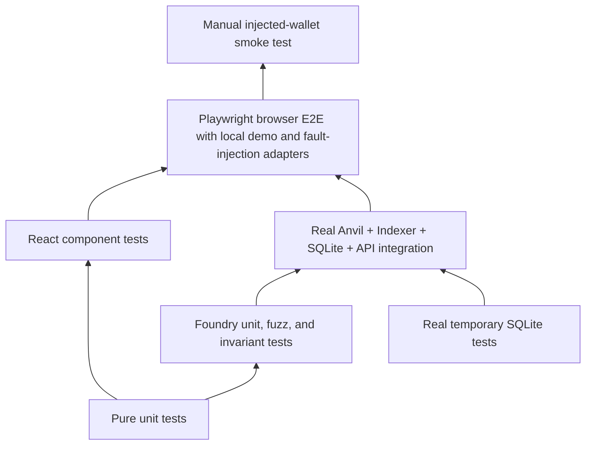

# Testing strategy

This page answers which engineering question belongs to which test layer, what has executed, and
which gaps remain. Test names, source files, and the latest machine record are linked separately so
the existence of a test cannot be mistaken for a passing run.

## Test layers



The diagram shows increasing integration breadth, not a claim that a higher layer replaces the
lower ones. Manual wallet checks are provider evidence; they do not replace contract invariants.

The repository exposes each delivery concern as a named test surface:

- **Contract Tests:** Foundry unit, fuzz, and stateful invariant tests.
- **Frontend Unit Tests:** feature and transaction capability rules in Vitest.
- **Component Tests:** React Testing Library and JSDOM behavior.
- **API Tests:** generated contract compatibility and readonly HTTP behavior.
- **Indexer Replay Tests:** overlap, content identity, rollback, rebuild, and reindex.
- **Database Migration Tests:** native history, drift, failure markers, and schema-source contract.
- **Integration Tests:** isolated real Anvil, Indexer, SQLite, and API processes.
- **E2E Tests:** Playwright through the local browser stack. The happy path uses the explicit
  loopback demo connector; failure paths use a controlled EIP-1193 provider.
- **Architecture Tests:** dependency graph, public export, and invalid-fixture rejection.

| Layer                                    | Runner and environment                                                         | Establishes                                                                                                                                              | Does not establish                                            |
| ---------------------------------------- | ------------------------------------------------------------------------------ | -------------------------------------------------------------------------------------------------------------------------------------------------------- | ------------------------------------------------------------- |
| Pure unit                                | Vitest in-process TypeScript                                                   | Arithmetic, event ordering, pure transitions, adapter-free rules                                                                                         | SQLite locks, RPC behavior, or rendered UI                    |
| React component                          | Vitest, React Testing Library, and JSDOM                                       | Controlled component states and user-visible status semantics                                                                                            | Injected-provider behavior or final browser layout            |
| Contract unit/fuzz/invariant             | Foundry EVM                                                                    | Escrow permissions, asset rollback, pull claims, and liability invariants                                                                                | Deployment manifest, Indexer, API, or wallet provider         |
| API and generated-contract compatibility | Generation drift checks, TypeScript consumers, API contract tests              | Generated ABI/OpenAPI match source and current consumers compile or validate responses                                                                   | Compatibility with an unreleased external consumer            |
| Database                                 | Temporary real SQLite with the native driver                                   | Constraints, migration history, lock competition, snapshot and restore behavior                                                                          | Chain truth, public filesystems, or hardware power loss       |
| Indexer replay                           | Real SQLite and selected Anvil fixtures                                        | Event identity, overlap idempotency, atomic projection/checkpoint commit, same-history recanonicalization, rebuild, canonical reindex and reorg recovery | Unavailable archive history or public-network finality policy |
| Integration                              | Isolated Anvil, SQLite, API, and Indexer                                       | Selected real logs, deployment identity, projection, reconciliation, and recovery paths                                                                  | Manual wallet UX or public-network finality                   |
| Browser E2E                              | Playwright, local stack, loopback demo connector, controlled EIP-1193 provider | UI-to-local-chain settlement, reload, rejection, account/network changes, stale/catch-up behavior                                                        | MetaMask or broad provider compatibility                      |
| Architecture                             | Static import graph and negative fixtures                                      | Selected dependency rules really fail when violated                                                                                                      | Runtime process isolation or remote review policy             |
| Manual wallet                            | Human-controlled injected wallet                                               | Actual provider prompts and account/network UX for that provider                                                                                         | Broad provider support or protocol correctness by itself      |

## Engineering question matrix

| Engineering question                                                                               | Primary test and source                                                                                                                                          | Current evidence                                                                                | Remaining limit                                                                                                        |
| -------------------------------------------------------------------------------------------------- | ---------------------------------------------------------------------------------------------------------------------------------------------------------------- | ----------------------------------------------------------------------------------------------- | ---------------------------------------------------------------------------------------------------------------------- |
| Does the escrow record and cover every independently calculated outstanding obligation?            | Foundry stateful invariant sums funded Sales and claimable Claims independently of `totalLiability`                                                              | `RUN-CONTRACTS`: executed/pass                                                                  | Local Foundry EVM only; no external audit                                                                              |
| Is a missing provider or wallet rejection visible without becoming a submitted transaction?        | `WalletPanel.test.tsx`, `TransactionTimeline.test.tsx`, and the Playwright rejection scenario                                                                    | `RUN-WEB-COMPONENT` and `RUN-E2E`: executed/pass                                                | Fault injection uses a controlled provider; manual MetaMask remains not run                                            |
| Do ABI and API consumers stay compatible with generated providers?                                 | `pnpm generate:check`, workspace typecheck/build, and `tests/integration/api-contract.test.ts`                                                                   | `RUN-GENERATE-CHECK`, `RUN-API-CONTRACT`, and `RUN-WORKSPACE-VERIFY`: executed/pass             | No released third-party consumer or prior protocol version exists                                                      |
| Does overlapping replay avoid applying the same event twice?                                       | `tests/integration/indexer-store.test.ts`                                                                                                                        | `RUN-INTEGRATION`: executed/pass                                                                | Arbitrary canonical branch repair remains outside current automation                                                   |
| Do sale, event, requested-height header, and checkpoint come from one snapshot?                    | `indexer-store.test.ts` with a second writer connection committed at an in-read barrier                                                                          | `RUN-INTEGRATION`: executed/pass                                                                | Real SQLite WAL concurrency; it is not a distributed database isolation claim                                          |
| Does a journal failure before the wallet prevent submission?                                       | `submit-operation.test.ts` with wallet call-count assertions                                                                                                     | `RUN-TRANSACTION-RECOVERY`: executed/pass                                                       | Controlled application port; no manual wallet crash claim                                                              |
| Can reload recovery inspect a supplied hash without a write capability?                            | `recovery.test.ts`, recovery architecture fixture, real-chain replacement tests, and Playwright response-loss scenario                                           | `RUN-TRANSACTION-RECOVERY`, `RUN-ARCHITECTURE`, `RUN-INTEGRATION`, and `RUN-E2E`: executed/pass | The EIP-1193 provider is controlled; manual MetaMask response-loss behavior remains unverified                         |
| Can a slow browser result erase newer receipt or projection evidence?                              | Controlled promise tests in `recovery.test.ts` and `submit-operation.test.ts`; current-reflection selector assertions                                            | `RUN-TRANSACTION-RECOVERY`: executed/pass                                                       | In-process and same-browser journal coordination; no cross-device distributed transaction claim                        |
| Does funding converge after the Indexer stops?                                                     | `transaction-convergence.test.ts` with real Anvil, API, SQLite, and restarted Indexer                                                                            | `RUN-INTEGRATION`: executed/pass                                                                | Application journal reload is serialized in-process; the browser test wallet remains a separate evidence layer         |
| Does a process death expose either side of SQLite COMMIT, never a partial batch?                   | `indexer-kill-recovery.test.ts` with child barriers and `SIGKILL`                                                                                                | `RUN-INDEXER-KILL`: executed/pass                                                               | Ordinary process termination with WAL; no disk failure or hardware power-loss claim                                    |
| Do migrations preserve existing authoritative rows?                                                | Fresh migration/rerun, real `0000` to `0001` upgrade, history divergence, source digest, and injected SQL failure tests in `tests/migrations/migrations.test.ts` | `RUN-DB-MIGRATIONS`: executed/pass for preserved-data upgrade, no-op rerun, and rollback        | Only the repository's recorded migration path is covered; unknown external schemas are unsupported                     |
| Can an interrupted migration resume without deleting its failure marker or accepting changed code? | Bundle-bound marker, known-prefix action, matching continuation, and current-schema metadata finalization in `tests/migrations/migrations.test.ts`               | `RUN-DB-MIGRATIONS`: executed/pass                                                              | Hardware power loss is not reproduced; SQLite transaction and durable marker states are controlled fixtures            |
| Can a stalled API body permanently occupy transaction verification single-flight?                  | Abort-aware body test in `motorcove-api.test.ts` plus Observer automatic-status tests                                                                            | `RUN-WEB-COMPONENT`: executed/pass                                                              | Controlled Fetch body; browser network-stack timeout timing is covered by full E2E only at the service level           |
| Do database faults fail atomically and release owned locks?                                        | `database.test.ts` child `SIGKILL`, `SQLITE_BUSY`, and bounded `SQLITE_FULL` fixtures                                                                            | `RUN-DB-BOUNDARIES`: executed/pass                                                              | Page-count exhaustion is not host-filesystem exhaustion; process death is not hardware power loss                      |
| Can a canonical reorg be repaired without erasing source evidence?                                 | `database-real-recovery.test.ts` with Anvil snapshot/revert and `ops:reindex`                                                                                    | `RUN-INTEGRATION`: executed/pass                                                                | Local deterministic Anvil only; no public-network archive or finality claim                                            |
| Can same-history reindex restore canonical blocks and projections?                                 | `reindex-canonical.test.ts` with durable block/event reuse plus projection rebuild                                                                               | `RUN-INTEGRATION`: executed/pass                                                                | Direct store integration plus separately tested guarded CLI; no public archive provider                                |
| Does a transport outage preserve checkpoint and service readability?                               | `ingest-range.test.ts`, `run-indexer.test.ts`, persisted `STALE` status, and independent `dev:full` processes                                                    | `RUN-INDEXER-UNIT` and `RUN-WORKSPACE-VERIFY`: executed/pass                                    | Controlled transport failure; host network partition and long-duration soak were not run                               |
| Does a real end-to-end settlement reach the query API?                                             | `tests/integration/real-stack.test.ts` and `tests/e2e/marketplace.spec.ts`                                                                                       | `RUN-INTEGRATION` and `RUN-E2E`: executed/pass                                                  | Uses local Anvil and the loopback-only demo connector; browser-extension behavior is separate evidence                 |
| Does bootstrap resume known transactions without replaying completed chain writes?                 | `chain-seed-journal.test.ts` plus completed-user-flow rerun in `tests/integration/real-stack.test.ts`                                                            | `RUN-CHAIN-SEED-JOURNAL` and `RUN-INTEGRATION`: executed/pass                                   | Deterministic state-machine and live rerun evidence; real process kill during broadcast-to-hash persistence not run    |
| Can two processes enter the same environment bootstrap?                                            | `bootstrap-ownership.test.ts`, the production bootstrap wrapper, and journal tests                                                                               | `RUN-INTEGRATION`: one process enters while the owner holds the lock                            | Same-host `flock`; no distributed worker-election claim                                                                |
| Can API config disagree with the registered deployment under the same ID?                          | `start-api.test.ts` and database reader tests                                                                                                                    | `RUN-INDEXER-UNIT`: descriptor mismatch fails before app creation/listen and closes the reader  | Startup evidence comparison; no repeated RPC attestation on each request                                               |
| Can reconciliation miss an extra claim row?                                                        | Real Anvil/SQLite orphan-claim fixture in `real-stack.test.ts`                                                                                                   | `RUN-INTEGRATION`: extra claim produces `MISMATCH`; clean data returns `MATCH`                  | Diagnostic only; it does not delete the row                                                                            |
| Can an owned event advance checkpoint without its prerequisite entity?                             | Pure projector tests and `indexer-store.test.ts`                                                                                                                 | `RUN-INDEXER-UNIT` and `RUN-INTEGRATION`: explicit error, atomic rollback, recovery status      | Controlled SQLite fixture; source repair remains operator action                                                       |
| Does a stored reconciliation report retain its own source scope?                                   | `api-reader-contract.test.ts` with real SQLite reader and Fastify injection                                                                                      | Historical report scope A and current envelope scope B remain distinct                          | Local SQLite and in-process Fastify only                                                                               |
| Can an API sale ID exceed the EVM uint256 boundary or turn a reader failure into a client error?   | `api-contract.test.ts` with malformed, boundary, overflow, missing, and internal-failure cases                                                                   | Overflow fails before reader; valid missing remains 404; reader failure remains 500             | Public HTTP load and adversarial volume testing are outside this correctness case                                      |
| Does the marketplace show the exact wei value it sends?                                            | `amount.test.ts` and `Marketplace.test.tsx`                                                                                                                      | One wei, fractional ETH, large values, round trip, and action-value equality                    | JSDOM verifies text and action arguments; wallet confirmation rendering is provider-owned                              |
| Does a stopped worker remain indefinitely `CURRENT`?                                               | Clock-controlled reader tests, diagnostic selector tests, and Playwright's stopped-Indexer observer page                                                         | Last-known status is retained, observation becomes stale, lag becomes unknown, recovery wins    | Freshness does not query or invent a newer chain head                                                                  |
| Are feature/capability/adapter and server package directions enforced?                             | `tooling/architecture/check.mjs` plus package, relative-path, alias, re-export, and layer negative fixtures                                                      | `RUN-ARCHITECTURE`: executed/pass                                                               | Static source imports only                                                                                             |
| Can projections be rebuilt and reconciled without deleting catalog data?                           | Real-stack recovery plus database recovery suites                                                                                                                | `RUN-INTEGRATION` and `RUN-DB-RECOVERY`: executed/pass                                          | Missing-sale and missing-token detection passed; broader process/filesystem and unavailable-history faults remain open |
| Does a later chain head turn an anchored match into a mismatch?                                    | Real-stack reconciliation after an extra mined block                                                                                                             | `RUN-INTEGRATION`: executed/pass with `MATCH` + `PROJECTION_LAGGING`                            | Anvil snapshot/revert anchor loss is covered; broader provider failure variants remain open                            |
| Are repeated rebuild results stable?                                                               | Two real-stack rebuilds from the same verified raw evidence                                                                                                      | `RUN-INTEGRATION`: executed/pass for sale and vehicle results                                   | Operation IDs and build IDs intentionally differ                                                                       |

### Resumable maintenance and durable-browser regressions

| Engineering question                                                                                     | Primary regression evidence                                                                                                            | Boundary                                                                                            |
| -------------------------------------------------------------------------------------------------------- | -------------------------------------------------------------------------------------------------------------------------------------- | --------------------------------------------------------------------------------------------------- |
| Does an interrupted reindex keep its original eligible target after the live head advances?              | `reindex-target.test.ts` plus projection maintenance tests                                                                             | Controlled chain reader and real temporary SQLite; the full CLI process was not invoked.            |
| Can a malformed or mismatched marker strand process locks?                                               | `projection-maintenance.test.ts` reacquires the real `flock` gates in the same process                                                 | Linux local advisory-lock semantics only.                                                           |
| Can source refresh delete raw or orphan evidence without a verified archive?                             | `indexer-store.test.ts` refuses an unarchived refresh, creates a real backup, verifies it, and reads the archived orphan row           | Local filesystem and SQLite backup; hardware loss is outside this case.                             |
| Can a failed source-incomplete rebuild move to the required recovery without deleting its marker?        | Projection maintenance tests require an explicit full reindex at deployment scan start and preserve failed-operation lineage           | Controlled maintenance marker and real lock gate; full CLI behavior is tested separately.           |
| Can migration back up an initialized database before any deployment exists?                              | Migration tests create a real old-schema database with zero deployments and no sidecars, verify the predeployment backup, then migrate | Local SQLite and filesystem; recovery tests reject predeployment restore before active replacement. |
| Can an awaited journal write make a previous context check stale?                                        | `submit-operation.test.ts` delays the pre-wallet write and asserts wallet call count zero after context invalidation                   | Controlled wallet port; identity dimensions are integrated in the gateway tests.                    |
| Can wall-clock rollback, hashless recovery, or a second tab silently overwrite newer operation evidence? | Submission merge and durable-overlay unit tests plus `journal-multitab.spec.ts` revision conflicts and writer handoff                  | One browser profile; no cross-device locking claim.                                                 |

## Commands

```bash
pnpm test:contracts
pnpm test:unit
pnpm test:migrations
pnpm test:db
pnpm test:seeds
pnpm test:recovery
pnpm test:integration
pnpm test:e2e
pnpm check:architecture
pnpm generate:check
```

The integration suite needs its own temporary directory, database, environment ID, Anvil port,
manifest, lock path, and signer nonce space. A separate database filename alone is insufficient.

## Evidence vocabulary

Use `proposed`, `not run`, `executed/pass`, `executed/fail`, or `blocked`. Record the command,
working directory, timestamp, dirty-worktree context, environment, sanitized result, and limits.
Source inspection and a test file's existence are not execution. Migration exceptions,
kill-process schedules, restore file-switch interruption, and real power loss are separate claims.
A mocked wallet rejection does not prove ambiguous post-broadcast recovery.

See the [scenario catalog](scenario-catalog.md), [database matrix](database-acceptance-matrix.md),
[acceptance evidence](../demo/acceptance-evidence.md), and
[machine evidence](../evidence/verification.json).

## Recovery integrity cases

| Engineering question                                                                        | Evidence                                                                                                                                                                         | Gate                              | Limit                                                                                  |
| ------------------------------------------------------------------------------------------- | -------------------------------------------------------------------------------------------------------------------------------------------------------------------------------- | --------------------------------- | -------------------------------------------------------------------------------------- |
| Can two tabs preserve different operations and transfer journal ownership after one closes? | `journal-multitab.spec.ts` with two real Chromium pages and Web Locks                                                                                                            | `RUN-E2E`                         | One browser profile; no cross-device coordination claim                                |
| Can two tabs observe one operation without superseding every verification result?           | Observation coordinator unit/component tests plus `journal-multitab.spec.ts` with a held operation lock, non-blocking contender, owner-close handoff, and unrelated journal save | `RUN-WEB-COMPONENT` and `RUN-E2E` | Cross-tab guarantee requires Web Locks; fallback coordinates one JavaScript realm only |
| Can two tabs open duplicate wallet requests for the same immutable intent?                  | Submission capability/coordinator tests plus `journal-multitab.spec.ts` with held simulation, a non-blocking contender, independent intent, and owner-close handoff              | `RUN-WEB-COMPONENT` and `RUN-E2E` | Cross-tab guarantee requires Web Locks; cross-device coordination is not claimed       |
| Do all supported writes reach receipt success or revert after reload?                       | Action table in `recovery.test.ts`, generic receipt adapter tests, and a non-funding reload/revert case                                                                          | `RUN-TRANSACTION-RECOVERY`        | Funding alone adds event and projection-effect convergence                             |
| Does rebuild preserve projection when its source is incomplete or altered?                  | Real SQLite source-count and bound raw/decoded evidence fixtures in `indexer-store.test.ts`                                                                                      | `RUN-INTEGRATION`                 | A failed preflight requires reindex; it does not repair source rows                    |
| Can the UI verify an alternative wallet hash while preserving an unavailable saved hash?    | `TransactionObserver.test.tsx` supplies a candidate for an existing-hash unavailable entry and asserts read-only resume arguments                                                | `RUN-WEB-COMPONENT`               | Controlled recovery port; no wallet request or public provider                         |
| Does restore reject a different deployment before quarantine?                               | Real SQLite backup/restore fixtures with changed deployment and sidecar evidence                                                                                                 | `RUN-DB-RECOVERY`                 | Same-deployment catch-up remains a separate Indexer step                               |
| Can interrupted restore attach a previous database generation's hot WAL?                    | Child-process `SIGKILL`, real better-sqlite3 WAL, staged backup, and marker-driven recovery                                                                                      | `RUN-DB-RECOVERY`                 | Ordinary process death; hardware power loss is not claimed                             |
| Can reset race bootstrap before its first destructive side effect?                          | Full reset CLI body, real lifecycle `flock`, controlled loopback RPC, and post-release success                                                                                   | `RUN-DB-BOUNDARIES`               | Controlled RPC; no user environment or public chain                                    |
| Can a deployment-keyed Web query accept another deployment's response?                      | HTTP adapter schema/provenance tests plus a real QueryClient rejection and replacement-key recovery                                                                              | `RUN-WEB-COMPONENT`               | Controlled fetch responses; full browser service replacement remains separate          |

## R11 concurrency and node isolation regressions

The transaction tests force hashless recovery to advance the durable journal revision while the
wallet request remains open, then verify that rejection survives a new journal instance. Separate
cases preserve a concurrently discovered candidate hash and expose volatile-only outcome storage.

The database tests normalize loopback aliases, reject duplicate endpoint claims and endpoint
changes, preserve the binding across reset, and fail closed when ownership is missing. A harness
integration starts two real Anvil processes and proves that each environment can reset only its own
node while the other chain remains unchanged.

## R12 recoverable evidence and unavailable observation regressions

Chain-seed tests inject one failure into the first `SUBMITTED` journal write. The retry must preserve
the returned hash and a stable persistence category; reopening the journal verifies that exact hash
without another submit call. Hashless submission failures and stranded `PREPARED` steps remain
blocked.

Browser-storage tests make `localStorage.getItem()` throw `SecurityError`. The journal must return
the same-instance volatile hash, expose `STORAGE_UNAVAILABLE`, keep the transaction hook mounted,
and show the reload limitation. A denied initial durable intent write still prevents the wallet
request.

Reconciliation tests use a real in-memory SQLite report table and a controlled chain client whose
first head read fails. The run must insert one new `UNVERIFIABLE / HEAD_UNKNOWN` report, retain the
checkpoint identity and failure reason, close the writer, and set a nonzero exit status.

## R13 intent ownership, NFT identity, and source refresh regressions

- Transaction capability tests hold simulation pending and submit one immutable intent twice. The
  second attempt must fail before another simulation, journal entry, or wallet request. React DOM
  tests verify the matching Sale action becomes busy and disabled, then releases on settlement.
- Reconciliation tests use the real CLI body and SQLite composite ownership key. Wrong collection
  rows are mismatches whether they replace or accompany the manifest collection row; another
  deployment does not contaminate the result. The real Anvil stack repeats the wrong-collection
  cases against anchored `ownerOf`.
- Indexer store tests distinguish contradictory non-null source evidence from a pure missing row.
  The real recovery lane corrupts one source digest, runs reindex, verifies the pre-refresh backup
  retains that digest, confirms active source was reacquired, and confirms catalog rows survived.

## R14 source snapshot and resumable reindex regressions

| Question                                                                                      | Repository evidence                                                                                                                                                                        | Boundary                                                                                                            |
| --------------------------------------------------------------------------------------------- | ------------------------------------------------------------------------------------------------------------------------------------------------------------------------------------------ | ------------------------------------------------------------------------------------------------------------------- |
| Can a branch change between head discovery and source acquisition publish a false empty scan? | `ingest-range.test.ts`, `viem-chain-reader.test.ts`, and `IDX-026` in `database-real-recovery.test.ts` bind log queries to observed block hashes and persist the post-reorg funding event. | Deterministic unit seams plus harness-owned Anvil snapshot/revert; public RPC finality is not claimed.              |
| Can a legitimate reindex require more than 1,000 successful batches?                          | `reindex-catchup.test.ts` completes 1,001 one-block batches and rejects a successful iteration with no durable checkpoint progress.                                                        | Controlled application test; the production CLI uses the same helper.                                               |
| Does a catch-up restart preserve accumulated progress?                                        | `reindex-replay.test.ts` and `projection-maintenance.test.ts` distinguish `PREPARING` from `CATCHING_UP`; a resumed catch-up rebuilds projections without a second source rewind.          | Real temporary SQLite marker tests plus application orchestration tests; hardware power loss remains outside scope. |

## R16 migration backup and environment ownership regressions

- Migration tests force a deployed old-schema database to fail backup because its deployment
  sidecar is missing. Two matching invocations both fail before SQL, proving a failed marker does
  not satisfy the backup phase.
- A second fixture completes a verified pre-migration snapshot, injects a later SQL failure, and
  proves the matching resume revalidates and reuses the single recorded backup. A tampered backup
  manifest is rejected before the migration callback runs.
- Fresh-environment tests distinguish empty directories from unowned databases and deployment,
  bootstrap, seed, maintenance, and managed-node sidecars. Rejection preserves original bytes and
  does not create `owner.json`; a genuinely empty environment initializes and reruns idempotently.

## R15 owned recovery and transaction-verification regressions

| Question                                                                                       | Repository evidence                                                                                                                                                   | Boundary                                                                                                     |
| ---------------------------------------------------------------------------------------------- | --------------------------------------------------------------------------------------------------------------------------------------------------------------------- | ------------------------------------------------------------------------------------------------------------ |
| Can maintenance completion act on a marker that changed while it waited for ownership?         | `projection-maintenance.test.ts` holds the real lock, replaces the marker, releases ownership, and proves recovery selects the new marker without changing its bytes. | Real filesystem marker and SQLite advisory locks; hardware power loss is outside this case.                  |
| Can a candidate hash be inspected through the wrong RPC chain or a different valid deployment? | `inspect-transaction.test.ts` and real-chain recovery integration verify saved descriptor, RPC chain ID, and escrow `deploymentId()` before transaction lookup.       | Controlled Viem ports plus harness-owned Anvil; public RPC and manual wallet providers are not claimed.      |
| Does a durable write failure prevent known-hash read-only verification or cause resubmission?  | Journal unit tests preserve durable bytes while advancing volatile evidence; Playwright observes the RPC lookup, zero added wallet submissions, warning, and reload.  | Browser fault injection uses `QuotaExceededError`; device failure and cross-device recovery remain untested. |
