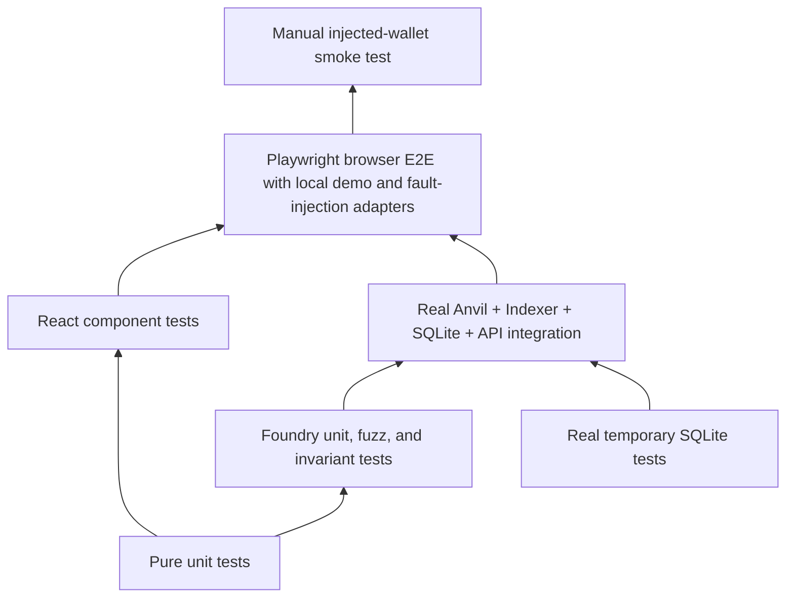

# Testing strategy

This page answers which engineering question belongs to which test layer, what has executed, and
which gaps remain. Test names, source files, and the latest machine record are linked separately so
the existence of a test cannot be mistaken for a passing run.

## Test layers



The diagram shows increasing integration breadth, not a claim that a higher layer replaces the
lower ones. Manual wallet checks are provider evidence; they do not replace contract invariants.

The repository exposes each delivery concern as a named test surface:

- **Contract Tests:** Foundry unit, fuzz, and stateful invariant tests.
- **Frontend Unit Tests:** feature and transaction capability rules in Vitest.
- **Component Tests:** React Testing Library and JSDOM behavior.
- **API Tests:** generated contract compatibility and readonly HTTP behavior.
- **Indexer Replay Tests:** overlap, content identity, rollback, rebuild, and reindex.
- **Database Migration Tests:** native history, drift, failure markers, and schema-source contract.
- **Integration Tests:** isolated real Anvil, Indexer, SQLite, and API processes.
- **E2E Tests:** Playwright through the local browser stack. The happy path uses the explicit
  loopback demo connector; failure paths use a controlled EIP-1193 provider.
- **Architecture Tests:** dependency graph, public export, and invalid-fixture rejection.

| Layer                                    | Runner and environment                                                         | Establishes                                                                                                                                              | Does not establish                                            |
| ---------------------------------------- | ------------------------------------------------------------------------------ | -------------------------------------------------------------------------------------------------------------------------------------------------------- | ------------------------------------------------------------- |
| Pure unit                                | Vitest in-process TypeScript                                                   | Arithmetic, event ordering, pure transitions, adapter-free rules                                                                                         | SQLite locks, RPC behavior, or rendered UI                    |
| React component                          | Vitest, React Testing Library, and JSDOM                                       | Controlled component states and user-visible status semantics                                                                                            | Injected-provider behavior or final browser layout            |
| Contract unit/fuzz/invariant             | Foundry EVM                                                                    | Escrow permissions, asset rollback, pull claims, and liability invariants                                                                                | Deployment manifest, Indexer, API, or wallet provider         |
| API and generated-contract compatibility | Generation drift checks, TypeScript consumers, API contract tests              | Generated ABI/OpenAPI match source and current consumers compile or validate responses                                                                   | Compatibility with an unreleased external consumer            |
| Database                                 | Temporary real SQLite with the native driver                                   | Constraints, migration history, lock competition, snapshot and restore behavior                                                                          | Chain truth, public filesystems, or hardware power loss       |
| Indexer replay                           | Real SQLite and selected Anvil fixtures                                        | Event identity, overlap idempotency, atomic projection/checkpoint commit, same-history recanonicalization, rebuild, canonical reindex and reorg recovery | Unavailable archive history or public-network finality policy |
| Integration                              | Isolated Anvil, SQLite, API, and Indexer                                       | Selected real logs, deployment identity, projection, reconciliation, and recovery paths                                                                  | Manual wallet UX or public-network finality                   |
| Browser E2E                              | Playwright, local stack, loopback demo connector, controlled EIP-1193 provider | UI-to-local-chain settlement, reload, rejection, account/network changes, stale/catch-up behavior                                                        | MetaMask or broad provider compatibility                      |
| Architecture                             | Static import graph and negative fixtures                                      | Selected dependency rules really fail when violated                                                                                                      | Runtime process isolation or remote review policy             |
| Manual wallet                            | Human-controlled injected wallet                                               | Actual provider prompts and account/network UX for that provider                                                                                         | Broad provider support or protocol correctness by itself      |

## Engineering question matrix

| Engineering question                                                                        | Primary test and source                                                                                                           | Current evidence                                                                                | Remaining limit                                                                                                                             |
| ------------------------------------------------------------------------------------------- | --------------------------------------------------------------------------------------------------------------------------------- | ----------------------------------------------------------------------------------------------- | ------------------------------------------------------------------------------------------------------------------------------------------- |
| Does the escrow always cover recorded liabilities?                                          | Foundry stateful invariant in `chain/test/invariant/EscrowInvariant.t.sol`                                                        | `RUN-CONTRACTS`: executed/pass                                                                  | Local Foundry EVM only; no external audit                                                                                                   |
| Is a missing provider or wallet rejection visible without becoming a submitted transaction? | `WalletPanel.test.tsx`, `TransactionTimeline.test.tsx`, and the Playwright rejection scenario                                     | `RUN-WEB-COMPONENT` and `RUN-E2E`: executed/pass                                                | Fault injection uses a controlled provider; manual MetaMask remains not run                                                                 |
| Do ABI and API consumers stay compatible with generated providers?                          | `pnpm generate:check`, workspace typecheck/build, and `tests/integration/api-contract.test.ts`                                    | `RUN-GENERATE-CHECK`, `RUN-API-CONTRACT`, and `RUN-WORKSPACE-VERIFY`: executed/pass             | No released third-party consumer or prior protocol version exists                                                                           |
| Does overlapping replay avoid applying the same event twice?                                | `tests/integration/indexer-store.test.ts`                                                                                         | `RUN-INTEGRATION`: executed/pass                                                                | Arbitrary canonical branch repair remains outside current automation                                                                        |
| Do sale, event, requested-height header, and checkpoint come from one snapshot?             | `indexer-store.test.ts` with a second writer connection committed at an in-read barrier                                           | `RUN-INTEGRATION`: executed/pass                                                                | Real SQLite WAL concurrency; it is not a distributed database isolation claim                                                               |
| Does a journal failure before the wallet prevent submission?                                | `submit-operation.test.ts` with wallet call-count assertions                                                                      | `RUN-TRANSACTION-RECOVERY`: executed/pass                                                       | Controlled application port; no manual wallet crash claim                                                                                   |
| Can reload recovery inspect a supplied hash without a write capability?                     | `recovery.test.ts`, recovery architecture fixture, real-chain replacement tests, and Playwright response-loss scenario            | `RUN-TRANSACTION-RECOVERY`, `RUN-ARCHITECTURE`, `RUN-INTEGRATION`, and `RUN-E2E`: executed/pass | The EIP-1193 provider is controlled; manual MetaMask response-loss behavior remains unverified                                              |
| Can a slow browser result erase newer receipt or projection evidence?                       | Controlled promise tests in `recovery.test.ts` and `submit-operation.test.ts`; current-reflection selector assertions             | `RUN-TRANSACTION-RECOVERY`: executed/pass                                                       | In-process and same-browser journal coordination; no cross-device distributed transaction claim                                             |
| Does funding converge after the Indexer stops?                                              | `transaction-convergence.test.ts` with real Anvil, API, SQLite, and restarted Indexer                                             | `RUN-INTEGRATION`: executed/pass                                                                | Application journal reload is serialized in-process; the browser test wallet remains a separate evidence layer                              |
| Does a process death expose either side of SQLite COMMIT, never a partial batch?            | `indexer-kill-recovery.test.ts` with child barriers and `SIGKILL`                                                                 | `RUN-INDEXER-KILL`: executed/pass                                                               | Ordinary process termination with WAL; no disk failure or hardware power-loss claim                                                         |
| Do migrations preserve existing authoritative rows?                                         | Fresh migration/rerun, history divergence, source digest, and injected SQL failure tests in `tests/migrations/migrations.test.ts` | `RUN-DB-MIGRATIONS`: executed/pass for current history, no-op rerun, and rollback               | No prior-schema upgrade fixture exists because only the initial migration exists; this requirement remains open for the first schema change |
| Do database faults fail atomically and release owned locks?                                 | `database.test.ts` child `SIGKILL`, `SQLITE_BUSY`, and bounded `SQLITE_FULL` fixtures                                             | `RUN-DB-BOUNDARIES`: executed/pass                                                              | Page-count exhaustion is not host-filesystem exhaustion; process death is not hardware power loss                                           |
| Can a canonical reorg be repaired without erasing source evidence?                          | `database-real-recovery.test.ts` with Anvil snapshot/revert and `ops:reindex`                                                     | `RUN-INTEGRATION`: executed/pass                                                                | Local deterministic Anvil only; no public-network archive or finality claim                                                                 |
| Can same-history reindex restore canonical blocks and projections?                          | `reindex-canonical.test.ts` with durable block/event reuse plus projection rebuild                                                | `RUN-INTEGRATION`: executed/pass                                                                | Direct store integration plus separately tested guarded CLI; no public archive provider                                                     |
| Does a transport outage preserve checkpoint and service readability?                        | `ingest-range.test.ts`, `run-indexer.test.ts`, persisted `STALE` status, and independent `dev:full` processes                     | `RUN-INDEXER-UNIT` and `RUN-WORKSPACE-VERIFY`: executed/pass                                    | Controlled transport failure; host network partition and long-duration soak were not run                                                    |
| Does a real end-to-end settlement reach the query API?                                      | `tests/integration/real-stack.test.ts` and `tests/e2e/marketplace.spec.ts`                                                        | `RUN-INTEGRATION` and `RUN-E2E`: executed/pass                                                  | Uses local Anvil and the loopback-only demo connector; browser-extension behavior is separate evidence                                      |
| Does bootstrap resume known transactions without replaying completed chain writes?          | `chain-seed-journal.test.ts` plus completed-user-flow rerun in `tests/integration/real-stack.test.ts`                             | `RUN-CHAIN-SEED-JOURNAL` and `RUN-INTEGRATION`: executed/pass                                   | Deterministic state-machine and live rerun evidence; real process kill during broadcast-to-hash persistence not run                         |
| Are feature/capability/adapter and server package directions enforced?                      | `tooling/architecture/check.mjs` plus eight negative fixtures                                                                     | `RUN-ARCHITECTURE`: executed/pass                                                               | Static source imports only                                                                                                                  |
| Can projections be rebuilt and reconciled without deleting catalog data?                    | Real-stack recovery plus database recovery suites                                                                                 | `RUN-INTEGRATION` and `RUN-DB-RECOVERY`: executed/pass                                          | Missing-sale and missing-token detection passed; broader process/filesystem and unavailable-history faults remain open                      |
| Does a later chain head turn an anchored match into a mismatch?                             | Real-stack reconciliation after an extra mined block                                                                              | `RUN-INTEGRATION`: executed/pass with `MATCH` + `PROJECTION_LAGGING`                            | Anvil snapshot/revert anchor loss is covered; broader provider failure variants remain open                                                 |
| Are repeated rebuild results stable?                                                        | Two real-stack rebuilds from the same verified raw evidence                                                                       | `RUN-INTEGRATION`: executed/pass for sale and vehicle results                                   | Operation IDs and build IDs intentionally differ                                                                                            |

## Commands

```bash
pnpm test:contracts
pnpm test:unit
pnpm test:migrations
pnpm test:db
pnpm test:seeds
pnpm test:recovery
pnpm test:integration
pnpm test:e2e
pnpm check:architecture
pnpm generate:check
```

The integration suite needs its own temporary directory, database, environment ID, Anvil port,
manifest, lock path, and signer nonce space. A separate database filename alone is insufficient.

## Evidence vocabulary

Use `proposed`, `not run`, `executed/pass`, `executed/fail`, or `blocked`. Record the command,
working directory, timestamp, dirty-worktree context, environment, sanitized result, and limits.
Source inspection and a test file's existence are not execution. Migration exceptions,
kill-process schedules, restore file-switch interruption, and real power loss are separate claims.
A mocked wallet rejection does not prove ambiguous post-broadcast recovery.

See the [scenario catalog](scenario-catalog.md), [database matrix](database-acceptance-matrix.md),
[acceptance evidence](../demo/acceptance-evidence.md), and
[machine evidence](../evidence/verification.json).
