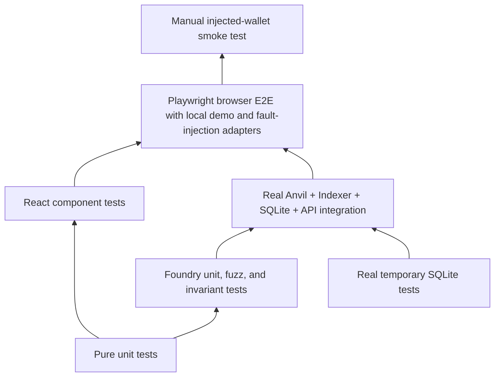

# 测试策略

[English](strategy.md) · [繁體中文](strategy.zh-TW.md)

此页面回答哪个工程问题属于哪个测试层、已执行什么以及还存在哪些差距。测试名称、源文件和最新的机器记录是单独链接的，因此测试的存在不会被误认为是通过运行。

## 测试层



该图显示了集成广度的增加，而不是声称较高层取代了较低层。手动钱包检查是提供商的证据；它们不会取代契约不变量。

存储库将每个交付关注点公开为命名测试面：

- **合约测试：** Foundry 单元、模糊和状态不变测试。
- **前端单元测试：** Vitest 中的功能和事务能力规则。
- **组件测试：** React 测试库和 JSDOM 行为。
- **API 测试：**生成合约兼容性和只读 HTTP 行为。
- **Indexer 重播测试：** 重叠、内容标识、回滚、重建和重新索引。
- **数据库迁移测试：** 本机历史记录、偏差、故障标记和模式源契约。
- **集成测试：**隔离真实的 Anvil、Indexer、SQLite 和 API 进程。
- **E2E 测试：** Playwright 通过本地浏览器堆栈。快乐路径使用显式
  环回演示连接器；故障路径使用受控的 EIP-1193 提供程序。
- **架构测试：**依赖图、公共导出和无效夹具拒绝。

| 层                   | 跑步者与环境                                                 | 成立                                                                                      | 不成立                                   |
| -------------------- | ------------------------------------------------------------ | ----------------------------------------------------------------------------------------- | ---------------------------------------- |
| 纯单位               | Vitest 进程中 TypeScript                                     | 算术、事件排序、纯转换、无适配器规则                                                      | SQLite 锁定、RPC 行为或呈现的 UI         |
| React组件            | Vitest、React 测试库和 JSDOM                                 | 受控组件状态和用户可见的状态语义                                                          | 注入提供者行为或最终浏览器布局           |
| 合约单位/模糊/不变量 | Foundry EVM                                                  | 托管权限、资产回滚、拉取索赔和责任不变量                                                  | 部署清单、Indexer、API 或钱包提供商      |
| API 和生成合约兼容性 | 世代漂移检查、TypeScript 消费者、API 合约测试                | 生成的 ABI/OpenAPI 匹配源和当前消费者编译或验证响应                                       | 与未发布的外部消费者的兼容性             |
| 数据库               | 临时真SQLite带原生驱动                                       | 约束、迁移历史、锁竞争、快照和恢复行为                                                    | 链真相、公共文件系统或硬件断电           |
| Indexer 回放         | 真实的 SQLite 和选定的 Anvil 灯具                            | 事件身份、重叠幂等性、原子投影/检查点提交、同历史重新规范化、重建、规范重新索引和重组恢复 | 不可用的存档历史记录或公共网络最终性政策 |
| 整合                 | 隔离型 Anvil、SQLite、API 和 Indexer                         | 选定的真实日志、部署身份、投影、对账和恢复路径                                            | 手动钱包用户体验或公共网络最终确定性     |
| 浏览器端到端         | Playwright，本地堆栈，环回演示连接器，受控 EIP-1193 提供程序 | UI 到本地链的结算、重新加载、拒绝、帐户/网络更改、陈旧/追赶行为                           | MetaMask 或广泛的提供商兼容性            |
| 建筑                 | 静态导入图和负夹具                                           | 选定的依赖规则在违反时确实会失败                                                          | 运行时进程隔离或远程审查策略             |
| 手动钱包             | 人控注射钱包                                                 | 该提供商的实际提供商提示和帐户/网络用户体验                                               | 广泛的提供商支持或协议本身的正确性       |

## 工程问题矩阵

| 工程问题                                                                  | 主要测试和来源                                                                                                                    | 目前的证据                                                                                  | 剩余限额                                                                    |
| ------------------------------------------------------------------------- | --------------------------------------------------------------------------------------------------------------------------------- | ------------------------------------------------------------------------------------------- | --------------------------------------------------------------------------- |
| 托管是否记录并涵盖每项独立计算的未偿债务？                                | Foundry 状态不变金额资助销售和可索赔索赔，独立于 `totalLiability`                                                                 | `RUN-CONTRACTS`：已执行/通过                                                                | 仅限本地 Foundry EVM；没有外部审计                                          |
| 缺失的提供商或钱包拒绝是否可见但未成为已提交的交易？                      | `WalletPanel.test.tsx`、`TransactionTimeline.test.tsx` 和 Playwright 拒绝场景                                                     | `RUN-WEB-COMPONENT` 和 `RUN-E2E`：已执行/通过                                               | 故障注入使用受控提供者；手动 MetaMask 仍然未运行                            |
| ABI 和 API 消费者是否与生成的提供者保持兼容？                             | `pnpm generate:check`、工作区类型检查/构建和 `tests/integration/api-contract.test.ts`                                             | `RUN-GENERATE-CHECK`、`RUN-API-CONTRACT` 和 `RUN-WORKSPACE-VERIFY`：已执行/通过             | 不存在已发布的第三方消费者或先前的协议版本                                  |
| 重叠重播是否可以避免两次应用同一事件？                                    | `tests/integration/indexer-store.test.ts`                                                                                         | `RUN-INTEGRATION`：已执行/通过                                                              | 任意规范分支修复仍处于当前自动化之外                                        |
| 销售、活动、请求高度标题和检查点是否来自一张快照？                        | `indexer-store.test.ts` 具有在读屏障处提交的第二个写入器连接                                                                      | `RUN-INTEGRATION`：已执行/通过                                                              | 真正的SQLite WAL并发；它不是分布式数据库隔离声明                            |
| 钱包之前的日志故障是否会阻止提交？                                        | `submit-operation.test.ts` 带有钱包调用计数断言                                                                                   | `RUN-TRANSACTION-RECOVERY`：已执行/通过                                                     | 受控的应用程序端口；无手动钱包崩溃索赔                                      |
| 重新加载恢复可以在没有写入功能的情况下检查提供的哈希吗？                  | `recovery.test.ts`、恢复架构夹具、实链替换测试和 Playwright 响应丢失场景                                                          | `RUN-TRANSACTION-RECOVERY`、`RUN-ARCHITECTURE`、`RUN-INTEGRATION` 和 `RUN-E2E`：已执行/通过 | EIP-1193提供商被控制；手动 MetaMask 响应丢失行为尚未验证                    |
| 缓慢的浏览器结果会删除新的收据或投影证据吗？                              | `recovery.test.ts` 和 `submit-operation.test.ts` 中的受控承诺测试；当前反射选择器断言                                             | `RUN-TRANSACTION-RECOVERY`：已执行/通过                                                     | 进程内和同一浏览器日志协调；无跨设备分布式事务主张                          |
| Indexer 停止后资金是否会收敛？                                            | `transaction-convergence.test.ts` 与真实的 Anvil、API、SQLite 以及重新启动的 Indexer                                              | `RUN-INTEGRATION`：已执行/通过                                                              | 应用程序日志重新加载在进程中序列化；浏览器测试钱包仍然是一个单独的证据层    |
| 进程死亡是否会暴露 SQLite COMMIT 的任一侧，而不是部分批处理？             | 带儿童屏障的 `indexer-kill-recovery.test.ts` 和 `SIGKILL`                                                                         | `RUN-INDEXER-KILL`：已执行/通过                                                             | 用WAL普通进程终止；无磁盘故障或硬件断电索赔                                 |
| 迁移是否保留现有的权威行？                                                | 全新迁移/重新运行、真正的 `0000` 到 `0001` 升级、历史分歧、源摘要以及 `tests/migrations/migrations.test.ts` 中注入的 SQL 故障测试 | `RUN-DB-MIGRATIONS`：已执行/通过保留数据升级、无操作重新运行和回滚                          | 仅覆盖存储库记录的迁移路径；不支持未知的外部模式                            |
| 中断的迁移是否可以在不删除其失败标记或接受更改的代码的情况下恢复？        | `tests/migrations/migrations.test.ts` 中的捆绑绑定标记、已知前缀操作、匹配延续和当前模式元数据最终确定                            | `RUN-DB-MIGRATIONS`：已执行/通过                                                            | 硬件断电未重现； SQLite 事务和持久标记状态是受控装置                        |
| 停滞的API体能否永久占用交易验证单航班？                                   | `motorcove-api.test.ts` 中的中止感知主体测试以及观察者自动状态测试                                                                | `RUN-WEB-COMPONENT`：已执行/通过                                                            | 受控获取主体；浏览器网络堆栈超时计时仅在服务级别由完整的 E2E 覆盖           |
| 数据库故障是否会自动失败并释放拥有的锁？                                  | `database.test.ts` 子 `SIGKILL`、`SQLITE_BUSY` 和有界 `SQLITE_FULL` 夹具                                                          | `RUN-DB-BOUNDARIES`：已执行/通过                                                            | 页计数耗尽不是主机文件系统耗尽；进程死亡不是硬件断电                        |
| 可以在不删除源证据的情况下修复规范重组吗？                                | `database-real-recovery.test.ts` 与 Anvil 快照/恢复和 `ops:reindex`                                                               | `RUN-INTEGRATION`：已执行/通过                                                              | 仅局部确定性 Anvil；没有公共网络存档或最终声明                              |
| 同历史重新索引可以恢复规范块和投影吗？                                    | `reindex-canonical.test.ts` 具有持久的块/事件重用以及投影重建                                                                     | `RUN-INTEGRATION`：已执行/通过                                                              | 直接商店集成加上单独测试的受保护的 CLI；没有公共档案提供者                  |
| 传输中断是否可以保持检查点和服务的可读性？                                | `ingest-range.test.ts`、`run-indexer.test.ts`、持久化`STALE`状态以及独立的`dev:full`进程                                          | `RUN-INDEXER-UNIT` 和 `RUN-WORKSPACE-VERIFY`：已执行/通过                                   | 受控运输故障；主机网络分区和长时间浸泡未运行                                |
| 真正的端到端结算是否到达查询API？                                         | `tests/integration/real-stack.test.ts` 和 `tests/e2e/marketplace.spec.ts`                                                         | `RUN-INTEGRATION` 和 `RUN-E2E`：已执行/通过                                                 | 使用本地 Anvil 和仅环回演示连接器；浏览器扩展行为是单独的证据               |
| 引导程序是否会恢复已知事务而不重播已完成的链写入？                        | `chain-seed-journal.test.ts` 加上在 `tests/integration/real-stack.test.ts` 中重新运行已完成的用户流程                             | `RUN-CHAIN-SEED-JOURNAL` 和 `RUN-INTEGRATION`：已执行/通过                                  | 确定性状态机和实时重播证据；广播到哈希持久性期间的真实进程终止未运行        |
| 两个进程可以进入同一个环境bootstrap吗？                                   | `bootstrap-ownership.test.ts`，生产引导包装器和日志测试                                                                           | `RUN-INTEGRATION`：一个进程进入，所有者持有锁                                               | 同主机`flock`；没有分布式工人选举主张                                       |
| API config 是否可以与同一 ID 下注册的部署不一致？                         | `start-api.test.ts`和数据库读取器测试                                                                                             | `RUN-INDEXER-UNIT`：描述符不匹配在应用程序创建/侦听之前失败并关闭读取器                     | 启动证据比较；每个请求都没有重复的 RPC 证明                                 |
| 对账会错过额外的索赔行吗？                                                | `real-stack.test.ts` 中的真实 Anvil/SQLite 孤儿索赔夹具                                                                           | `RUN-INTEGRATION`：额外索赔产生`MISMATCH`；干净的数据返回 `MATCH`                           | 仅用于诊断；它不会删除该行                                                  |
| 拥有的事件可以在没有其先决实体的情况下推进检查点吗？                      | 纯投影器测试和`indexer-store.test.ts`                                                                                             | `RUN-INDEXER-UNIT` 和 `RUN-INTEGRATION`：显式错误、原子回滚、恢复状态                       | 受控SQLite夹具；源头修复仍由操作员采取行动                                  |
| 存储的对账报告是否保留其自己的源范围？                                    | `api-reader-contract.test.ts` 带有真正的 SQLite 读卡器和 Fastify 注入                                                             | 历史报告范围 A 和当前信封范围 B 仍然不同                                                    | 仅限本地 SQLite 和进程内 Fastify                                            |
| API 销售 ID 是否可以超出 EVM uint256 边界或将读取器故障转变为客户端错误？ | `api-contract.test.ts` 具有格式错误、边界、溢出、缺失和内部故障情况                                                               | 读取器之前溢出失败；有效失踪遗骸404；读卡器故障仍为 500                                     | 公共 HTTP 负载和对抗性体积测试不在此正确性案例之外                          |
| 市场是否显示其发送的确切 wei 值？                                         | `amount.test.ts` 和 `Marketplace.test.tsx`                                                                                        | 1 wei、分数 ETH、大值、往返和动作值相等                                                     | JSDOM 验证文本和操作参数；钱包确认渲染由提供商拥有                          |
| 停止工作的工人是否无限期地保持`CURRENT`？                                 | 时钟控制的读卡器测试、诊断选择器测试和 Playwright 的停止-Indexer 观察器页面                                                       | 最后已知的状态被保留，观察变得陈旧，滞后变得未知，恢复获胜                                  | 新鲜度并不质疑或发明更新的链头                                              |
| 是否强制执行特性/功能/适配器和服务器包指示？                              | `tooling/architecture/check.mjs` plus 包、相对路径、别名、重新导出和层负夹具                                                      | `RUN-ARCHITECTURE`：已执行/通过                                                             | 仅静态源导入                                                                |
| 可以在不删除目录数据的情况下重建投影和对账吗？                            | 真实堆栈恢复加上数据库恢复套件                                                                                                    | `RUN-INTEGRATION` 和 `RUN-DB-RECOVERY`：已执行/通过                                         | 通过漏售和遗失代币检测；更广泛的进程/文件系统和不可用历史故障仍然存在       |
| 后来的链头是否会将锚定匹配变成不匹配？                                    | 额外开采区块后的真实堆栈对账                                                                                                      | `RUN-INTEGRATION`：使用 `MATCH` + `PROJECTION_LAGGING` 执行/通过                            | Anvil快照/恢复锚点丢失被覆盖；更广泛的提供商失败变种仍然存在                |
| 引导程序可以重叠标准备份或恢复到混合数据库和 sidecar 代吗？               | 真实引导程序 `flock`、better-sqlite3 备份/恢复装置、不完整的 sidecar 对以及隔离前生成比较                                         | `RUN-DB-RECOVERY` 和 `RUN-DB-MIGRATIONS`                                                    | 同主机咨询锁和本地文件系统；硬件损失不在索赔范围内                          |
| 经过长时间的锚定比较后，对账可以发布过时的 `CURRENT` 吗？                 | 具有真实 SQLite 和受控初始、锚定和发布时间头读取的生产 CLI                                                                        | `RUN-INTEGRATION`：头部运动变为`PROJECTION_LAGGING`；失败的发布读取未知                     | 受控链客户端；真正的 Anvil 时序由更广泛的对账通道覆盖                       |
| 如果没有持久的恢复意图，重置是否会改变链？                                | 在 RPC 断言之前重置 CLI 标记、链回调内的真实子 `SIGKILL`、文件系统清理失败和托管 Anvil 集成                                       | `RUN-DB-BOUNDARIES` 和 `RUN-INTEGRATION`：PREPARED 保持可操作性； CHAIN_RESET 清理恢复      | 儿童杀伤链副作用得到控制；真正的 Anvil 集成运行正常的复位路径，没有故障注入 |
| 更严格的索引深度能否将保留的块标记为当前块？                              | `ingest-range.test.ts`，检查点 100，头 100，深度增加 0→10，深度减少，深度不变，无合格块情况                                       | `RUN-INDEXER-UNIT`：增加深度需要恢复；深度减小，向前推进                                    | 受控链端口；现有的维护和规范的重新索引套件涵盖了显式的重新索引行为          |
| 重复重建结果稳定吗？                                                      | 根据相同的经过验证的原始证据重建两个真实堆栈                                                                                      | `RUN-INTEGRATION`：执行/通过销售和车辆结果                                                  | 操作 ID 和构建 ID 故意不同                                                  |

### 可恢复的维护和持久的浏览器回归

| 工程问题                                                             | 主要回归证据                                                                           | 边界                                                         |
| -------------------------------------------------------------------- | -------------------------------------------------------------------------------------- | ------------------------------------------------------------ |
| 在实时头部前进后，中断的重新索引是否仍保留其原始合格目标？           | `reindex-target.test.ts` 加投影维护测试                                                | 受控链阅读器和真实临时SQLite；未调用完整的 CLI 过程。        |
| 畸形或不匹配的标记链可以处理锁吗？                                   | `projection-maintenance.test.ts`在同一过程中重新获取真实的`flock`门                    | Linux 仅本地咨询锁语义。                                     |
| 源刷新是否可以在没有经过验证的存档的情况下删除原始或孤立证据？       | `indexer-store.test.ts` 拒绝未归档的刷新，创建真正的备份，验证它，并读取已归档的孤立行 | 本地文件系统和SQLite备份；硬件丢失不属于这种情况。           |
| 失败的源不完整重建是否可以移动到所需的恢复而不删除其标记？           | 投影维护测试需要在部署扫描开始时进行显式完整重新索引并保留失败操作沿袭                 | 受控维护标记和真实锁门；完整的 CLI 行为是单独测试的。        |
| 迁移是否可以在任何部署存在之前备份已初始化的数据库？                 | 迁移测试创建一个真正的零部署、无sidecar的旧模式数据库，验证部署前备份，然后迁移        | 本地SQLite和文件系统；恢复测试拒绝主动替换之前的部署前恢复。 |
| 等待的日志写入是否会使先前的上下文检查过时？                         | `submit-operation.test.ts` 延迟预钱包写入并在上下文失效后断言钱包调用计数为零          | 受控钱包端口；身份维度集成在网关测试中。                     |
| 挂钟回滚、无哈希恢复或第二个选项卡是否可以默默地覆盖较新的操作证据？ | 提交合并和持久覆盖单元测试加上 `journal-multitab.spec.ts` 修订冲突和作者切换           | 一个浏览器配置文件；没有跨设备锁定声明。                     |

## 命令

```bash
pnpm test:contracts
pnpm test:unit
pnpm test:migrations
pnpm test:db
pnpm test:seeds
pnpm test:recovery
pnpm test:integration
pnpm test:e2e
pnpm check:architecture
pnpm generate:check
```

集成套件需要自己的临时目录、数据库、环境 ID、Anvil 端口、清单、锁定路径和签名者随机数空间。仅单独的数据库文件名是不够的。

## 证据词汇

使用 `proposed`、`not run`、`executed/pass`、`executed/fail` 或 `blocked`。记录命令、工作目录、时间戳、脏工作树上下文、环境、清理结果和限制。源检查和测试文件的存在不被执行。迁移异常、终止进程计划、恢复文件切换中断和实际断电是单独的索赔。被嘲笑的钱包拒绝并不能证明广播后恢复的模糊性。

请参阅 [场景目录](scenario-catalog.zh-CN.md), [数据库矩阵](database-acceptance-matrix.zh-CN.md), [验收证据](../demo/acceptance-evidence.zh-CN.md)， 和 [机器证据](../evidence/verification.json).

## 恢复完整性案例

| 工程问题                                                                   | 证据                                                                                                                     | 门                               | 限制                                                  |
| -------------------------------------------------------------------------- | ------------------------------------------------------------------------------------------------------------------------ | -------------------------------- | ----------------------------------------------------- |
| 两个选项卡可以保留不同的操作并在一个选项卡关闭后转移日志所有权吗？         | `journal-multitab.spec.ts` 具有两个真正的 Chromium 页面和 Web Locks                                                      | `RUN-E2E`                        | 一个浏览器配置文件；无跨设备协调声明                  |
| 两个选项卡可以观察一个操作而不取代每个验证结果吗？                         | 观察协调器单元/组件测试加上 `journal-multitab.spec.ts`，具有持有的操作锁、非阻塞竞争者、所有者关闭切换和不相关的日志保存 | `RUN-WEB-COMPONENT` 和 `RUN-E2E` | 跨表保证需要Web Locks；仅回退坐标一个 JavaScript 领域 |
| 两个选项卡可以打开重复的钱包请求以实现相同的不可变意图吗？                 | 提交能力/协调器测试加上带有保持模拟、非阻塞竞争者、独立意图和所有者关闭切换的 `journal-multitab.spec.ts`                 | `RUN-WEB-COMPONENT` 和 `RUN-E2E` | 跨表保证需要Web Locks；未声明跨设备协调               |
| 所有支持的写入是否都成功接收或在重新加载后恢复？                           | `recovery.test.ts` 中的操作表、通用收据适配器测试以及非资金重新加载/恢复案例                                             | `RUN-TRANSACTION-RECOVERY`       | 仅资金就增加了事件和投影效应的融合                    |
| Does rebuild preserve projection when its source is incomplete or altered? | `indexer-store.test.ts` 中的真实 SQLite 源计数和绑定原始/解码证据固定装置                                                | `RUN-INTEGRATION`                | 预检失败需要重新索引；它不修复源行                    |
| UI 能否验证替代钱包哈希，同时保留不可用的已保存哈希？                      | `TransactionObserver.test.tsx` 为现有哈希不可用条目提供候选并断言只读恢复参数                                            | `RUN-WEB-COMPONENT`              | 受控恢复端口；没有钱包请求或公共提供商                |
| 恢复是否会拒绝隔离之前的不同部署？                                         | 真正的 SQLite 备份/恢复装置，具有更改的部署和边车证据                                                                    | `RUN-DB-RECOVERY`                | 相同部署的追赶仍然是一个单独的 Indexer 步骤           |
| 中断恢复能否附加上一代数据库的热 WAL？                                     | 子进程 `SIGKILL`、真正的 better-sqlite3 WAL、分阶段备份和标记驱动恢复                                                    | `RUN-DB-RECOVERY`                | 普通进程死亡；未索赔硬件断电                          |
| 可以在出现第一个破坏性副作用之前重置竞赛引导程序吗？                       | 完全重置 CLI 主体、真实生命周期 `flock`、受控环回 RPC 以及发布后成功                                                     | `RUN-DB-BOUNDARIES`              | 受控RPC；无用户环境、无公链                           |
| 部署键控的 Web 查询可以接受另一个部署的响应吗？                            | HTTP 适配器模式/来源测试加上真正的 QueryClient 拒绝和替换密钥恢复                                                        | `RUN-WEB-COMPONENT`              | 受控的获取响应；完整的浏览器服务替换仍然是分开的      |

## R11并发和节点隔离回归

交易测试强制无哈希恢复以在钱包请求保持打开状态的同时推进持久的日志修订，然后验证拒绝是否能够在新的日志实例中幸存下来。单独的案例保留同时发现的候选哈希并公开仅易失性结果存储。

数据库测试标准化环回别名，拒绝重复的端点声明和端点更改，在重置时保留绑定，并在所有权丢失时关闭失败。线束集成启动两个真实的 Anvil 进程，并证明每个环境只能重置自己的节点，而其他链保持不变。

## R12 可恢复的证据和不可用的观察回归

链种子测试将一个失败注入到第一个 `SUBMITTED` 日志写入中。重试必须保留返回的哈希值和稳定的持久化类别；重新打开日志可以验证确切的哈希值，而无需再次提交调用。无哈希提交失败和搁浅的 `PREPARED` 步骤仍然被阻止。

浏览器存储测试使 `localStorage.getItem()` 抛出 `SecurityError`。 日志必须返回相同实例的易失性哈希，公开 `STORAGE_UNAVAILABLE`，保持交易挂钩挂载，并显示重新加载限制。被拒绝的初始持久意图写入仍然会阻止钱包请求。

对账测试使用真实的内存中 SQLite 报告表和第一次头读取失败的受控链客户端。运行必须插入一份新的 `UNVERIFIABLE / HEAD_UNKNOWN` 报告，保留检查点标识和失败原因，关闭写入器，并设置非零退出状态。

## R13 意图所有权、NFT 身份和源刷新回归

- 事务能力测试将模拟挂起并提交一个不可变意图两次。的
  第二次尝试必须在另一次模拟、日志输入或钱包请求之前失败。 React DOM 测试验证匹配的 Sale 操作变为繁忙并禁用，然后在结算时释放。
- 对账测试使用真实的 CLI 主体和 SQLite 复合所有权密钥。收藏错误
  行不匹配，无论它们替换还是伴随清单集合行；另一个部署不会影响结果。真实的 Anvil 堆栈针对锚定的 `ownerOf` 重复错误收集情况。
- Indexer 存储测试区分矛盾的非空源证据和纯缺失行。
  真正的恢复通道会损坏一个源摘要，运行重新索引，验证刷新前备份是否保留该摘要，确认活动源已重新获取，并确认目录行幸存下来。

## R14 源快照和可恢复重新索引回归

| 问题                                                   | 储存库证据                                                                                                                                                  | 边界                                                                  |
| ------------------------------------------------------ | ----------------------------------------------------------------------------------------------------------------------------------------------------------- | --------------------------------------------------------------------- |
| 头部发现和源获取之间的分支更改是否会发布错误的空扫描？ | `database-real-recovery.test.ts` 中的 `ingest-range.test.ts`、`viem-chain-reader.test.ts` 和 `IDX-026` 将日志查询绑定到观察到的块哈希并保留重组后融资事件。 | 确定性单元接缝加上线束拥有的 Anvil 快照/恢复；公开 RPC 未声明最终性。 |
| 合法的重新索引是否需要超过 1,000 个成功批次？          | `reindex-catchup.test.ts` 完成 1,001 个单块批次，并拒绝没有持久检查点进度的成功迭代。                                                                       | 受控应用测试；生产 CLI 使用相同的帮助程序。                           |
| 追赶式重启能否保留累积的进度？                         | `reindex-replay.test.ts`和`projection-maintenance.test.ts`区分`PREPARING`和`CATCHING_UP`；恢复的追赶重建投影，无需第二个源倒带。                            | 真正的临时SQLite标记测试加上应用程序编排测试；硬件断电仍然超出范围。  |

## R16 迁移备份和环境所有权回归

- 迁移测试强制已部署的旧模式数据库备份失败，因为其部署
  边车不见了。两个匹配的调用都在 SQL 之前失败，证明失败的标记不满足备份阶段。
- 第二个固定装置完成验证的预迁移快照，注入稍后的 SQL 故障，并且
  证明匹配的简历重新生效并重用单个记录的备份。在迁移回调运行之前，被篡改的备份清单将被拒绝。
- 新环境测试将空目录与无主数据库和部署区分开来，
  引导程序、种子、维护和托管节点 sidecar。拒绝保留原始字节，不会创建`owner.json`；真正空的环境会幂等地初始化并重新运行。

## R15 拥有的恢复和交易验证回归

| 问题                                                      | 储存库证据                                                                                                      | 边界                                                                       |
| --------------------------------------------------------- | --------------------------------------------------------------------------------------------------------------- | -------------------------------------------------------------------------- |
| 维护完成是否可以作用于在等待所有权期间发生更改的标记？    | `projection-maintenance.test.ts` 持有真实的锁，替换标记，释放所有权，并证明恢复选择新标记而不更改其字节。       | 真实文件系统标记和 SQLite 咨询锁；硬件断电不属于这种情况。                 |
| 是否可以通过错误的 RPC 链或不同的有效部署来检查候选哈希？ | `inspect-transaction.test.ts` 和实链恢复集成在事务查找之前验证保存的描述符、RPC 链 ID 和托管 `deploymentId()`。 | 受控的 Viem 端口加上线束拥有的 Anvil；公共 RPC 和手动钱包提供商未声明。    |
| 持久写入失败是否会阻止已知哈希只读验证或导致重新提交？    | 日志单元测试保留持久字节，同时推进易失性证据； Playwright 观察 RPC 查找、零添加钱包提交、警告和重新加载。       | 浏览器故障注入使用`QuotaExceededError`；设备故障和跨设备恢复尚未经过测试。 |
