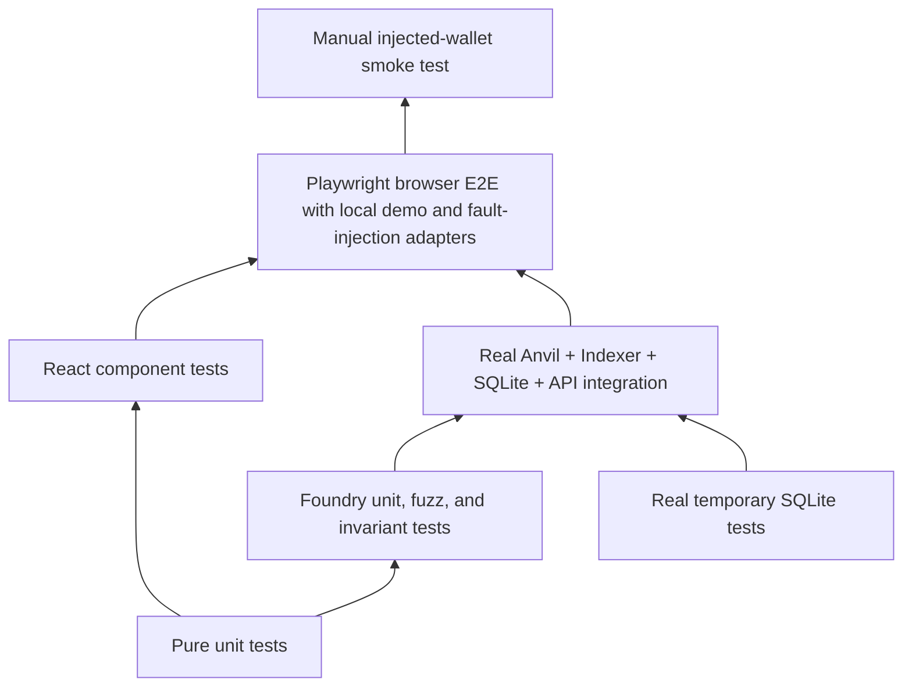

# 測試策略

[English](strategy.md) · [简体中文](strategy.zh-CN.md)

此頁面回答哪個工程問題屬於哪個測試層、已執行什麼以及還存在哪些差距。測試名稱、原始檔案和最新的機器記錄是單獨連結的，因此測試的存在不會被誤認為是透過運行。

## 測試層



該圖顯示了整合廣度的增加，而不是聲稱較高層取代了較低層。手動錢包檢查是提供者的證據；它們不會取代契約不變量。

儲存庫將每個交付關注點公開為命名測試面：

- **合約測試：** Foundry 單元、模糊和狀態不變測試。
- **前端單元測試：** Vitest 中的功能和事務能力規則。
- **元件測試：** React 測試函式庫和 JSDOM 行為。
- **API 測試：**產生合約相容性和唯讀 HTTP 行為。
- **Indexer 重播測試：** 重疊、內容標識、回溯、重建和重新索引。
- **資料庫遷移測試：** 本機歷史記錄、偏差、故障標記和模式來源契約。
- **整合測試：**隔離真實的 Anvil、Indexer、SQLite 和 API 進程。
- **E2E 測試：** Playwright 透過本機瀏覽器堆疊。快樂路徑使用顯式
  環回演示連接器；故障路徑使用受控的 EIP-1193 提供者。
- **架構測試：**依賴圖、公共匯出和無效夾具拒絕。

| 層                   | 跑者與環境                                                   | 成立                                                                                      | 不成立                                   |
| -------------------- | ------------------------------------------------------------ | ----------------------------------------------------------------------------------------- | ---------------------------------------- |
| 純單位               | Vitest 進程中 TypeScript                                     | 算術、事件排序、純轉換、無適配器規則                                                      | SQLite 鎖定、RPC 行為或呈現的 UI         |
| React組件            | Vitest、React 測試函式庫和 JSDOM                             | 受控組件狀態和使用者可見的狀態語義                                                        | 注入提供者行為或最終瀏覽器佈局           |
| 合約單位/模糊/不變量 | Foundry EVM                                                  | 託管權限、資產回滾、拉取索賠和責任不變量                                                  | 部署清單、Indexer、API 或錢包提供商      |
| API 和生成合約相容性 | 世代漂移檢查、TypeScript 消費者、API 合約測試                | 產生的 ABI/OpenAPI 匹配來源和當前消費者編譯或驗證回應                                     | 與未發布的外部消費者的兼容性             |
| 資料庫               | 臨時真SQLite帶原生驅動                                       | 約束、遷移歷史、鎖定競爭、快照和復原行為                                                  | 鏈真相、公共文件系統或硬體斷電           |
| Indexer 回放         | 真正的 SQLite 和選定的 Anvil 燈具                            | 事件身份、重疊冪等性、原子投影/檢查點提交、同歷史重新標準化、重建、規範重新索引和重組恢復 | 不可用的存檔歷史記錄或公共網路最終性政策 |
| 整合                 | 隔離型 Anvil、SQLite、API 和 Indexer                         | 選定的真實日誌、部署身分、投影、對帳和復原路徑                                            | 手動錢包用戶體驗或公共網路最終確定性     |
| 瀏覽器端到端         | Playwright，本地堆疊，環回演示連接器，受控 EIP-1193 提供程序 | UI 到本地鏈的結算、重新載入、拒絕、帳戶/網路變更、陳舊/追趕行為                           | MetaMask 或廣泛的供應商相容性            |
| 大樓                 | 靜態導入圖和負夾具                                           | 選定的依賴規則在違反時確實會失敗                                                          | 運行時進程隔離或遠端審查策略             |
| 手動錢包             | 人控注射錢包                                                 | 該提供者的實際提供者提示和帳戶/網路使用者體驗                                             | 廣泛的提供者支援或協議本身的正確性       |

## 工程問題矩陣

| 工程問題                                                                  | 主要測試和來源                                                                                                                      | 目前的證據                                                                                  | 剩餘限額                                                                    |
| ------------------------------------------------------------------------- | ----------------------------------------------------------------------------------------------------------------------------------- | ------------------------------------------------------------------------------------------- | --------------------------------------------------------------------------- |
| 託管是否記錄並涵蓋每項獨立計算的未償債務？                                | Foundry 狀態不變金額資助銷售和可索賠索賠，獨立於 `totalLiability`                                                                   | `RUN-CONTRACTS`：已執行/通過                                                                | 僅限本地 Foundry EVM；沒有外部審計                                          |
| 缺少的提供者或錢包拒絕是否可見但未成為已提交的交易？                      | `WalletPanel.test.tsx`、`TransactionTimeline.test.tsx` 和 Playwright 拒絕場景                                                       | `RUN-WEB-COMPONENT` 和 `RUN-E2E`：已執行/通過                                               | 故障注入使用受控提供者；手動 MetaMask 仍然未運作                            |
| ABI 和 API 消費者是否與生成的提供者保持相容？                             | `pnpm generate:check`、工作區類型檢查/建置和 `tests/integration/api-contract.test.ts`                                               | `RUN-GENERATE-CHECK`、`RUN-API-CONTRACT` 和 `RUN-WORKSPACE-VERIFY`：已執行/通過             | 不存在已发布的第三方消费者或先前的协议版本                                  |
| 重叠重播是否可以避免两次应用同一事件？                                    | `tests/integration/indexer-store.test.ts`                                                                                           | `RUN-INTEGRATION`：已執行/通過                                                              | 任意规范分支修复仍处于当前自动化之外                                        |
| 销售、活动、请求高度标题和检查点是否来自一张快照？                        | `indexer-store.test.ts` 具有在讀取屏障處提交的第二個寫入器連接                                                                      | `RUN-INTEGRATION`：已執行/通過                                                              | 真正的SQLite WAL並發；它不是分散式資料庫隔離聲明                            |
| 錢包之前的日誌故障是否會阻止提交？                                        | `submit-operation.test.ts` 帶有錢包呼叫計數斷言                                                                                     | `RUN-TRANSACTION-RECOVERY`：已執行/通過                                                     | 受控的应用程序端口；无手动钱包崩溃索赔                                      |
| 重新加载恢复可以在没有写入功能的情况下检查提供的哈希吗？                  | `recovery.test.ts`、復原架構夾具、實鏈替換測試和 Playwright 回應遺失場景                                                            | `RUN-TRANSACTION-RECOVERY`、`RUN-ARCHITECTURE`、`RUN-INTEGRATION` 和 `RUN-E2E`：已執行/通過 | EIP-1193提供者被控制；手動 MetaMask 回應遺失行為尚未驗證                    |
| 緩慢的瀏覽器結果會刪除新的收據或投影證據嗎？                              | `recovery.test.ts` 和 `submit-operation.test.ts` 中的受控承诺测试；当前反射选择器断言                                               | `RUN-TRANSACTION-RECOVERY`：已執行/通過                                                     | 進程內和同一瀏覽器日誌協調；無跨裝置分散式事務主張                          |
| Indexer 停止後資金是否會收斂？                                            | `transaction-convergence.test.ts` 與真實的 Anvil、API、SQLite 以及重新啟動的 Indexer                                                | `RUN-INTEGRATION`：已執行/通過                                                              | 應用程式日誌重新載入在進程中序列化；瀏覽器測試錢包仍然是一個單獨的證據層    |
| 進程死亡是否會暴露 SQLite COMMIT 的任一側，而不是部分批次？               | 兒童屏障的 `indexer-kill-recovery.test.ts` 和 `SIGKILL`                                                                             | `RUN-INDEXER-KILL`：已執行/通過                                                             | 用WAL普通進程終止；無磁碟故障或硬體斷電索賠                                 |
| 遷移是否保留現有的權威行？                                                | 全新遷移/重新運行、真正的 `0000` 到 `0001` 升級、歷史分歧、來源摘要以及 `tests/migrations/migrations.test.ts` 中註入的 SQL 故障測試 | `RUN-DB-MIGRATIONS`：已執行/透過保留資料升級、無操作重新運行和回滾                          | 僅覆蓋儲存庫記錄的遷移路徑；不支援未知的外部模式                            |
| 中斷的遷移是否可以在不刪除其失敗標記或接受更改的程式碼的情況下恢復？      | `tests/migrations/migrations.test.ts` 中的捆綁綁定標記、已知前綴操作、匹配延續和當前模式元資料最終確定                              | `RUN-DB-MIGRATIONS`：已執行/通過                                                            | 硬體斷電未重現； SQLite 事務和持久標記狀態是受控裝置                        |
| 停滯的API體能否永久佔用交易驗證單航班？                                   | `motorcove-api.test.ts` 中的中止感知主體測試以及觀察者自動狀態測試                                                                  | `RUN-WEB-COMPONENT`：已執行/通過                                                            | 受控獲取主體；瀏覽器網路堆疊逾時計時僅在服務等級由完整的 E2E 覆蓋           |
| 資料庫故障是否會自動失敗並釋放擁有的鎖？                                  | `database.test.ts` 子 `SIGKILL`、`SQLITE_BUSY` 和有界 `SQLITE_FULL` 夾具                                                            | `RUN-DB-BOUNDARIES`：已執行/通過                                                            | 頁計數耗盡不是主機檔案系統耗盡；進程死亡不是硬體斷電                        |
| 可以在不刪除來源證據的情況下修復規範重組嗎？                              | `database-real-recovery.test.ts` 與 Anvil 快照/恢復和 `ops:reindex`                                                                 | `RUN-INTEGRATION`：已執行/通過                                                              | 僅局部確定性 Anvil；沒有公共網路存檔或最終聲明                              |
| 同歷史重新索引可以恢復規範塊和投影嗎？                                    | `reindex-canonical.test.ts` 具有持久的區塊/事件重用以及投影重建                                                                     | `RUN-INTEGRATION`：已執行/通過                                                              | 直接商店整合加上單獨測試的受保護的 CLI；沒有公共檔案提供者                  |
| 傳輸中斷是否可以保持檢查點和服務的可讀性？                                | `ingest-range.test.ts`、`run-indexer.test.ts`、持久化`STALE`狀態以及獨立的`dev:full`進程                                            | `RUN-INDEXER-UNIT` 和 `RUN-WORKSPACE-VERIFY`：已執行/通過                                   | 受控運輸故障；主機網路分區和長時間浸泡未運行                                |
| 真正的端對端結算是否到達查詢API？                                         | `tests/integration/real-stack.test.ts` 和 `tests/e2e/marketplace.spec.ts`                                                           | `RUN-INTEGRATION` 和 `RUN-E2E`：已執行/通過                                                 | 使用本機 Anvil 和僅環回演示連接器；瀏覽器擴充功能是單獨的證據               |
| 引導程式是否會恢復已知交易而不重播已完成的鏈寫入？                        | `chain-seed-journal.test.ts` 加上在 `tests/integration/real-stack.test.ts` 中重新運行已完成的使用者流程                             | `RUN-CHAIN-SEED-JOURNAL` 和 `RUN-INTEGRATION`：已執行/通過                                  | 確定性狀態機和即時重播證據；廣播到哈希持久性期間的真實進程終止未運行        |
| 兩個進程可以進入同一個環境bootstrap嗎？                                   | `bootstrap-ownership.test.ts`，生產引導包裝器和日誌測試                                                                             | `RUN-INTEGRATION`：一個進程進入，擁有者持有鎖                                               | 同主機`flock`；沒有分散式工人選舉主張                                       |
| API config 是否可以與相同 ID 下註冊的部署不一致？                         | `start-api.test.ts`和資料庫讀取器測試                                                                                               | `RUN-INDEXER-UNIT`：描述符不匹配在應用程式建立/偵聽之前失敗並關閉讀取器                     | 啟動證據比較；每個請求都沒有重複的 RPC 證明                                 |
| 對帳會錯過額外的索賠行嗎？                                                | `real-stack.test.ts` 中的真實 Anvil/SQLite 孤兒索賠夾具                                                                             | `RUN-INTEGRATION`：額外索賠產生`MISMATCH`；乾淨的資料回傳 `MATCH`                           | 僅用於診斷；它不會刪除該行                                                  |
| 擁有的事件可以在沒有其先決實體的情況下推進檢查點嗎？                      | 純投影器測試和`indexer-store.test.ts`                                                                                               | `RUN-INDEXER-UNIT` 和 `RUN-INTEGRATION`：明確錯誤、原子回滾、恢復狀態                       | 受控SQLite夾具；源頭修復仍由操作員採取行動                                  |
| 儲存的對帳報告是否保留其自己的來源範圍？                                  | `api-reader-contract.test.ts` 帶有真正的 SQLite 讀卡機和 Fastify 注入                                                               | 歷史報告範圍 A 和目前信封範圍 B 仍然不同                                                    | 僅限本地 SQLite 和進程內 Fastify                                            |
| API 銷售 ID 是否可以超出 EVM uint256 邊界或將讀取器故障轉變為客戶端錯誤？ | `api-contract.test.ts` 具有格式錯誤、邊界、溢位、缺失和內部故障狀況                                                                 | 讀取器之前溢出失敗；有效失蹤遺骸404；讀卡機故障仍為 500                                     | 公共 HTTP 負載和對抗性體積測試不在此正確性案例之外                          |
| 市場是否顯示其發送的確切 wei 值？                                         | `amount.test.ts` 和 `Marketplace.test.tsx`                                                                                          | 1 wei、分數 ETH、大值、往返和動作值相等                                                     | JSDOM 驗證文字和操作參數；錢包確認渲染由提供者擁有                          |
| 停止工作的工人是否無限期地維持`CURRENT`？                                 | 時脈控制的讀卡機測試、診斷選擇器測試和 Playwright 的停止-Indexer 觀察器頁面                                                         | 最後已知的狀態被保留，觀察變得陳舊，滯後變得未知，恢復獲勝                                  | 新鮮度並不質疑或發明更新的鏈頭                                              |
| 是否強制執行特性/功能/適配器和伺服器包指示？                              | `tooling/architecture/check.mjs` plus 套件、相對路徑、別名、重新匯出和層負夾具                                                      | `RUN-ARCHITECTURE`：已執行/通過                                                             | 僅靜態來源導入                                                              |
| 可以在不刪除目錄資料的情況下重建投影和對帳嗎？                            | 真實堆疊復原加上資料庫復原套件                                                                                                      | `RUN-INTEGRATION` 和 `RUN-DB-RECOVERY`：已執行/通過                                         | 透過漏售和遺失代幣檢測；更廣泛的進程/檔案系統和不可用歷史故障仍然存在       |
| 後來的鏈頭是否會將錨定匹配變成不匹配？                                    | 額外開採區塊後的真實堆疊對帳                                                                                                        | `RUN-INTEGRATION`：使用 `MATCH` + `PROJECTION_LAGGING` 執行/透過                            | Anvil快照/恢復錨點遺失被覆蓋；更廣泛的提供者失敗變種仍然存在                |
| 引導程式可以重疊標準備份或還原到混合資料庫和 sidecar 代嗎？               | 真實引導程式 `flock`、better-sqlite3 備份/復原裝置、不完整的 sidecar 對以及隔離前產生比較                                           | `RUN-DB-RECOVERY` 和 `RUN-DB-MIGRATIONS`                                                    | 同主機諮詢鎖定和本地檔案系統；硬體損失不在索賠範圍內                        |
| 經過長時間的錨定比較後，對帳可以發布過時的 `CURRENT` 嗎？                 | 具有真實 SQLite 和受控初始、錨定和發佈時間頭讀取的生產 CLI                                                                          | `RUN-INTEGRATION`：頭部運動變成`PROJECTION_LAGGING`；失敗的發布讀取未知                     | 受控鏈客戶端；真正的 Anvil 時序由更廣泛的對帳通道覆蓋                       |
| 如果沒有持久的恢復意圖，重置是否會改變鏈？                                | 在 RPC 斷言之前重置 CLI 標記、鏈回調內的真實子 `SIGKILL`、檔案系統清理失敗和託管 Anvil 集成                                         | `RUN-DB-BOUNDARIES` 和 `RUN-INTEGRATION`：PREPARED 保持可操作性； CHAIN_RESET 清理恢復      | 兒童殺傷鏈副作用得到控制；真正的 Anvil 整合運作正常的重設路徑，沒有故障注入 |
| 更嚴格的索引深度能否將保留的區塊標記為當前區塊？                          | `ingest-range.test.ts`，檢查點 100，頭 100，深度增加 0→10，深度減少，深度不變，無合格區塊情況                                       | `RUN-INDEXER-UNIT`：增加深度需恢復；深度減小，向前推進                                      | 受控鏈連接埠；現有的維護和規範的重新索引套件涵蓋了明確的重新索引行為        |
| 重複重建結果穩定嗎？                                                      | 根據相同的經過驗證的原始證據重建兩個真實堆疊                                                                                        | `RUN-INTEGRATION`：執行/透過銷售和車輛結果                                                  | 操作 ID 和建置 ID 故意不同                                                  |

### 可恢復的維護和持久的瀏覽器回歸

| 工程問題                                                             | 主要回歸證據                                                                           | 邊界                                                         |
| -------------------------------------------------------------------- | -------------------------------------------------------------------------------------- | ------------------------------------------------------------ |
| 在實時頭部前進後，中斷的重新索引是否仍保留其原始合格目標？           | `reindex-target.test.ts` 加投影維護測試                                                | 受控鏈閱讀器和真實臨時SQLite；未呼叫完整的 CLI 過程。        |
| 畸形或不匹配的標記鏈可以處理鎖嗎？                                   | `projection-maintenance.test.ts`在同一過程中重新取得真實的`flock`門                    | Linux 僅本地諮詢鎖定語義。                                   |
| 來源刷新是否可以在沒有經過驗證的存檔的情況下刪除原始或孤立證據？     | `indexer-store.test.ts` 拒絕未歸檔的刷新，創建真正的備份，驗證它，並讀取已歸檔的孤立行 | 本機檔案系統和SQLite備份；硬體遺失不屬於這種情況。           |
| 失敗的來源不完整重建是否可以移動到所需的恢復而不刪除其標記？         | 投影維護測試需要在部署掃描開始時進行明確完整重新索引並保留失敗操作沿襲                 | 受控維護標記和真實鎖門；完整的 CLI 行為是單獨測試的。        |
| 遷移是否可以在任何部署存在之前備份已初始化的資料庫？                 | 遷移測試創建一個真正的零部署、無sidecar的舊模式資料庫，驗證部署前備份，然後遷移        | 本機SQLite和檔案系統；復原測試拒絕主動取代先前的部署前復原。 |
| 等待的日誌寫入是否會使先前的上下文檢查過時？                         | `submit-operation.test.ts` 延遲預錢包寫入並在上下文失效後斷言錢包呼叫計數為零          | 受控錢包連接埠；身份維度整合在網關測試中。                   |
| 掛鐘回滾、無雜湊恢復或第二個選項卡是否可以默默地覆蓋較新的操作證據？ | 提交合併和持久覆蓋單元測試加上 `journal-multitab.spec.ts` 修訂衝突和作者切換           | 一個瀏覽器設定檔；沒有跨裝置鎖定聲明。                       |

## 命令

```bash
pnpm test:contracts
pnpm test:unit
pnpm test:migrations
pnpm test:db
pnpm test:seeds
pnpm test:recovery
pnpm test:integration
pnpm test:e2e
pnpm check:architecture
pnpm generate:check
```

整合套件需要自己的臨時目錄、資料庫、環境 ID、Anvil 連接埠、清單、鎖定路徑和簽署者隨機數空間。僅單獨的資料庫檔案名稱是不夠的。

## 證據詞彙

使用 `proposed`、`not run`、`executed/pass`、`executed/fail` 或 `blocked`。記錄指令、工作目錄、時間戳記、髒工作樹上下文、環境、清理結果和限制。來源檢查和測試文件的存在不被執行。遷移異常、終止進程計劃、恢復檔案切換中斷和實際斷電是單獨的索賠。被嘲笑的錢包拒絕並不能證明廣播後恢復的模糊性。

請參閱 [場景目錄](scenario-catalog.zh-TW.md), [資料庫矩陣](database-acceptance-matrix.zh-TW.md), [驗收證據](../demo/acceptance-evidence.zh-TW.md)， 和 [機器證據](../evidence/verification.json).

## 恢復完整性案例

| 工程問題                                                                   | 證據                                                                                                                     | 門                               | 限制                                                  |
| -------------------------------------------------------------------------- | ------------------------------------------------------------------------------------------------------------------------ | -------------------------------- | ----------------------------------------------------- |
| 兩個選項卡可以保留不同的操作並在一個選項卡關閉後轉移日誌所有權嗎？         | `journal-multitab.spec.ts` 具有兩個真正的 Chromium 頁面和 Web Locks                                                      | `RUN-E2E`                        | 一個瀏覽器設定檔；無跨裝置協調聲明                    |
| 兩個選項卡可以觀察一個操作而不取代每個驗證結果嗎？                         | 觀察協調器單元/組件測試加上 `journal-multitab.spec.ts`，具有持有的操作鎖、非阻塞競爭者、所有者關閉切換和不相關的日誌保存 | `RUN-WEB-COMPONENT` 和 `RUN-E2E` | 跨表保證需要Web Locks；僅回退座標一個 JavaScript 領域 |
| 兩個選項卡可以打開重複的錢包請求以實現相同的不可變意圖嗎？                 | 提交能力/協調器測試加上帶有保持模擬、非阻塞競爭者、獨立意圖和所有者關閉切換的 `journal-multitab.spec.ts`                 | `RUN-WEB-COMPONENT` 和 `RUN-E2E` | 跨表保證需要Web Locks；未聲明跨裝置協調               |
| 所有支援的寫入是否都成功接收或在重新載入後恢復？                           | `recovery.test.ts` 中的操作表、通用收據適配器測試以及非資金重新加載/恢復案例                                             | `RUN-TRANSACTION-RECOVERY`       | 僅資金就增加了事件和投影效應的融合                    |
| Does rebuild preserve projection when its source is incomplete or altered? | `indexer-store.test.ts` 中的真實 SQLite 來源計數和綁定原始/解碼證據固定裝置                                              | `RUN-INTEGRATION`                | 預檢失敗需要重新索引；它不會修復來源行                |
| UI 能否驗證替代錢包哈希，同時保留不可用的已儲存哈希？                      | `TransactionObserver.test.tsx` 為現有雜湊不可用條目提供候選並斷言唯讀恢復參數                                            | `RUN-WEB-COMPONENT`              | 受控恢復連接埠；沒有錢包請求或公共提供者              |
| 恢復是否會拒絕隔離之前的不同部署？                                         | 真正的 SQLite 備份/恢復裝置，具有更改的部署和邊車證據                                                                    | `RUN-DB-RECOVERY`                | 相同部署的追趕仍然是一個單獨的 Indexer 步驟           |
| 中斷復原能否附加上一代資料庫的熱 WAL？                                     | 子進程 `SIGKILL`、真正的 better-sqlite3 WAL、分階段備份和標記驅動恢復                                                    | `RUN-DB-RECOVERY`                | 普通進程死亡；未索賠硬體斷電                          |
| 可以在出現第一個破壞性副作用之前重置競賽引導程式嗎？                       | 完全重置 CLI 主體、真實生命週期 `flock`、受控環回 RPC 以及發布後成功                                                     | `RUN-DB-BOUNDARIES`              | 受控RPC；無用戶環境、無公鏈                           |
| 部署鍵控的 Web 查詢可以接受另一個部署的回應嗎？                            | HTTP 適配器模式/來源測試加上真正的 QueryClient 拒絕和替換金鑰恢復                                                        | `RUN-WEB-COMPONENT`              | 受控的獲取回應；完整的瀏覽器服務替換仍然是分開的      |

## R11並發與節點隔離回歸

交易測試強制無哈希恢復以在錢包請求保持打開狀態的同時推進持久的日誌修訂，然後驗證拒絕是否能夠在新的日誌實例中倖存下來。單獨的案例保留同時發現的候選雜湊並公開僅易失性結果儲存。

資料庫測試標準化環回別名，拒絕重複的端點聲明和端點更改，在重置時保留綁定，並在所有權遺失時關閉失敗。線束整合啟動兩個真實的 Anvil 進程，並證明每個環境只能重置自己的節點，而其他鏈保持不變。

## R12 可恢復的證據和不可用的觀察回歸

鏈種子測試將一個失敗注入到第一個 `SUBMITTED` 日誌寫入。重試必須保留傳回的雜湊值和穩定的持久化類別；重新開啟日誌可以驗證確切的雜湊值，而無需再次提交呼叫。無哈希提交失敗和擱淺的 `PREPARED` 步驟仍然被阻止。

瀏覽器儲存測試使 `localStorage.getItem()` 拋出 `SecurityError`。 日誌必須傳回相同執行個體的揮發性哈希，公開 `STORAGE_UNAVAILABLE`，保持交易掛鉤掛載，並顯示重新載入限制。被拒絕的初始持久意圖寫入仍然會阻止錢包請求。

對帳測試使用真實的記憶體中 SQLite 報告表和第一次頭讀取失敗的受控鏈客戶端。運行必須插入新的 `UNVERIFIABLE / HEAD_UNKNOWN` 報告，保留檢查點標識和失敗原因，關閉寫入器，並設定非零退出狀態。

## R13 意圖所有權、NFT 身分和來源刷新回歸

- 事務能力測試將模擬掛起並提交一個不可變意圖兩次。的
  第二次嘗試必須在另一次模擬、日誌輸入或錢包請求之前失敗。 React DOM 測試驗證匹配的 Sale 操作變為繁忙並停用，然後在結算時釋放。
- 對帳測試使用真實的 CLI 主體和 SQLite 複合所有權金鑰。收藏錯誤
  行不匹配，無論它們替換還是伴隨清單集合行；另一個部署不會影響結果。真實的 Anvil 堆疊針對錨定的 `ownerOf` 重複錯誤收集情況。
- Indexer 儲存測試區分矛盾的非空源證據和純缺失行。
  真正的復原通道會損壞一個來源摘要，運行重新索引，驗證刷新前備份是否保留該摘要，確認活動來源已重新獲取，並確認目錄行倖存下來。

## R14 來源快照和可還原重新索引回歸

| 問題                                                     | 儲存庫證據                                                                                                                                                    | 邊界                                                                  |
| -------------------------------------------------------- | ------------------------------------------------------------------------------------------------------------------------------------------------------------- | --------------------------------------------------------------------- |
| 頭部發現和來源取得之間的分支變更是否會發布錯誤的空掃描？ | `database-real-recovery.test.ts` 中的 `ingest-range.test.ts`、`viem-chain-reader.test.ts` 和 `IDX-026` 將日誌查詢綁定到觀察到的區塊雜湊並保留重組後融資事件。 | 確定性單元接縫加上線束擁有的 Anvil 快照/恢復；公開 RPC 未聲明最終性。 |
| 合法的重新索引是否需要超過 1,000 個成功批次？            | `reindex-catchup.test.ts` 完成 1,001 個單塊批次，並拒絕沒有持久檢查點進度的成功迭代。                                                                         | 受控應用測試；生產 CLI 使用相同的幫助程序。                           |
| 追趕式重啟能否保留累積的進度？                           | `reindex-replay.test.ts`和`projection-maintenance.test.ts`區分`PREPARING`和`CATCHING_UP`；恢復的追趕重建投影，無需第二個來源倒帶。                            | 真正的臨時SQLite標記測試加上應用程式編排測試；硬體斷電仍然超出範圍。  |

## R16 遷移備份與環境所有權迴歸

- 遷移測試強制已部署的舊模式資料庫備份失敗，因為其部署
  邊車不見了。兩個符合的呼叫都在 SQL 之前失敗，證明失敗的標記不符合備份階段。
- 第二個固定裝置完成驗證的預遷移快照，注入稍後的 SQL 故障，並且
  證明匹配的簡歷重新生效並重複使用單一記錄的備份。在遷移回調運行之前，被竄改的備份清單將被拒絕。
- 新環境測試將空目錄與無主資料庫和部署區分開來，
  引導程式、種子、維護和託管節點 sidecar。拒絕保留原始字節，不會創建`owner.json`；真正空的環境會冪等地初始化並重新運行。

## R15 擁有的恢復和交易驗證回歸

| 問題                                                      | 儲存庫證據                                                                                                        | 邊界                                                                      |
| --------------------------------------------------------- | ----------------------------------------------------------------------------------------------------------------- | ------------------------------------------------------------------------- |
| 維護完成是否可以作用於在等待所有權期間發生變更的標記？    | `projection-maintenance.test.ts` 持有真實的鎖，替換標記，釋放所有權，並證明恢復選擇新標記而不更改其位元組。       | 真實檔案系統標記和 SQLite 諮詢鎖定；硬體斷電不屬於這種情況。              |
| 是否可以透過錯誤的 RPC 鍊或不同的有效部署來檢查候選哈希？ | `inspect-transaction.test.ts` 和實鏈復原整合在交易尋找之前驗證已儲存的描述符、RPC 鏈 ID 和託管 `deploymentId()`。 | 受控的 Viem 連接埠加上線束擁有的 Anvil；公共 RPC 和手動錢包提供者未聲明。 |
| 持久寫入失敗是否會阻止已知哈希只讀驗證或導致重新提交？    | 日誌單元測試保留持久字節，同時推進易失性證據； Playwright 觀察 RPC 查找、零添加錢包提交、警告和重新加載。         | 瀏覽器故障注入使用`QuotaExceededError`；設備故障和跨裝置恢復尚未測試。    |
